# RAG 项目技术报告

> 最后更新：2026-06-18

---

## 一、文档拆分策略

### 1.1 分块流程（注意：存在两次分块）

**第一次分块** — `preprocessing/loader.py` 中的 `split_documents()` 函数：

| 文档类型 | 分块器 | 策略 |
|---------|--------|------|
| Markdown (`.md`) | `MarkdownHeaderTextSplitter` | 按标题层级切分（`#`、`##`、`###`），不设固定大小 |
| 非 Markdown (`.txt`、`.pdf`) | `RecursiveCharacterTextSplitter` | 按字符递归切分，配置见下 |

### 1.2 分块参数

| 参数 | 当前生效值 (.env) | 默认值 (config.py) |
|------|-------------------|---------------------|
| `CHUNK_SIZE` | **300** 字符 | 500 字符 |
| `CHUNK_OVERLAP` | **30** 字符 | 50 字符 |

### 1.3 分隔符（优先级从高到低）

```
"\n\n"    → 段落分隔（双换行）
"\n"      → 行分隔（单换行）
"。"  → 中文句号 。
"！"  → 中文感叹号 ！
"？"  → 中文问号 ？
"."       → 英文句号
"!"       → 英文感叹号
"?"       → 英文问号
" "       → 空格
""        → 逐字符切分（最终兜底）
```

中英文标点混用，适合中文为主、英文为辅的混合文档。

### 1.4 文档加载器

| 格式 | 加载器 |
|------|--------|
| PDF | `PyPDFLoader` + `langchain-unstructured` |
| 纯文本 | `TextLoader` |
| Markdown | `TextLoader`（先加载）+ `MarkdownHeaderTextSplitter`（后分块） |

### 1.5 元数据增强

每个分块/文档在预处理阶段异步生成以下元数据：

- **关键词**：jieba TF-IDF + textrank，LLM 兜底
- **文档类型分类**：简历 / 项目报告 / 技术文档 / 制度手册 / 政策文件 / 通用
- **业务领域检测**：金融 / 人力资源 / 电商 / 运营 / 基础设施
- **信号词规则**：基于领域关键词加权识别（如 `Redis`→基础设施、`订单`→电商）
- **时间引用**、**人名**、**章节标题**
- **全文摘要**（针对简历/项目/报告类型，由 LLM 生成，面向搜索优化）

---

## 二、技术栈

### 2.1 基础设施

| 层级 | 技术 |
|------|------|
| **语言** | Python 3.10 |
| **编排框架** | LangChain v1.2.18 + LangGraph（LCEL 链式编排 + 图状态机） |
| **部署方式** | CLI 单进程 / FastAPI Web（`api/`）+ Docker Compose |
| **对话记忆** | **三层记忆系统**：L1 短期缓冲 + L2 PostgreSQL 会话 + L3 pgvector 长期记忆 |

### 2.2 向量与检索

| 组件 | 技术选型 | 说明 |
|------|---------|------|
| **向量数据库** | ChromaDB v1.5.9 | 本地持久化，**双库架构**：`data/chroma`（分块级）+ `data/doc_db`（文档级） |
| **嵌入模型** | `BAAI/bge-small-zh-v1.5` | 离线加载（HuggingFaceEmbeddings），本地缓存 |
| **重排序模型** | `BAAI/bge-reranker-base` | sentence-transformers CrossEncoder，超时 15s |
| **BM25 检索** | `rank-bm25`（langchain_community BM25Retriever） | 与传统向量检索混合使用 |
| **关键词提取** | jieba（TF-IDF + textrank） | LLM 兜底 |

### 2.3 大语言模型

| 参数 | 值 |
|------|-----|
| **模型** | `qwen2.5:3b` |
| **部署方式** | Ollama 本地（`ChatOllama`） |
| **Temperature** | 0.1 |
| **上下文窗口** | 4096 tokens |
| **请求超时** | 30s |
| **最大并发** | 4 |

### 2.4 检索关键参数

| 参数 | 值 | 说明 |
|------|-----|------|
| 向量检索 K | 5 | CustomRetriever 单次向量检索 |
| BM25 检索 K | 20 | BM25 单次检索 |
| 混合检索 K (HYBRID_SEARCH_K) | 20 | RRF 融合后取 top-K |
| 重排序 Top-K (RERANK_TOP_K) | 6 (env) / 8 (default) | 重排序后最终返回 |
| 重排序阈值 (RERANK_SCORE_THRESHOLD) | 0.3 | 低于此分数的文档被丢弃 |
| **Citation 支撑阈值** (CITATION_SUPPORT_THRESHOLD) | **0.4** | 比检索阈值更严格，确保引用质量 |
| RRF 平滑参数 (rrf_k) | 60 | 倒数排名融合的平滑因子 |
| 多查询变体数 | 5（仅在 .env 中配置） | MultiQueryRetriever 生成 |

### 2.5 记忆系统参数

| 参数 | 值 | 说明 |
|------|-----|------|
| L1 短期 | 20 条消息 | 当前 ask() 调用内的消息缓冲 |
| L2 会话 | 50 条消息 | PostgreSQL async 持久化，超出触发摘要压缩 |
| L2 存储 | `chat_sessions` + `chat_messages` 表 | SQLAlchemy 2.0 Async + asyncpg |
| L3 存储 | `memory_records` 表 | PostgreSQL + pgvector (ivfflat cosine) |
| L3 写入管线 | Extract → PII → Trigger → Importance → Dedup → Write | 6 阶段异步管线，不阻塞主流程 |
| L3 价值分类 | STORE / IGNORE | 规则优先 + LLM 回退 |
| L3 重要性阈值 | 0.6 | 低于此分数不进入长期记忆 |
| L3 去重阈值 | 0.85 (cosine) | pgvector 原生余弦相似度 |
| L3 检索算法 | Hybrid: 0.5×sim + 0.3×importance + 0.2×recency | 三因子加权 + 重排序 |
| L3 衰减策略 | >90d ×0.95, >180d ×0.9, <0.2 归档 | MemoryDecayService 定时执行 |
| L3 并发 | asyncio + 持久事件循环线程 | 连接池 20+10，pool_pre_ping |

### 2.6 其他组件

| 组件 | 技术 |
|------|------|
| **SQL Agent** | PostgreSQL + psycopg2 + sqlglot（6 层 AST 安全校验） |
| **Multi-Agent** | LangGraph（Planner → Supervisor ⇄ Workers → Reporter） + SSE 流式进度 |
| **资源监控** | psutil（内存 < 85%，CPU < 90% 才处理请求） |
| **版本管理** | MD5 哈希检测文档变更，自动重建向量库 |
| **Web API** | FastAPI + SSE（`api/`），Docker Compose 一键部署 |

---

## 三、核心检索管线（新版）

### 3.1 管线架构

```
文档加载 → 元数据增强 → 双库向量化 → Chain 构建
                                            │
用户提问 → 三层记忆加载 → HistoryAware → MultiQuery → ChunkRetrieve
                                                          │
                                                     AdaptiveRetriever
                                                     （文档分布分析）
                                                          │
                                                     RerankCompressor
                                                     （CrossEncoder 重排序）
                                                          │
                                                     Citation Filter
                                                     （内联引用 + 反向验证）
                                                          │
                                                     LLM 生成答案
                                                          │
                                                     记忆持久化
```

### 3.2 Chain 构建链路（`retrieval/chain.py`）

实际 LCEL 链式构建顺序：

```
ChunkLevelRetriever
  → MultiQueryRetriever (LLM 生成多角度查询变体)
    → AdaptiveRetriever (分析 chunk 文档分布 → 按需补全文档全文)
      → ContextualCompressionRetriever (RerankCompressor 重排序)
        → create_history_aware_retriever (对话历史消解指代)
          → create_retrieval_chain + create_stuff_documents_chain
```

---

## 四、Citation Filter — 内联引用 + 来源验证

### 4.1 设计理念

传统 RAG 直接返回 LLM 生成的答案，无法追溯每条事实的来源，容易出现"幻觉引用"。Citation Filter 分两步解决：

1. **正向注入**：给每个 chunk 分配序号 `[文档{index}]`，通过 `DOCUMENT_PROMPT` 强制 LLM 在答案中标注 `[1]`、`[2]` 等引用
2. **反向验证**：用 CrossEncoder 反向检查每个 chunk 是否真正支撑答案，过滤未通过的来源

### 4.2 三阶段验证流程

```
阶段 1: 以原始问题为 query，对每个 chunk 打分
        过滤 score < CITATION_SUPPORT_THRESHOLD(0.4) 的 chunk
              ↓
阶段 2: 验证通过的 chunk 保留，写入 support_score 到 metadata
        若全部未通过 → 回退到原始结果（避免误杀）
              ↓
阶段 3: 句子级验证 — 逐句检查是否被剩余 chunk 支撑
        无支撑句子 → 前缀标记 [推断]
              ↓
最终输出: 答案 + [推断] 标记 + 参考文献列表（仅显示文中实际引用的来源）
```

### 4.3 参考文献输出格式

```
### 参考文献

1. **吴浩简历.pdf** (简历) — 相关度: 0.85
2. **技术架构文档.md** (项目文档) — 相关度: 0.72
```

关键策略：
- **去噪**：仅保留在 answer 中通过 `[数字]` 实际引用的来源
- **排序**：按引用编号（index）排序，与文中标注顺序一致
- **富信息**：显示文档类型（简历/项目文档/报告/操作手册/制度规范）和相关度分数

---

## 五、自适应检索（Adaptive Retrieval）

### 5.1 问题

原始 MultiQuery 检索返回多个 chunk，但这些 chunk 可能来自同一个文档，也可能分散在多个文档中。当 chunk 集中在少数文档时，LLM 缺少该文档的全局上下文，容易断章取义。

### 5.2 方案

`AdaptiveRetriever` 在 MultiQuery 合并结果后分析 chunk 的文档分布：

| 分布情况 | 策略 | 原因 |
|---------|------|------|
| chunk 集中在 ≤ 2 个文档（单文档占比 ≥ 30%） | **补全文档全文** | 需要全局上下文，如简历、项目报告 |
| chunk 分散在多个文档 | **仅返回 chunks** | 避免上下文爆炸、避免无关文档污染 |

### 5.3 配置

| 参数 | 默认值 | 说明 |
|------|--------|------|
| `ADAPTIVE_CLUSTER_THRESHOLD` | 0.3 | 单文档在 top chunks 中占比超过此值触发补全 |
| `ADAPTIVE_MAX_CLUSTER_DOCS` | 2 | 聚类文档数 ≤ 此值才补全 |

---

## 六、三层记忆系统（Memory）

### 6.1 架构总览

```
┌──────────────────────────────────────────────────────────────┐
│                      MemoryService                           │
│                   （Agent 唯一接入点）                         │
│                                                              │
│  ┌───────────────┐  ┌───────────────┐  ┌─────────────────┐  │
│  │ L1: ShortTerm │  │ L2: Session   │  │ L3: LongTerm    │  │
│  │    Buffer     │  │   Memory      │  │    Memory       │  │
│  │   (内存)      │  │ (PostgreSQL)  │  │  (pgvector)     │  │
│  │               │  │               │  │                 │  │
│  │ 当前 ask()    │  │ chat_sessions │  │ memory_records  │  │
│  │ 消息缓冲区    │  │ chat_messages │  │ vector(512)     │  │
│  │ max: 20 条    │  │ max: 50 条    │  │ 无上限          │  │
│  └──────┬────────┘  └──────┬────────┘  └───────┬─────────┘  │
│         │                  │                    │            │
│         └──────────────────┴────────────────────┘            │
│                          │                                   │
│                    每次 ask()                                │
│                L1 ← L2(历史) + L3(Hybrid 检索)               │
│                L1 → LLM context                              │
│                          │                                   │
│                ask() 结束后：                                │
│                L2 ← 保存本轮问答（同步）                      │
│                L3 ← 6 阶段管线写入（异步，不阻塞）             │
└──────────────────────────────────────────────────────────────┘
```

### 6.2 L1 — 短期缓冲（ShortTermBuffer）

- **实现**：`memory/short_term.py`
- **存储**：纯内存，Python list
- **容量**：最大 20 条消息（`SHORT_TERM_MAX_MESSAGES`）
- **生命周期**：单次 `ask()` 调用
- **数据来源**：L2 加载的历史消息 + L3 Hybrid 检索注入（SystemMessage）

### 6.3 L2 — 会话记忆（SessionMemory）

- **实现**：`memory/session.py` → `memory/repository/session_repo.py`
- **存储**：PostgreSQL（`chat_sessions` + `chat_messages` 表），SQLAlchemy 2.0 Async + asyncpg
- **容量**：最大 50 条消息（`SESSION_MAX_MESSAGES`），超出自动触发 LLM 摘要压缩
- **生命周期**：同一 `session_id` 跨多次 `ask()` 调用
- **功能**：`get_or_create` / `load_messages` / `save_turn` / `needs_summarization`
- **ORM**：`memory/models/session.py`（`ChatSession` + `ChatMessage`）

### 6.4 L3 — 长期记忆（LongTermMemory）

#### 6.4.1 存储管线（6 阶段，全异步）

```
LLM 事实提取 → PII 正则脱敏 → Worthiness 分类(STORE/IGNORE)
  → Importance 评分(0.0-1.0) → 阈值过滤(≥0.6) → 向量去重
  → pgvector INSERT
```

**关键设计**：`asyncio.ensure_future()` + `MemoryManager` 持久事件循环 drain，写入不阻塞用户应答。

#### 6.4.2 事实提取

- **驱动**：LLM（qwen2.5:3b）
- **格式**：`类型|内容`（每行一条）
- **类型**：`user_fact` / `preference` / `decision` / `knowledge`
- **鲁棒解析**：支持管道格式 + key-value 格式 + 自由文本回退

#### 6.4.3 Memory Worthiness 分类器（`memory/trigger.py`）

双层决策：`user_fact` / `preference` 类型直接 STORE → 规则匹配 → LLM 回退。

#### 6.4.4 Importance 评分器（`memory/importance.py`）

5 维加权 + 类型加成，输出 0.0-1.0。`user_fact`（1.0）> `preference`（0.8）> `project`（0.7）> `work`（0.5）> `casual`（0.2）。阈值 0.6。

#### 6.4.5 PII 过滤器（`memory/pii_filter.py`）

纯正则实现，不依赖 LLM。7 类 PII 检测脱敏（身份证/手机/银行卡/邮箱/IP/车牌/统一社会信用代码）。保留语义骨架。

#### 6.4.6 去重决策（`memory/dedup.py`）

pgvector 原生余弦相似度 + 类型规则。`≥0.92` 同类型覆盖、跨类型降权，`0.85-0.92` 跳过，`<0.85` 正常写入。

#### 6.4.7 存储后端（`memory/repository/memory_repo.py`）

| 特性 | 实现 |
|------|------|
| 向量索引 | IVF-Flat（100 lists），可升级 HNSW |
| 相似度 | pgvector 原生 `cosine_distance` |
| 访问统计 | `UPDATE access_count + 1, last_access_at = NOW()` |
| 覆盖 | `UPDATE is_active=FALSE, superseded_by=new_id` |
| 衰减 | `importance_score * factor WHERE last_access_at < NOW() - INTERVAL` |
| 归档 | `UPDATE is_active=FALSE WHERE importance < 0.2` |

#### 6.4.8 Hybrid Retrieval（`memory/retriever.py`）

```
Query → pgvector cosine top-20 召回
  → final_score = 0.5×similarity + 0.3×importance + 0.2×recency
  → 重排序 → Top-5 返回
```

#### 6.4.9 Memory Decay（`memory/decay.py`）

定时任务，每日执行：`>180d ×0.9`，`>90d ×0.95`，`importance < 0.2` 自动归档（`is_active=FALSE`）。

#### 6.4.10 同步兼容层（`memory/manager.py`）

`MemoryManager` 持久后台事件循环线程 + `run_until_complete` + pending task drain。LangGraph 同步调用 `ask()` 内部透明访问全异步记忆系统。

---

## 七、Multi-Agent 协同架构

### 7.1 图拓扑（LangGraph）

```
START → Planner → Supervisor → Workers（并行）→ Supervisor（循环）
                     │                              │
                     └── 全部完成 → Reporter → END

Workers:
  ├── sql_worker    → 数据库查询
  ├── rag_worker    → 知识库检索
  └── report_worker → 报告生成
```

### 7.2 节点职责

| 节点 | 文件 | 职责 |
|------|------|------|
| **Planner** | `multi_agent/planner.py` | 分析用户问题 → 生成 DAG 任务计划（nodes + edges） |
| **Supervisor** | `multi_agent/supervisor.py` | 调度决策：检查就绪步骤 → 并行分发 → 收集结果 → 循环 |
| **Workers** | `multi_agent/workers/*.py` | 执行具体任务：SQL 查询 / RAG 检索 / 报告生成 |
| **Reporter** | `multi_agent/reporter.py` | 聚合所有 step_results → LLM 生成最终 Markdown 报告 |

### 7.3 关键设计

- **Send API 并行扇出**：`route_after_supervisor` 返回 `list[Send]`，LangGraph 自动并发执行所有 Worker，完成后合并回 Supervisor
- **状态驱动循环**：Worker 完成 → Supervisor 检查是否有新的就绪步骤 → 存在则再次分发，否则进入 Reporter
- **SSE 流式进度**：`stream_events()` 逐步产出 `{stage, label, message, data}` 事件，前端可实时渲染进度条
- **零侵入集成**：通过 `ToolRegistry`（`multi_agent/tool_registry.py`）注册已有子系统，不修改原有代码
- **共享三层记忆**：MultiAgentSystem 复用 MemoryManager，实现跨系统记忆一致性

---

## 八、SQL Agent 安全架构

### 8.1 六层安全校验

```
用户问题 → Router(需SQL?) → SchemaLoader → SQLGenerator → SQLValidator → RowSecurity → Executor
               │                                │               │              │              │
           LLM 分类                       LLM 生成 SQL    sqlglot AST    行级安全      只读执行
                                                          语法校验        注入
```

| 层级 | 组件 | 校验内容 |
|------|------|---------|
| 1 | `router.py` | LLM 判断问题是否需要 SQL 查询 |
| 2 | `schema_loader.py` | 从 schema_config 加载表/列/关系元数据 |
| 3 | `sql_generator.py` | LLM 基于 schema 生成 SQL |
| 4 | `sql_validator.py` | sqlglot AST 校验：SELECT-only、表白名单、列白名单、禁用函数、自动 LIMIT |
| 5 | `row_security.py` | 行级安全策略注入（tenant_id 隔离） |
| 6 | `executor.py` | 只读执行器，禁止 INSERT/UPDATE/DELETE/DROP |

---

## 九、用户问题完整处理流程图

```mermaid
flowchart TD
    A["👤 用户输入问题"] --> B["RAGPipeline.ask(question, session_id)"]

    B --> C{"资源检查\n内存 < 85% & CPU < 90%?"}
    C -- 否 --> D["返回错误：资源不足"]
    C -- 是 --> MEM["🧠 三层记忆加载\nMemoryManager.start_session()"]

    MEM --> MEM1["L2 PostgreSQL → 加载会话历史"]
    MEM1 --> MEM2["L3 pgvector → Hybrid 检索 top-5"]
    MEM2 --> MEM3["L1 缓冲区 ← L2 历史 + L3 记忆(SystemMessage)"]

    MEM3 --> CHAIN["RAGChain.ask()"]

    CHAIN --> H0["HistoryAware Retriever\n结合对话历史消解指代"]
    H0 --> H1["MultiQuery Retriever\nLLM 生成多角度查询变体"]
    H1 --> H2["ChunkLevelRetriever\nStage 1: Doc 级过滤 → Stage 2: Chunk 级混合检索"]

    H2 --> H3["AdaptiveRetriever\n分析 chunk 文档分布"]
    H3 --> H3a{"分布集中？\n(单文档占比 ≥ 30%\n且文档数 ≤ 2)"}
    H3a -- 是 --> H3b["补全文档全文 + chunks"]
    H3a -- 否 --> H3c["仅返回 chunks"]

    H3b --> H4
    H3c --> H4

    H4["RerankCompressor\nBAAI/bge-reranker-base CrossEncoder\n过滤 < 0.3 阈值 → Top-6/8"]

    H4 --> H5["Citation Filter 反向验证"]

    subgraph CITATION["📎 Citation Filter"]
        H5a["阶段1: 以问题为 query\nCrossEncoder 打分每个 chunk\n过滤 < 0.4 的 chunk"] --> H5b["阶段2: 过滤通过 → 写入 support_score\n全部未通过 → 回退原始结果"]
        H5b --> H5c["阶段3: 句子级验证\n逐句检查是否被 chunk 支撑\n无支撑 → 前缀 [推断]"]
    end

    H5 --> H5a

    H5c --> H6["Stuff Documents Chain\n填充 QA_PROMPT 模板\n(含 [文档{index}] 序号标注)"]

    H6 --> H7["LLM 生成最终答案\n(qwen2.5:3b, temperature=0.1)\n输出内联引用 [1][2][3]"]

    H7 --> H8["📎 附加参考文献列表\n(仅显示文中实际引用的来源)"]

    H8 --> SAVE["💾 记忆持久化\nL2: PostgreSQL 保存本轮问答\nL3: 6阶段管线异步写入"]

    SAVE --> J["📤 返回答案给用户"]

    style A fill:#4A90D9,color:#fff
    style J fill:#27AE60,color:#fff
    style MEM fill:#8E44AD,color:#fff
    style CITATION fill:#E74C3C,color:#fff
    style H3 fill:#F39C12,color:#fff
    style H4 fill:#E74C3C,color:#fff
    style H7 fill:#F39C12,color:#fff
    style SAVE fill:#9B59B6,color:#fff
```



### 流程文字描述

**步骤 1：资源检查与记忆加载**
- 检查系统内存和 CPU，超过阈值则拒绝请求
- MemoryManager.start_session() 加载三层记忆：
  - L2 PostgreSQL → 加载该 session 的历史对话
  - L3 pgvector → Hybrid 检索 top-5 相关事实 → 格式化为 SystemMessage
  - L1 短期缓冲 ← L2 消息 + L3 记忆

**步骤 2：查询改写与多路检索**
- HistoryAware Retriever：结合对话历史，将指代消解为完整查询
- MultiQuery Retriever：LLM 生成多角度查询变体，扩大召回范围
- ChunkLevelRetriever：两阶段检索（Doc 级过滤 → Chunk 级混合检索）

**步骤 3：自适应检索**
- 分析 top chunks 的文档分布
- 集中在 1-2 个文档 → 补全文档全文（适合简历/报告类问题）
- 分散在多个文档 → 仅用 chunks（避免上下文爆炸）

**步骤 4：重排序**
- 使用 `bge-reranker-base` CrossEncoder 对候选文档精细打分
- 过滤低于 0.3 分的文档
- 返回最终 Top-6/8 结果

**步骤 5：Citation Filter 验证**
- 阶段 1：CrossEncoder 以问题为 query 反向打分每个 chunk，过滤 < 0.4 的
- 阶段 2：通过验证的 chunk 保留；全部未通过则回退
- 阶段 3：逐句检查是否被剩余 chunk 支撑，无支撑标记 `[推断]`

**步骤 6：答案生成与引用输出**
- 将检索结果填充到 QA_PROMPT 模板（含 `[文档{index}]` 序号）
- LLM 生成答案，强制输出内联引用 `[1][2][3]`
- 附加参考文献列表（仅显示文中实际引用的来源）

**步骤 7：记忆持久化**
- L2：保存本轮问答到 PostgreSQL（同步，`chat_sessions` + `chat_messages`）
- L3：6 阶段管线异步写入 pgvector（提取→PII→分类→评分→去重→存储），不阻塞主流程

---

## 附一：架构亮点

1. **双库双路径架构**：文档级向量库用于快速定位相关文档，分块级向量库用于精细检索
2. **三层记忆系统（企业级）**：L1 环形缓冲 → L2 PostgreSQL 会话 → L3 pgvector 长期记忆，6 阶段异步写入管线，Hybrid 检索，定时衰减归档
3. **Citation Filter 全链路**：正向注入序号 → LLM 内联引用 → CrossEncoder 反向验证 → 句子级 [推断] 标记
4. **自适应检索**：根据 chunk 文档分布自动决定是否补全全文，平衡上下文完整性与精度
5. **人名倒排索引**：预处理阶段构建 person→doc_ids 映射，命中时直接跳过向量检索
6. **版本感知自动重建**：MD5 检测文档变更，自动触发向量库重建
7. **SQL Agent 安全沙箱**：6 层 AST 校验（SELECT-only、表白名单、列白名单、禁用函数、自动 LIMIT、行级安全注入）
8. **Multi-Agent 流式协作**：LangGraph Send API 并行扇出 + SSE 进度反馈，前端实时感知执行状态
9. **企业级记忆后端**：L2/L3 统一迁移至 PostgreSQL + pgvector，SQLAlchemy 2.0 Async，连接池 20+10，全异步非阻塞写入

## 附二：项目文件结构

```
agent/
├── config.py              # 统一配置（环境变量 + 默认值）
├── llm/                   # LLM 工厂（Ollama 适配）
├── retrieval/             # 🆕 RAG 检索管线（原 rag/）
│   ├── pipeline.py        #   主入口 RAGPipeline
│   ├── chain.py           #   LCEL QA Chain（含 Citation Filter）
│   ├── retrievers.py      #   BaseRetriever 封装（Doc/Chunk/Adaptive）
│   ├── bm25.py            #   BM25 关键词检索
│   ├── hybrid.py          #   混合检索（向量 + BM25 + RRF）
│   ├── reranker.py        #   BGE-Reranker + RerankCompressor
│   └── base.py            #   基类与协议
├── preprocessing/         # 文档预处理
│   ├── loader.py          #   多格式文档加载与分块
│   ├── entity.py          #   实体识别（人名）
│   ├── keyword.py         #   关键词提取
│   └── metadata.py        #   元数据管理（异步批量）
├── memory/                # 🆕 企业级三层记忆系统
│   ├── __init__.py        #   MemoryManager 兼容层 + MemoryService 导出
│   ├── service.py         #   MemoryService 统一入口（Agent 唯一接入点）
│   ├── manager.py         #   MemoryManager 同步兼容层（持久事件循环）
│   ├── database.py        #   AsyncEngine + AsyncSessionLocal（连接池）
│   ├── short_term.py      #   L1 短期缓冲
│   ├── session.py         #   L2 会话持久化（PostgreSQL async）
│   ├── long_term.py       #   L3 长期记忆（pgvector + 事实提取）
│   ├── trigger.py         #   MemoryWorthinessClassifier（STORE/IGNORE）
│   ├── importance.py      #   ImportanceScorer（5维评分 0.0-1.0）
│   ├── retriever.py       #   HybridRetriever（3因子加权）
│   ├── decay.py           #   MemoryDecayService（定时衰减归档）
│   ├── pii_filter.py      #   PII 正则脱敏
│   ├── dedup.py           #   向量去重决策
│   ├── models/            #   SQLAlchemy ORM
│   │   ├── session.py     #     ChatSession + ChatMessage
│   │   └── memory.py      #     MemoryRecord (Vector(512))
│   ├── repository/        #   数据访问层
│   │   ├── session_repo.py #   会话 CRUD
│   │   └── memory_repo.py  #   pgvector 检索 + CRUD
│   └── migrations/
│       └── 001_init.sql   #   DDL（3表 + 7索引）
├── multi_agent/           # LangGraph Multi-Agent 工作流
│   ├── graph.py           #   MultiAgentSystem 主入口 + SSE 流式
│   ├── planner.py         #   DAG 任务规划器
│   ├── supervisor.py      #   监督者（任务调度 + Send 并行扇出）
│   ├── tools.py           #   工具执行器
│   ├── reporter.py        #   结果聚合器
│   ├── state.py           #   AgentState 状态定义
│   ├── tool_registry.py   #   工具注册表
│   └── workers/           #   Worker 节点
│       ├── sql_worker.py
│       ├── rag_worker.py
│       └── report_worker.py
├── sql_agent/             # SQL 安全查询 Agent
│   ├── sql_agent.py       #   主入口
│   ├── router.py          #   问题路由
│   ├── schema_loader.py   #   数据库 schema 加载
│   ├── sql_generator.py   #   LLM SQL 生成
│   ├── sql_validator.py   #   sqlglot 语法校验
│   ├── row_security.py    #   行级安全控制
│   └── executor.py        #   只读执行器
├── report_agent/          # 报告生成模块
│   ├── report_generator.py #  主入口
│   ├── data_fetcher.py    #   SQL/API 数据取数
│   ├── template_engine.py #   Jinja2 模板渲染
│   ├── llm_polisher.py    #   LLM 语言润色
│   ├── chart_generator.py #   matplotlib 图表
│   └── snapshot.py        #   报告快照
├── api/                   # 🆕 FastAPI Web 接口 + SSE
├── web/                   # 🆕 前端界面
├── docker/                # 🆕 Docker 部署配置
├── utils/                 # 工具函数
│   ├── logger.py          #   日志
│   ├── resource_monitor.py #  资源监控
│   ├── timeout.py         #   超时控制 + safe_call_with_timeout
│   └── async_utils.py     #   异步并发控制
└── data/                  # 运行时数据（不提交）
    ├── chroma/            #   分块级向量数据库（RAG）
    ├── doc_db/            #   文档级向量数据库（RAG）
    ├── docs/              #   原始文档
    ├── reports/           #   生成的报告
    └── long_term_memory/  #   已废弃（L3 已迁移至 PostgreSQL）
```