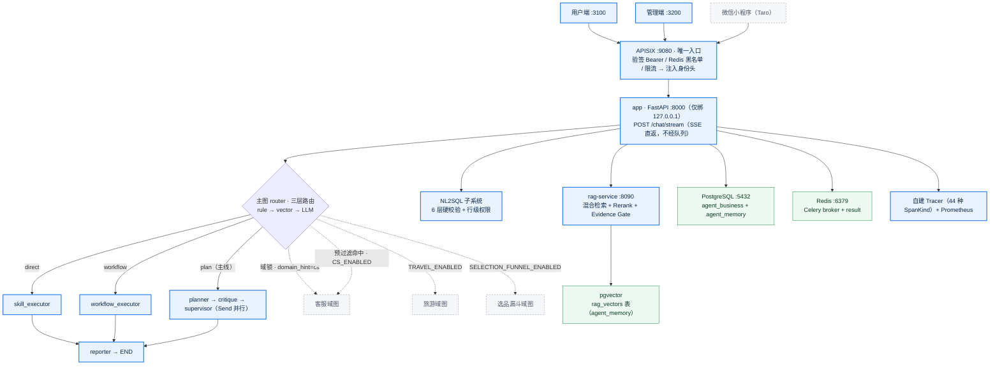

# Agent Platform

电商 RAG + Multi-Agent 平台 — FastAPI + LangGraph + Skill/Tool 四层分层 + APISIX 网关

> 本文件只保留「一眼看懂系统规模 + 怎么跑起来」。架构约束、新增资产规范、待办以下文链接的文档为唯一事实源，**不要**在 README 里维护第二份口径表。

---

## 总览

**主线**（实线，默认启用）：用户端 / 管理端 → APISIX 网关 → `app` → 主图三条支线（direct / workflow / plan）→ reporter。
**扩展**（虚线，由开关控制）：3 个垂直域图（客服 / 旅游 / 选品漏斗，代码默认关闭）、Kafka `java-loop`、Ollama `local-llm`、Prometheus/Grafana。小程序为客户端扩展。



> Java 侧（Spring Boot + SCG）是**独立项目**，不在本仓库的启动链路里；`--profile java-loop` 只为联调保留。

---

## 系统规模（2026-09-20 实测口径）

| 资产 | 数量 | 事实源 |
|------|------|--------|
| 主图核心节点 | 8 | `backend/orchestration/graph/builder.py` |
| Skill | 12 | `backend/skills/registry.py::_instances` |
| Capability | 17（其中 3 个 `routed: false` 内部能力） | `backend/orchestration/router/capabilities.yaml` |
| Tool | 34 | `backend/tools/`（`@tool` + 文件底部 `tool_registry.register`） |
| Workflow | 4 | `backend/orchestration/workflows/__init__.py::register_all()` |
| 域图 / 业务 Agent | 3（客服 / 旅游 / 选品漏斗，代码默认关闭；进法见「垂直域图」） | `backend/domains/__init__.py` |
| MCP Server / Tool | 2 / 5 | `mcp_servers/servers/` |
| 后端用例 | 5293（`pytest --collect-only`，55s） | `backend/tests/` |
| 前端路由 | 用户端 7 / 管理端 41 | `*/src/app/**/page.tsx` |

> ⚠️ **口径纪律**：不要把"节点""Skill""Tool"统称 Agent。四层定义与例外台账见
> [docs/2026-09-16-Agent-Skill-Tool-MCP四层设计规范.md](docs/2026-09-16-Agent-Skill-Tool-MCP四层设计规范.md)。

---

## 核心能力

### 企业知识问答 RAG

- 文档解析：PDF / DOCX / Markdown / TXT（含 OCR 兜底）
- 类型感知切片 + Metadata 治理（关键词 / 摘要 / 实体，含灰度与影子链路）
- 混合检索：Vector + BM25 → RRF 融合 → CrossEncoder Rerank + 阈值过滤
- Evidence Gate：三层主动拒答（Retrieval / Rerank / Faithfulness），防幻觉
- Citation：内联引用 `[1][2]` + 参考文献列表 + META 尾拒答判定

### Multi-Agent 编排（主图）

固定 8 个核心节点，**顺序与命名不得随意改动**；Skill 节点与域图节点由自动发现加入：

```
START → router ─┬─ 客服域锁（domain_hint=cs，跳过判域/灰度）→ 客服域图 → END
                ├─ 客服预过滤命中（CS_ENABLED + 灰度）     → 客服域图 → END
                ├─ 旅游预过滤命中（TRAVEL_ENABLED）        → 旅游域图 → END
                ├─ 选品预过滤命中（SELECTION_FUNNEL_ENABLED）→ 选品漏斗域图 → END
                └─ 三层 Router（rule → vector → LLM）→ route_selector
                      ├─ direct   → skill_executor   → reporter → END
                      ├─ workflow → workflow_executor → reporter → END
                      └─ plan     → planner → critique → supervisor（Send 并行）
                                                    → reporter → END
```

| 节点 | 职责边界 |
|------|----------|
| Router | 三层路由：规则强信号 → 向量召回（pgvector 路由索引）→ LLM 兜底；域图预过滤（客服/旅游/选品）与 CS 域检测为**纯正则**、不走向量 |
| Planner | 只做任务拆解 → Capability DAG，**禁调 Tool/Skill/DB** |
| Critique | 规则校验优先，仅 anomaly 才调 LLM；含计划深度上限（≤8） |
| Supervisor | 纯规则 DAG 调度，`Send[]` 并行 + 注入 `previous_outputs` |
| skill_executor / workflow_executor | 单能力直调 / 工作流执行，均绕过 Planner |
| Reporter | `step_results` → Markdown + 引用格式化 |

**LLM 决策节点仅 3 个**（Planner / Critique / Reporter）；Router 与 CS Supervisor 的 LLM 层是兜底分支；Supervisor 本身是纯规则调度器。

### 垂直域图（Domain Graph）

三个域图的**代码默认全关**（`CS_ENABLED` / `TRAVEL_ENABLED` / `SELECTION_FUNNEL_ENABLED` 均为 `false`，新 clone 拿到的是这个）；当前仓库根 `.env` 三个已全部打开。进入域图有**两条独立通路**：

| 入口 | 触发方式 | 行为 |
|---|---|---|
| **客服窗口锁域** | 用户端客服抽屉 `CSDrawer` 每条消息带 `domain_hint=customer_service`（`frontend/src/hooks/useCSChat.ts`） | `router_node` 置 `cs_forced` → **跳过域检测门、跳过灰度判定（恒 treatment）、跳过旅游/选品 prefilter**，直接进客服管线。仍受 `CS_ENABLED` 总闸约束（关闭则降级回主路由） |
| **全局入口** | `domain_hint` 为空（普通对话页） | 在 router 内按序判定：CS 廉价规则预判 → 旅游正则 → 选品正则 → CS 完整检测（同为纯正则，与第一步同源）；CS 命中后还须过服务端灰度 `CS_ROLLOUT_PERCENT`（默认 100），落 control 组则回主图 |

预过滤优先级 **客服 > 旅游**（"订单里的行程单"按客服诉求处理）。

> **客服窗口为什么必须锁域**：此处**不存在"漏进主图"的 A/B 对照语义**（用户已显式进入客服窗口），而每条消息重新判域有两个实测代价——
> ① **召回漏判**：CS 规则阈值 `CS_RULE_MIN_HITS=2`，实测「东西坏了咋办」「我的订单三天前就显示已发货，为什么还没收到」规则命中**均仅 1** → 全局入口判非客服、落到 `route_mode=plan`，白跑一轮 Planner/LLM；
> ② **域错配**：非客服问法被甩到主图 plan 支线（实测「下周去大阪怎么玩」`cs规则=0` → `route_mode=plan`）。
> 锁域顺带把该窗口的 token 用量归因到 `component="customer_service"`（trace 打 `cs_domain_lock=1`）。
>
> ⚠️ **锁域几乎不省时间，别当性能优化看**：全部域预过滤合计 **< 0.1ms**（实测 CS 规则预判 14~35µs / 旅游正则 22~53µs / 选品正则 9~20µs）；CS 域检测自 2026-09-18 起已无向量通道，冷路径 ~21µs、命中缓存 ~1µs。
>
> **锁域不等于绝对**：域锁下若「无任何客服规则信号 **且** 命中旅游/选品强信号」，仍会走 `redirect_main` 正则阶段转出主路由——但该正则**只认种子城市（福州/厦门/杭州）**，故「去大阪怎么玩」这类问法仍留守客服管线（阶段二 LLM 语义仲裁默认 OFF，`CS_REDIRECT_MAIN_LLM_ENABLED`）。混合信号（如"订单里的行程单怎么退款"含客服规则）**仍守 CS 优先**。行为有测试守护：`backend/tests/orchestration/graph/test_router_prefilter_order.py`（**19 例全绿**，覆盖锁域越过检测失败 / CS 关闭降级主路由 / 旅游转出 / 混合信号留守 / 灰度顺序等）。

- **客服域图**：`state_loader → pending_handler → cs_supervisor → 5 专家 → cs_reporter`
  - `cs_supervisor` 承担三件事：handoff 拦截、循环上限、LLM 兜底
- **旅游域图**：`travel_slot_filler → travel_supervisor → poi/transit/budget/risk 专家 → travel_validator →（未过）travel_repair → travel_reporter`
  - `travel_validator` 是旅游域的 Evidence Gate：纯规则零 LLM 零 IO，**只判定不修改**（修复在 `repair.py`），四轴校验（时间/地理/体力/预算）
  - error 级违反**阻塞交付**并触发修复；局部修复只动被点名的天与条目，用户点名必去条目永不被静默丢弃（`kept_required`）
- **选品漏斗域图**：prefilter **已接线**（`router_node` 内与旅游同层，2026-09-17）；仅受 `SELECTION_FUNNEL_ENABLED` 开关控制，无域锁通路

**跨轮状态契约**（checkpointer 关闭时同样必须遵守，Domained Graph 通用）：

1. `new_*_graph_input()` **只放本轮输入**，不预置产物/执行态默认值 —— checkpointer 会把 input 当对上轮状态的**更新**合并，预置 `brief: {}` 等于每轮清空成果
2. 读状态一律 `.get()` —— 本轮没写过的键不在最终状态里
3. `brief_fingerprint` 变 → 只在 slot_filler 里 `planning_reset()`；不清则 supervisor 会把**上一轮行程**当新需求输出

### NL2SQL 数据分析

```
"分析最近 30 天库存异常"
   ↓ Schema Router（自动选表）→ SQL Generator → Validator（6 层硬校验 + 行级权限）
   ↓ Executor（连接池 + 脱敏）→ Markdown
```

6 层安全：①SELECT 校验 ②表名白名单 ③敏感列拒绝 ④函数黑名单 ⑤LIMIT 强制 ⑥`agent_readonly` 只读角色。

### Workflow 自动化

日报生成｜库存预警｜市场调研（证据管线 → 12 章节报告）｜选品决策（市场评估 → 差异化 → 财务测算 → AI 评审团）

### 三层记忆

| 层级 | 存储 | 生命周期 |
|------|------|---------|
| L1 短期 | 消息缓冲区 | 单次会话 |
| L2 会话 | PostgreSQL | 持久化 |
| L3 长期 | pgvector | 跨会话检索 + 衰减归档 |

---

## 评测结果（实测，非目标值）

| 模块 | 数据集 / 子集 | 用例数 | 关键指标 | 运行记录 |
|------|--------------|:---:|------|------|
| RAG 检索 | `datasets/rag/suites/expanded_100.json` | 100 | Recall@5 **0.9588** ｜ MRR **0.8980** ｜ Top-1 **1.0000** ｜ 通过 **99%** | `data/eval_runs/2026-09-17T20-54-57-c76a1b/` |
| RAG 快评 | 20 例子集 | 20 | Recall@5 **0.9608** ｜ MRR **0.9314** ｜ Top-1 **1.0000** ｜ 通过 **100%** | `data/eval_runs/2026-09-18T04-12-24-efe47d/` |
| 旅游规划 | `datasets/travel/cases.jsonl` | 22 | **22/22**，pass_rate **1.000**（A–F 六组 × smoke/core/hard/regression 分层） | `docs/2026-09-18-旅游域P1候选交接.md` |
| NL2SQL | `datasets/sql/cases.jsonl` | 15 | Release Gate **PASS**（准确率 / 拒答指标当前为「无数据」，尚未启用） | `data/eval_runs/2026-09-10T09-01-00-e81bc8/` |
| 端到端 | `datasets/e2e/cases.jsonl` | 13（报告口径） | Release Gate **PASS** | `data/eval_runs/2026-09-11T08-55-26-153602/` |

复现：
```bash
python -m backend.evaluation rag --selection expanded_100 --live --compare latest
```

> ⚠️ **引用指标必须同时写明 suite 与 run id。** `datasets/rag/cases.jsonl` 现为 **269 例 unified v5.0.0**，上表 100 / 20 是套在其上的 suite 子集而非全量。
> 历史上曾出现「同名不同 schema」的误口径运行 —— 同一天同时存在 30% FAIL 与 100% PASS 两份报告，FAIL 那份是把 `rag_100_docs.json` 的 V1/V2 schema 喂给 V4 评测器而产生的假阴性，**不是真实回归**。判定依据与清理过程见 `docs/2026-09-18-全站存储收口交接报告.md` §3.4。

---

## 架构

### 分层与调用方向

```
Agent      — 任务理解、规划、决策（不直接操作业务）
   ↓
Skill      — 业务能力封装（rag.search / sql.query / report.generate）
   ↓
Tool       — 无状态底层执行（vector_search / postgres_query / send_email）
   ↓
External   — PostgreSQL（含 pgvector）/ SMTP / MCP / 地图服务
```

方向固定：`Planner → capability → Skill → Tool → Infrastructure`。
**MCP 不是第 5 层**，是 Tool 的第二出口（Tool 不得 import Skill）。

三条铁律：**G1** 声明式注册、启动期派生、fail-fast ｜ **G2** 单一事实源，派生量禁止手写回去 ｜ **G3** 谁定义谁注册，禁止集中代注册。

### 运行拓扑与端口

| 端口 | 组件 | 说明 |
|------|------|------|
| **9080** | **APISIX 网关** | **唯一入口**：验签 Bearer / Redis 黑名单 / 限流 → 注入身份头 |
| 8000 | `app`（FastAPI） | 仅绑 `127.0.0.1`，外部流量一律走 9080 |
| 8090 | `rag-service` | 独立 RAG 服务 |
| 8091 | `mcp-service` | MCP 服务 |
| 3100 / 3200 | 用户端 / 管理端 | `next dev`（本地进程，非容器） |
| 5433 → 5432 | `postgres` | `agent_business` + `agent_memory` |
| 6379 | `redis` | Celery broker + result backend |
| 9090 / 3001 | Prometheus / Grafana | `--profile observability` |
| 9094 / 11434 | `kafka` / `ollama` | `--profile java-loop` / `--profile local-llm`，默认不启 |

**请求链路**：前端 rewrite → APISIX:9080 → `X-User-Id` 等身份头 → app（`IDENTITY_SOURCE=header` 只认头）。

### 异步层

- `/chat/stream` 主链路**同步执行、不经队列**，SSE 直返（帧序 `meta → status/log/delta → done/error`）
- Celery 双队列 `agent` ｜ `rag_index`（`backend/tasks/celery_app.py::task_routes` 固定路由）
- 状态权威在 PostgreSQL（`agent_memory.tasks`），payload 仅 `task_id`；`acks_late` + `prefetch=1` + 软/硬双层超时
- 重试 = 从最近 LangGraph checkpoint 自愈式续跑；业务终态异常不重试

细节见 [docs/OPTIMIZATION_P3_ASYNC_QUEUE_ARCHITECTURE.md](docs/OPTIMIZATION_P3_ASYNC_QUEUE_ARCHITECTURE.md)。

### 网关与认证

- Python 侧自建认证：`local_jwt.py`（HS512 + pbkdf2），`/auth/*` + `/sys/users/register`
- APISIX standalone 声明式配置进 Git（`apisix/apisix.yaml`），改宿主文件后 `docker compose restart apisix` 即生效，无需 build
- ⚠️ 网关伪头剥离**无条件执行**（不受 `GATEWAY_AUTH_MODE` 门控）；验收必须用回显桩看请求头，不能用"行为观察法"

---

## MCP Integration

基于 Model Context Protocol，把 Tool 能力标准化暴露给外部 Agent（Claude / Cursor / GPT 等）：

```
mcp_servers/
├── sql — sql_query / list_tables
└── rag — search_knowledge / list_documents / get_stats
```

| 端点 | 说明 |
|------|------|
| `GET /mcp/tools` | 列出所有可用 tool |
| `POST /mcp/call` | 调用指定 tool |

参数定义一律 `langchain_tool_to_mcp_meta` 从 Tool 的 `args_schema` 派生，**禁止手写**。

---

## Observability

- **Trace**：主图节点、Skill、Tool、检索与索引阶段均落 Span，类型由 `observability/tracer.py::SpanKind` 枚举强约束（**照 G2 不在此手抄阶段清单**）；每 Span 记录 latency / token_usage / retrieval_score / tool_args / execution_result
  - Evidence Gate 有 4 个专有 Span：`retrieval_gate` / `rerank_gate` / `faithfulness_gate` / `self_correction`
- **Metrics**：Prometheus `/metrics`；黄金信号 = 首 token 延迟（TTFT P99 < 3s）/ 每 token 耗时（TPOT P99 < 200ms）/ 错误率 / 并发占用
- **告警**：`docker/prometheus-alert-rules.yml`（16 条，warning/critical 两级）
- **成本治理**：`GET /observability/tokens/calls` 逐次调用 token 与成本；budgets + prices 可在管理端配置

SLO 定义见 [docs/observability/slo.md](docs/observability/slo.md)。

---

## 技术栈

| 层次 | 技术 |
|------|------|
| 接入 | Apache APISIX（standalone）+ FastAPI + SSE Streaming |
| Agent | LangGraph（StateGraph + Send API + checkpointer） |
| LLM | DeepSeek / Qwen / Ollama（`sys_config` + 管理端可切换） |
| 向量 | PostgreSQL + pgvector（`rag_vectors`，HNSW + cosine）｜embedding 双轨：text-embedding-v3 1024d / bge-small-zh-v1.5 512d |
| 检索 | BM25 + Vector → RRF → CrossEncoder Rerank |
| 数据 | PostgreSQL（业务库 7 schema × 18 表｜元数据库 17 表，含向量表 `rag_vectors`） |
| 异步 | Celery + Redis（双队列）+ Kafka（`java-loop` profile，默认不启） |
| 可观测 | 自建 Tracer + Prometheus + Grafana |
| MCP | stdio / HTTP SSE |
| 前端 | Next.js 14 + React 18 + Tailwind 3 + Zustand + TanStack Query｜小程序 Taro |

---

## 快速开始

### 0. 环境准备（首次运行）

| 依赖 | 版本 | 用途 |
|------|------|------|
| Docker Desktop | 近期版本 | 起 apisix / app / postgres / redis / rag-service / mcp-service / worker |
| Python | **3.10** | 后端与评测；`.venv` 必须是 3.10 |
| Node.js | **22** | 两个 Next.js 前端 |
| Ollama | 可选 | 仅 `local-llm` profile 与本地推理场景 |

```bash
cp .env.example .env
# 至少填 PGPASSWORD / PG_READONLY_PASSWORD —— compose 用 ${VAR:?} 强校验，缺失直接起不来
```

- 根 `.env` 才是**生效配置**（`backend/.env` 不会被加载）。根 `.env.example` 是最小可启动集；86 项完整清单（逐项带注释）见 `backend/.env.example`。
- 模型 provider / model / api_key **不在 env 里配** —— 走 `sys_config`，由管理端「模型配置」页维护（DB override + 环境变量 fallback）。

### 1. 一键启停（唯一入口 = `devctl.bat`）

```bat
devctl.bat status                  :: 查看三服务状态（空参 = status）
devctl.bat start all               :: backend(compose app) + admin + web
devctl.bat restart all /y          :: 免确认重启全部
devctl.bat stop web /y             :: 只停用户端
```

`dev-start.bat` / `dev-stop.bat` / `dev-restart.bat` 是上表的短路写法，实现只在 `dev-svc.bat` 一份。
服务定义：`backend` = compose 的 `app` 服务（探活 `/health`）｜`admin` = `frontend-admin`（:3200）｜`web` = `frontend`（:3100）。

> ⚠️ 旧的 `start_py.bat` / `start_frontend.bat` 系列**已删除**，请勿按旧文档执行。

### 容器栈

```bash
docker compose up -d --build      # apisix + app + rag-service + mcp-service + worker + postgres + redis
docker compose --profile observability up -d prometheus grafana
docker compose down               # ⚠️ 加 -v 会连数据卷一起删
```

`devctl backend` 只操作 compose 的 `app` 服务，**不会**动 postgres / redis / apisix / rag-service / mcp-service / worker。

### 非 Windows 环境（macOS / Linux）

一键启停脚本目前是 Windows 批处理，其他平台用等价的 compose / node 命令即可，功能无差异：

```bash
docker compose up -d --build                                   # 等价 devctl start backend
cd frontend       && npm install && npx next dev -p 3100       # 等价 devctl start web
cd frontend-admin && npm install && npx next dev -p 3200       # 等价 devctl start admin
```

### 访问入口

| 入口 | 地址 |
|------|------|
| 用户端（登录页 `/login`） | http://localhost:3100 |
| 管理端 | http://localhost:3200 |
| API 文档 | http://localhost:8000/docs |
| 网关 | http://localhost:9080（本地 dev 必启，否则前端所有 `/api/*` 请求失败） |

> 前端请求目标由 `next.config.js` 的 `API_URL` 决定，默认 `http://127.0.0.1:9080`（走网关）。
> `API_URL=http://localhost:8000 npx next dev` 可绕过网关直连后端，**仅调试用**（chat 身份一律 guest）。

完整命令速查与故障排查见 [命令文档.md](命令文档.md)。

---

## 开发与验证

### 后端

```bash
# 依赖（venv = Py3.10）
pip install -e ".[dev]"

# 全量用例
./.venv/Scripts/python.exe -m pytest backend/tests/ -q --no-cov

# 改动四层资产后必跑的一致性门禁
cd backend && ../.venv/Scripts/python.exe -m pytest \
  tests/test_registry_consistency.py tests/test_layer_consistency.py \
  tests/test_adr0001_dual_registry_merge.py -q --no-cov
```

> ⚠️ 局部跑**必须加 `--no-cov`**：`pytest.ini` 挂死 `--cov-fail-under=55` 且无运行范围隔离，否则用例全绿但 EXIT=1。
> ⚠️ 改 `params_schema` / 描述 / prompt 后需另跑 planner 评估（`backend/evaluation/datasets/planner_params.json`）。

### 评测

```bash
python -m backend.evaluation              # 全量：planner + rag + sql + e2e
python -m backend.evaluation rag --smoke  # 单模块冒烟
python -m backend.evaluation e2e --verbose
```

报告落 `data/eval_runs/{run_id}/`，断点续跑默认开启（`--no-resume` 强制全量）。

### 前端

```bash
cd frontend && npm install
npx tsc --noEmit      # 类型门禁
npx vitest run        # 单测
```

### 新增资产

Tool / Skill / Workflow / MCP / 域图的改动点位与隐藏接线点见
[docs/2026-09-16-新增Agent-Skill-Tool-MCP操作手册.md](docs/2026-09-16-新增Agent-Skill-Tool-MCP操作手册.md)。
**约定：Tool 一律定义在 `backend/tools/`（禁止在 `skills/` 下定义），返回 JSON 字符串；写操作类 Tool 必须过 `security/tool_approval.ensure_approved()` 审批门。**

---

## 项目结构

```
agent/
├── apisix/                    # 网关声明式配置（standalone，进 Git；改完 docker restart apisix 即生效）
├── backend/
│   ├── app/                   # FastAPI（routes / middleware / server）
│   ├── orchestration/         # LangGraph 运行时（graph / router / workflows / skill_executor）
│   ├── skills/                # 12 个 Skill（业务能力封装）
│   ├── tools/                 # 34 个 Tool（无状态可测试）
│   ├── domains/               # 域图注册入口（→ 下面三个垂直域）
│   ├── customer_service/      # 客服域图
│   ├── travel/                # 旅游域图
│   ├── selection_funnel/      # 选品漏斗域图（prefilter 已接线）
│   ├── rag/                   # RAG 管道（检索 / 索引 / 预处理）
│   ├── sql/                   # NL2SQL（6 层校验 + 行级权限）
│   ├── memory/                # 三层记忆
│   ├── tasks/                 # Celery（双队列 + worker）
│   ├── evaluation/            # 评测框架（datasets/ 数据集 + runners/）
│   ├── observability/         # Tracer / Metrics / Alerts
│   ├── security/              # 认证 / 审批门 / 守卫
│   ├── infra/                 # LLM 代理 / 计价 / 预算 / 限流
│   └── tests/                 # 5293 用例
├── mcp_servers/               # MCP 服务（2 server / 5 tool）
├── frontend/                  # 用户端 Next.js（:3100）
├── frontend-admin/            # 管理端 Next.js（:3200）
├── frontend-mp/               # 微信小程序（Taro，客户端扩展）
├── docker/                    # init-dbs.sh + Prometheus 告警规则等
├── 部署/                       # 部署脚本与说明
├── scripts/                   # 运维 / 验收 / 网关基线脚本
├── docs/                      # 架构文档 + ADR + 交接报告（含 HANDOFF.md、TRAVEL_ARCHITECTURE_AUDIT.md）
├── data/                      # 评测语料与运行产物（eval_runs/、docs/ 语料库）
├── tmp/                       # 临时工作区（语料加工中间产物）
├── docker-compose.yml         # apisix + app + postgres + redis + rag-service + mcp-service + worker
├── docker-compose.observability.yml
├── .env.example               # 根 env 最小可启动集（→ cp 成 .env）
├── devctl.bat                 # 统一启停入口（dev-start/dev-stop/dev-restart 为短路写法）
└── AGENTS.md                  # 项目级硬约束（改代码前先读）
```

> `data/` 与 `tmp/` 目前有较多语料/中间产物直接入库（分别约 760 / 1500 个文件）。**这是已知待清理项**：语料本体宜转为按需拉取，仓库只保留 schema 与小型固件集。

---

## 文档索引

| 文档 | 用途 |
|------|------|
| [AGENTS.md](AGENTS.md) | 项目级硬约束与架构知识（**改代码前先读**） |
| [命令文档.md](命令文档.md) | 启停 / 评测 CLI / 可观测性速查 |
| [docs/README.md](docs/README.md) | 文档总索引 |
| [docs/2026-09-16-Agent-Skill-Tool-MCP四层设计规范.md](docs/2026-09-16-Agent-Skill-Tool-MCP四层设计规范.md) | 四层定义、写法、例外台账 |
| [docs/2026-09-16-新增Agent-Skill-Tool-MCP操作手册.md](docs/2026-09-16-新增Agent-Skill-Tool-MCP操作手册.md) | 新增资产 checklist |
| [docs/gateway-apisix-migration-plan.md](docs/gateway-apisix-migration-plan.md) | 网关迁移计划（B0→B4 分批 + 审批门禁） |
| [docs/2026-09-16-总交接与实施计划.md](docs/2026-09-16-总交接与实施计划.md) | 跨会话交接与施工顺序（推荐入口） |
| [docs/未完成功能进度汇总-2026-09-16.md](docs/未完成功能进度汇总-2026-09-16.md) | 功能欠账 + 开工顺序 |
| [docs/HANDOFF.md](docs/HANDOFF.md) | 会话交接记录 |
| [docs/TRAVEL_ARCHITECTURE_AUDIT.md](docs/TRAVEL_ARCHITECTURE_AUDIT.md) | 旅游域架构审计（Phase 0，含数据 Provider 层缺口） |
| [docs/production-readiness-assessment.md](docs/production-readiness-assessment.md) | 生产就绪风险清单（P0/P1，含未修复项） |
| [docs/2026-09-18-全站存储收口交接报告.md](docs/2026-09-18-全站存储收口交接报告.md) | 评测口径澄清与存储收口 |

---

## License

**All rights reserved —— 保留全部权利。源码公开仅用于展示与技术交流，未经授权不得用于商业用途。**

本仓库是 Public，但**不是**开源项目：仓库内没有 `LICENSE` 文件，即默认保留全部权利。
若需在其他项目中使用其中代码或设计，请先联系作者取得授权。

<!-- 若要改为真正的开源许可：在仓库根放一份 LICENSE（MIT / Apache-2.0 等），
     并把上面这段替换为对应声明即可。当前写法是「公开展示但不授权」的保守默认。 -->

---

<!--
## 演示素材（待补）

建议加 2~3 张截图 / 一段 GIF，放在 `docs/assets/` 下再引用，例如：


推荐取材：`/agent` 任务模式（流式 + 工具调用过程）、管理端模型配置与成本页、
RAG 的引用标注与 Evidence Gate 拒答、NL2SQL 的执行计划与脱敏结果。
截图时注意不要带真实业务数据与密钥。
-->

