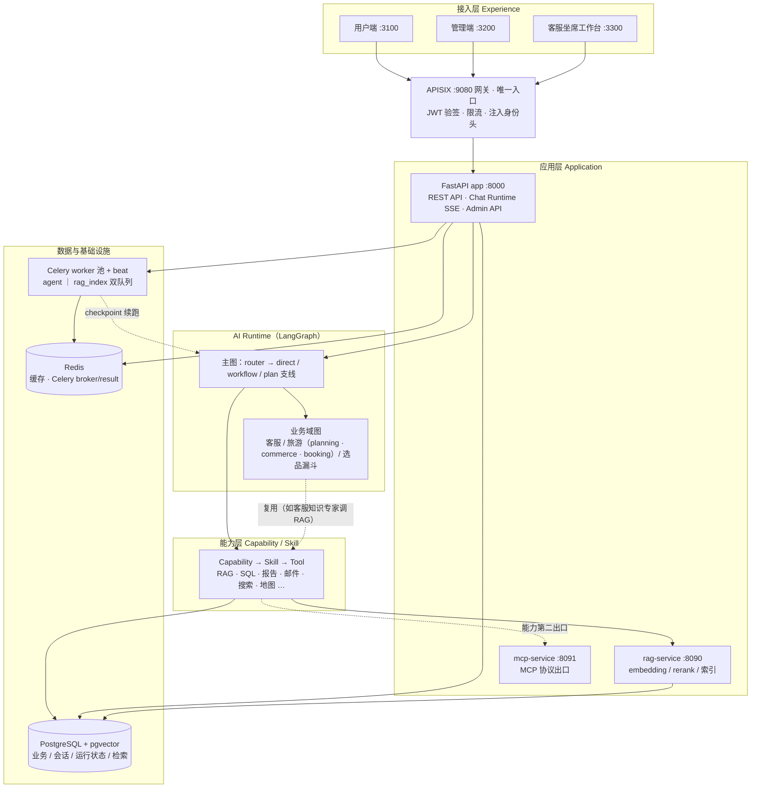
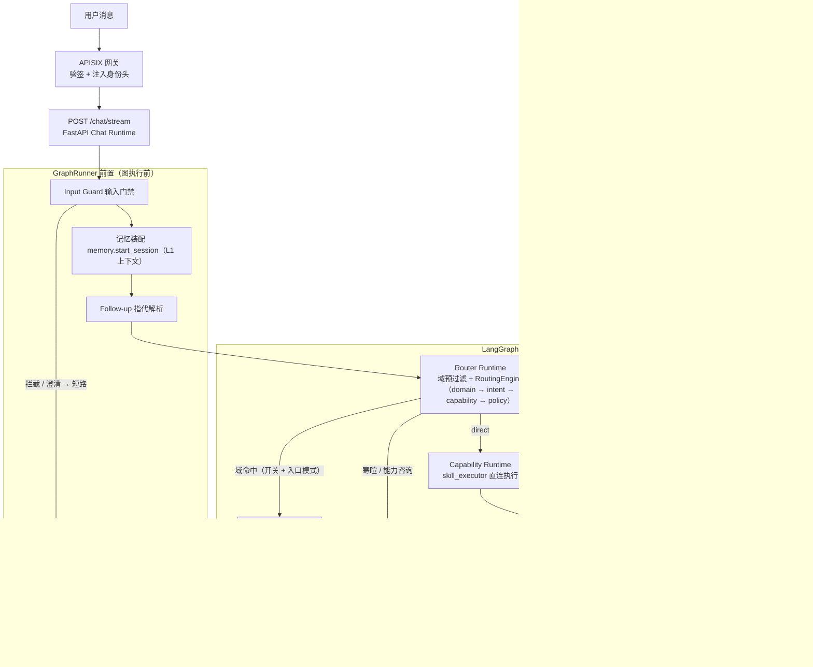

# Agent Platform

面向电商业务的 Agent Platform —— RAG + NL2SQL + 多域 Agent 编排，FastAPI · LangGraph · Next.js · APISIX。

平台把「知识问答、数据分析、智能客服、旅游规划、选品决策」收敛到同一套 Router / Runtime / Domain Agent / Skill / Tool 架构上：一次请求由网关验签进入，由路由引擎拍板去向，再落到能力直连、预定义工作流、任务规划或垂直业务域图执行，过程与结果通过 SSE 实时回传。

> 本文件只负责「看懂系统 + 跑起来」。运行契约、开发规范与业务细节以下文链接的文档为唯一事实源，README 不维护第二份口径。

---

## 系统架构

三个 Next.js 前端（用户端 / 管理端 / 客服坐席工作台）经 APISIX 网关进入 FastAPI；`/chat/stream` 主链路同步执行、不经队列；业务域由总开关控制（代码默认全关，见「垂直域图」）；能力层统一以 Capability → Skill → Tool 分层，MCP 是 Tool 对外暴露的第二出口。


```mermaid
flowchart TB
    subgraph EXP["接入层 Experience"]
        WEB["用户端 :3100"]
        ADM["管理端 :3200"]
        CSW["客服坐席工作台 :3300"]
    end

    GW["APISIX :9080 网关 · 唯一入口<br/>JWT 验签 · 限流 · 注入身份头"]

    subgraph APPL["应用层 Application"]
        APP["FastAPI app :8000<br/>REST API · Chat Runtime SSE · Admin API"]
        RAGS["rag-service :8090<br/>embedding / rerank / 索引"]
        MCPS["mcp-service :8091<br/>MCP 协议出口"]
    end

    subgraph AIRT["AI Runtime（LangGraph）"]
        MAIN["主图：router → direct / workflow / plan 支线"]
        DOM["业务域图<br/>客服 / 旅游（planning · commerce · booking）/ 选品漏斗"]
    end

    subgraph CAPL["能力层 Capability / Skill"]
        SK["Capability → Skill → Tool<br/>RAG · SQL · 报告 · 邮件 · 搜索 · 地图 …"]
    end

    subgraph INFRA["数据与基础设施"]
        PG[("PostgreSQL + pgvector<br/>业务 / 会话 / 运行状态 / 检索")]
        RD[("Redis<br/>缓存 · Celery broker/result")]
        CEL["Celery worker 池 + beat<br/>agent ｜ rag_index 双队列"]
    end

    WEB --> GW
    ADM --> GW
    CSW --> GW
    GW --> APP
    APP --> MAIN
    MAIN --> DOM
    MAIN --> SK
    DOM -.->|"复用（如客服知识专家调 RAG）"| SK
    SK --> RAGS
    SK --> PG
    APP --> CEL
    APP --> PG
    APP --> RD
    CEL --> RD
    RAGS --> PG
    SK -.->|"能力第二出口"| MCPS
    CEL -.->|"checkpoint 续跑"| MAIN
```

部署拓扑、端口表、异步层与网关认证细节见 [system-overview.md](docs/architecture/system-overview.md)。

## 请求执行链路

一次 `POST /chat/stream` 的真实顺序：网关验签 → Input Guard 门禁（拦截即短路）→ 记忆装配 → 指代解析 → 进图路由（域预过滤优先，RoutingEngine 统一拍板）→ 分流执行 → reporter / 域图自带 reporter → SSE 收尾。`rag-service`、模型与数据库都在 Skill / Tool 层之后，不在图上单独展开。


```mermaid
flowchart TB
    OUT["SSE 流式返回<br/>status / log / delta → done ｜ memory.end_turn + trace 收尾"]
    U["用户消息"] --> GW["APISIX 网关<br/>验签 + 注入身份头"]
    GW --> API["POST /chat/stream<br/>FastAPI Chat Runtime"]
    API --> IG

    subgraph PRE["GraphRunner 前置（图执行前）"]
        IG["Input Guard 输入门禁"] -->|"拦截 / 澄清 → 短路"| OUT
        IG --> MEM["记忆装配 memory.start_session（L1 上下文）"]
        MEM --> FU["Follow-up 指代解析"]
    end

    FU --> RT

    subgraph G["LangGraph 主图"]
        RT["Router Runtime<br/>域预过滤 + RoutingEngine（domain → intent → capability → policy）"]
        RT -->|"direct"| DE["Capability Runtime<br/>skill_executor 直连执行"]
        RT -->|"workflow"| WE["workflow_executor"]
        RT -->|"plan"| PL["Plan Runtime<br/>任务拆解 → 并行调度（Send）"]
        RT -->|"寒暄 / 能力咨询"| GC["general_chat 直答"]
        RT -->|"域命中（开关 + 入口模式）"| DG["Domain Runtime<br/>客服 / 旅游 / 选品"]
        DE --> REP["reporter"]
        WE --> REP
        PL --> REP
    end

    DG --> OUT
    GC --> OUT
    REP --> OUT
```

节点职责与运行契约见 [ai-runtime.md](docs/architecture/ai-runtime.md)，公共守卫见 [Frozen-Contracts.md](docs/architecture/Frozen-Contracts.md)。

## 技术栈

| 层次 | 技术 |
|------|------|
| 接入与编排 | Apache APISIX（standalone）+ FastAPI + SSE Streaming ｜ LangGraph（StateGraph + Send API + checkpointer） |
| LLM | DeepSeek / Qwen / Ollama，经统一模型网关 `infra/llm`；provider 与 key 走 `sys_config` + 管理端，不进 env |
| 存储与检索 | PostgreSQL + pgvector（BM25 + Vector → RRF → CrossEncoder Rerank） |
| 异步与可观测 | Celery + Redis 双队列（Kafka 仅 `java-loop` profile）｜自研 Tracer（PG 权威，可镜像 OTLP）+ Prometheus + Grafana |
| MCP 与前端 | MCP stdio / Streamable HTTP，既是 Tool 出口也消费外部数据源 ｜ Next.js 14 + React 18 + Tailwind 3 + Zustand + TanStack Query |

## 核心能力

### 企业知识问答 RAG

文档解析（PDF / DOCX / Markdown / TXT，含 OCR 兜底）→ 类型感知切片 + Metadata 治理（关键词 / 摘要 / 实体）→ **混合检索**（Vector + BM25 → RRF 融合 → CrossEncoder Rerank + 阈值过滤）→ **Evidence Gate 三层主动拒答**（Retrieval / Rerank / Faithfulness）防幻觉 → **Citation** 内联引用 `[1][2]` + 参考文献列表 + META 尾拒答判定。细节见 [rag.md](docs/domains/rag.md)。

### NL2SQL 数据分析

`分析最近 30 天库存异常` → 选表（SQL Schema Router）→ SQL 生成 → 校验 → 行级范围处理 → 只读执行 → Markdown。**六层安全**：① SELECT 校验 ② 表名白名单 ③ 敏感列拒绝 ④ 函数黑名单 ⑤ LIMIT 强制 ⑥ `agent_readonly` 只读角色；授权表清单与数据范围由服务端 `SQLPolicyContext` 提供，查询 fail closed，拒绝不伪装成空结果。细节见 [sql.md](docs/domains/sql.md)。

### 智能客服

客服域图由域主 Agent 调度 knowledge / query / action / complaint / handoff 子 Agent；域检测规则优先，配合实体感知路由，订单号等显式实体可精确定位到查单链路；转人工直通、等待倒计时与超时降级建留言工单构成人工接管闭环；写操作走操作预览 + 用户确认 + 幂等账本，权限与租户范围只取自服务端上下文。细节见 [customer-service.md](docs/domains/customer-service.md)。

### 旅游规划

独立旅游专属页 `/travel` 采用「表单首发 + 页内对话改单」：表单产出结构化行程（逐日时间轴、地图打点、日历导出），页内助手在同一会话上对话式改单；行程版本账本支持确认 / 放弃 / 恢复；路况与天气走真实 Provider，失败如实披露而不用本地估算冒充；住宿与交通查询由旅游商务、预订两个子域独立承接，各有独立开关。细节见 [travel.md](docs/domains/travel.md)。

### 智能选品

选品专属页 `/selection-funnel` 支持导入候选池（CSV / TSV / Excel 复制文本）→ 跑完整漏斗 → 页内出报告。漏斗链路为导入 → 粗筛（口碑线 / 热度线）→ 核验 → 单位经济测算 → 综合排序，附带各层留淘计数与 Top 榜；类目差异化阈值走配置声明而非硬编码；缺槽位时追问并复用同一会话续跑，候选池不丢。

### Workflow 与公共平台能力

预定义多步编排（绕过 Planner 直接执行）：日报生成 ｜ 库存预警 ｜ 市场调研（证据管线 → 章节化报告）｜ 选品决策（市场评估 → 差异化 → 财务测算 → AI 评审团）。公共平台能力是横切支撑，不与业务域并列：授权与 RBAC（含写操作审批门）、三层记忆（L1 短时 / L2 会话 / L3 长期）、上下文预算、模型治理、副作用幂等账本、可观测与评测。

## 垂直域图（Domain Graph）

各业务域是独立子图，自带状态、检查点策略与 reporter，由 `backend/domains/__init__.py` 统一注册、主图 builder 自动布线。域图**恒注册、恒加载**：下表的开关只决定「**全局预过滤通路**放不放行」，既不代表域图不存在，也**不影响专属页面**（`/travel`、`/selection-funnel`、坐席工作台走各自端点）。开关**代码默认关闭**，在根 `.env` 或管理端 `sys_config` 中开启（DB 覆盖免重启生效）。

| 域图 | 开关 | 构成 |
|---|---|---|
| 客服 | `CS_ENABLED` | 域主 Agent + 5 子 Agent（knowledge / query / action / complaint / handoff） |
| 旅游 | `TRAVEL_ENABLED` | slot_filler + 子 Agent + validator / repair 四轴校验 |
| 旅游商务 | `TRAVEL_COMMERCE_ENABLED` | 酒店 / 机票等库存查询子域 |
| 旅游预订 | `TRAVEL_BOOKING_ENABLED` | 预订事务 + 幂等账本复用 |
| 选品漏斗 | `SELECTION_FUNNEL_ENABLED` | 线性漏斗域图 |

进入域图有两条独立通路：**全局预过滤**（未带页面锁域时按 客服 → 旅游 → 选品 → 预订 → 商务 顺序判定，命中且总闸开启后按域入口模式分派）与**页面锁域**（前端在每条消息上带 `domain_hint`，锁定本页负责的域）。

### 主聊天页与旅游专属页的实际分工

`/agent` 每条消息带 `domain_hint=main`，该锁域**无条件生效**：命中旅游 / 选品 / 预订 / 商务强信号即直接产 `handoff` 引导卡并带参跳专属页，**不再经过**全局预过滤，也不读域入口模式（`router_node.py` 中 `main_forced` 与域预过滤是互斥分支）；SQL / RAG / 计划支线、`general_chat` 与客服引导不受此锁影响。**故 `/agent` 不生成行程**，行程在 `/travel` 生成 —— 表单与页内对话都走旅游域自身的 `/api/travel/plan(/stream)` 端点（只读改单走只读图）。

> 由此带来一个容易误读的后果：**旅游 / 选品 / 预订 / 商务这 4 个开关在 `/agent` 这一页走不到**（请求在锁域分支就被截成引导卡了），但它们仍是其他入口的总闸，并非常量或废弃项。**客服不同**：`CS_ENABLED` 对应的兜底预过滤不在该互斥分支内，`/agent` 同样会读它。

域入口模式（`*_GLOBAL_ENTRY_MODE`，代码默认 `execute`）只作用于**全局预过滤这条通路**：`execute` 进域图执行，`guide` 同样产引导卡送专属页；对已被 `/agent` 锁域拦下的请求无效。锁域判定见 `backend/orchestration/graph/routing/lock_domain.py`，模式定义见 `backend/services/sys_config.py`，细节见 [ai-runtime.md](docs/architecture/ai-runtime.md)。

## 前端三端

### 用户端 `frontend`（:3100）

以聊天主界面 `/agent` 为核心（流式回答 + 实时路由与工具调用过程；知识问答、SQL 问答、闲聊自动分流），右上角有客服抽屉入口；旅游 / 选品 / 预订 / 商务的引导卡也在此页触发，但**只送去专属页，不在本页执行**。另有旅游规划 `/travel`、智能选品 `/selection-funnel`、未登录兜底门户 `/`、登录注册与 `/change-password` 改密。

### 管理端 `frontend-admin`（:3200）

面向管理员与运营，侧栏按工作台合并：**运营总览**、**知识库**（上传管理、关键词、待审队列、入库失败、索引 trace）、**平台资产**（Agent 清单、Skill / Capability 对账、Prompt 管理与 playground）、**可观测与成本**（Traces、告警、网关日志、Token 用量与成本、预算与模型价格双人审核）、**安全与设置**（RBAC、模型配置、写操作审批门）、**业务运营**（数据查询、选品决策与漏斗、竞品监控、预警、报告、定时任务、评测与反馈）、**任务中心**。

### 客服坐席工作台 `frontend-cs`（:3300）

面向人工客服坐席：坐席工作台（`/cs`）、会话管理、人工接管 handoff、工单、坐席与派单统计。


## 快速开始

### 环境准备

需要 **Docker Desktop**（本地开发栈）、**Python 3.10**（后端与评测）、**Node.js 18+**（三个前端）。**根 `.env` 才是生效配置**（`backend/.env` 不加载）：`cp .env.example .env` 后至少填 `PGPASSWORD` / `PG_READONLY_PASSWORD`（compose 以 `${VAR:?}` 强校验，缺失直接起不来）；模型 provider / model / api_key 走 `sys_config`，由管理端「模型配置」页维护。

### 启停（Windows 一键脚本）

```bat
devctl.bat status                  :: 查看各端服务状态（空参 = status）
devctl.bat start all               :: backend(compose app) + admin + cs + web
devctl.bat stop web /y             :: 只停用户端，免确认
devctl.bat restart all /y          :: 重启全部
devctl.bat rebuild /y              :: 重建后端（改代码 / 改 .env 后必用）
```

服务定义：`backend` = compose 的 `app` 服务（探活 `/health`）｜`admin` = `frontend-admin` :3200｜`cs` = `frontend-cs` :3300｜`web` = `frontend` :3100；`dev-start/stop/restart/rebuild.bat` 是上表动作的短路写法，实现只有 `dev-svc.bat` 一份。
> ⚠️ **改了后端代码或根 `.env`，用 `dev-rebuild.bat /y`**：它重新构建镜像并重建全部后端代码服务（迁移一次性容器随依赖链自动重跑）。普通 restart 复用旧镜像且不重读 `.env`，只适合纯重启。

非 Windows 环境用等价的 compose / node 命令，功能无差异：
```bash
docker compose up -d --build                              # 等价 devctl start backend
cd frontend       && npm install && npx next dev -p 3100  # 等价 devctl start web
cd frontend-admin && npm install && npx next dev -p 3200  # 等价 devctl start admin
cd frontend-cs    && npm install && npx next dev -p 3300  # 等价 devctl start cs
```

### 访问入口

用户端 http://localhost:3100 ｜ 管理端 http://localhost:3200 ｜ 客服坐席工作台 http://localhost:3300 ｜ API 文档 http://localhost:8000/docs ｜ 网关 http://localhost:9080。

> 本地开发必须启动网关，否则前端所有 `/api/*` 请求失败。浏览器请求一律走各前端的 BFF 代理路由（`src/app/api/[...path]/route.ts`），由它按服务端 `API_URL` 转发到网关（默认 `http://127.0.0.1:9080`）并在服务端注入 `X-API-Key`。

## 开发与验证

```bash
pip install -e ".[dev]"                                    # 后端依赖（venv = Python 3.10）
./.venv/Scripts/python.exe -m pytest backend/tests/<路径> -q --no-cov   # 定向测试
cd frontend && npx tsc --noEmit && npm test -- <测试文件>   # 前端类型检查与单测
```

- 局部跑 pytest **必须加 `--no-cov`**：`pytest.ini` 挂死覆盖率下限，否则用例全绿但退出码非 0。测试分层与范围选择遵循 [testing-guide.md](docs/development/testing-guide.md)（T0–T3），默认最小充分集合。
- 新增或修改 Agent、Skill、Tool、Workflow、MCP 前先读 [tool-skill-guide.md](docs/development/tool-skill-guide.md)；仓库协作与安全红线见 [AGENTS.md](AGENTS.md)。

## 项目结构

```
agent/
├── apisix/                    # 网关声明式配置（standalone，进 Git）
├── backend/
│   ├── app/                   # FastAPI（routes / middleware / server）
│   ├── orchestration/         # LangGraph 运行时（graph / router / workflows）
│   ├── skills/  tools/        # Skill（业务能力封装）/ Tool（无状态原子操作）
│   ├── domains/  customer_service/  travel/  selection_funnel/
│   │                          #   域图注册入口 + 客服 / 旅游 / 选品漏斗域图
│   ├── rag/  sql/             # RAG 管道 / NL2SQL（多层校验 + 行级权限）
│   ├── memory/  tasks/        # 三层记忆 / Celery（双队列 + worker）
│   ├── evaluation/  observability/  security/  infra/
│   │                          #   评测 / 观测 / 认证审批 / LLM 代理与配额
├── mcp_servers/               # MCP 服务
├── frontend/  frontend-admin/ frontend-cs/   # 用户端 :3100 / 管理端 :3200 / 坐席 :3300
├── docker/  docs/  data/      # 运维配置 / 文档 / 评测语料与运行产物
├── docker-compose.yml  devctl.bat            # 本地全栈编排 / 统一启停入口
└── AGENTS.md                  # 项目级硬约束（改代码前先读）
```

## 文档导航

| 文档 | 用途 |
|------|------|
| [AGENTS.md](AGENTS.md) | 仓库协作规则和按需文档入口 |
| [docs/README.md](docs/README.md) | 当前文档导航总入口 |
| [system-overview.md](docs/architecture/system-overview.md) | 部署边界、网关和服务关系 |
| [ai-runtime.md](docs/architecture/ai-runtime.md) | Router、主图、域图接入和运行契约 |
| [domain-service-map.md](docs/architecture/domain-service-map.md) | 域服务、Provider 和失败边界 |
| [tool-skill-guide.md](docs/development/tool-skill-guide.md) | Agent、Skill、Tool、Workflow 和 MCP 规范 |
| [testing-guide.md](docs/development/testing-guide.md) | 测试分层与范围选择（T0–T3） |
| [commands.md](docs/operations/commands.md) | 常用服务和验证命令 |
| [旅游](docs/domains/travel.md)、[客服](docs/domains/customer-service.md)、[RAG](docs/domains/rag.md)、[SQL](docs/domains/sql.md) | 业务域文档 |

## License

**All rights reserved —— 保留全部权利。源码公开仅用于展示与技术交流，未经授权不得用于商业用途。**

本仓库是 Public，但**不是**开源项目：仓库内没有 `LICENSE` 文件，即默认保留全部权利。若需在其他项目中使用其中代码或设计，请先联系作者取得授权。