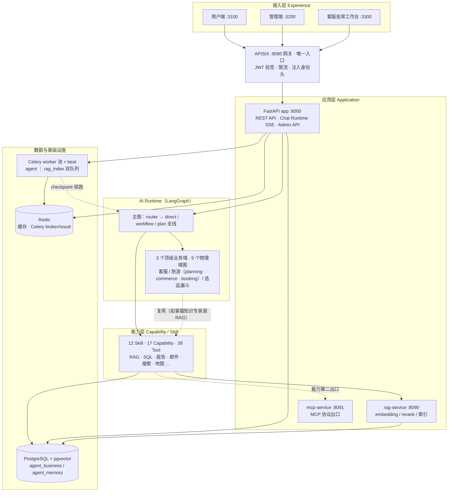
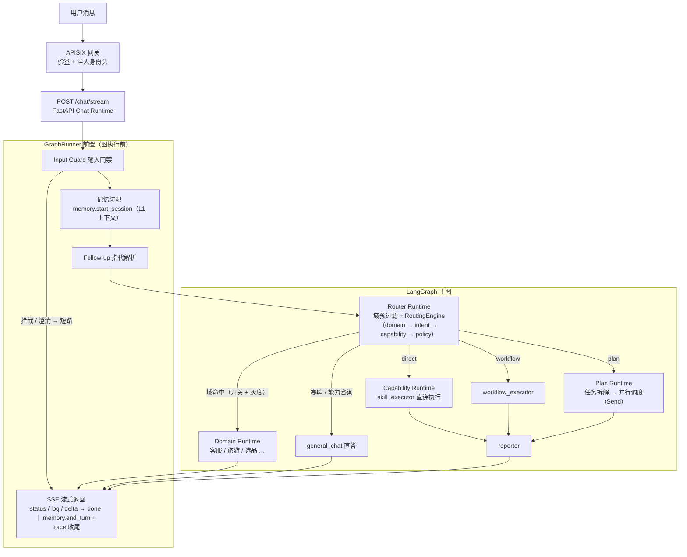
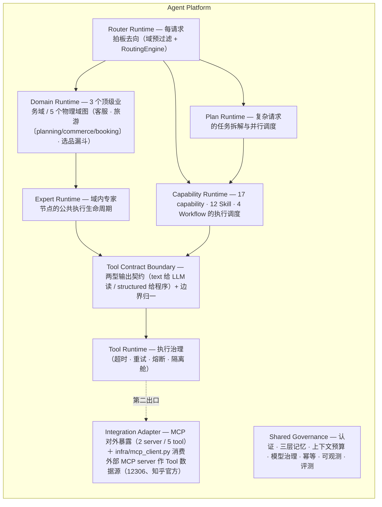

# Agent Platform

电商 RAG + Multi-Agent 平台 — FastAPI + LangGraph + Skill/Tool 四层分层 + APISIX 网关

> 本文件只保留「一眼看懂系统 + 架构三张图 + 怎么跑起来」。架构细节、新增资产规范、待办以下文链接的文档为唯一事实源，**不要**在 README 里维护第二份口径表。

---

## Architecture

> **架构基线已冻结**（2026-09-29，Architecture Simplification STOP A-H 收官）：九层 Runtime 分层与请求生命周期以 [docs/architecture/Architecture-Baseline.md](docs/architecture/Architecture-Baseline.md) 为基线，契约红线见 [docs/architecture/Frozen-Contracts.md](docs/architecture/Frozen-Contracts.md)，扩展入口见 [docs/architecture/Extension-Guide.md](docs/architecture/Extension-Guide.md)。

三张图各答一个问题：**系统由什么组成**（图 1）、**一次请求怎么跑**（图 2）、**平台分层**（图 3）。
部署细节（端口 / 异步层 / 网关认证）见 [docs/architecture/system-overview.md](docs/architecture/system-overview.md)；
编排细节（主图节点职责 / 域图 / 客服锁域）见 [docs/architecture/ai-runtime.md](docs/architecture/ai-runtime.md)。

### 1. System Architecture

用户端 / 管理端 / 客服坐席工作台三个 Next.js 前端，经 APISIX 网关进入 FastAPI 应用；`/chat/stream` 同步直返不经队列；3 个顶级业务域（客服 / 旅游 / 选品漏斗）由开关控制——旅游域含 planning / commerce / booking 三个子流，落地为 5 个物理域图（**代码默认全关**，当前 `.env` 打开客服 / 旅游 / 选品三个）；能力层统一以 Capability → Skill → Tool 分层；MCP 是 Tool 对外暴露的第二出口。


```mermaid
flowchart TB
    subgraph EXP["接入层 Experience"]
        WEB["用户端 :3100"]
        ADM["管理端 :3200"]
        CSW["客服坐席工作台 :3300"]
    end

    GW["APISIX :9080 网关 · 唯一入口<br/>JWT 验签 · 限流 · 注入身份头"]

    subgraph APPL["应用层 Application"]
        APP["FastAPI app :8000<br/>REST API · Chat Runtime SSE · Admin API"]
        RAGS["rag-service :8090<br/>embedding / rerank / 索引"]
        MCPS["mcp-service :8091<br/>MCP 协议出口"]
    end

    subgraph AIRT["AI Runtime（LangGraph）"]
        MAIN["主图：router → direct / workflow / plan 支线"]
        DOM["3 个顶级业务域 · 5 个物理域图<br/>客服 / 旅游（planning · commerce · booking）/ 选品漏斗"]
    end

    subgraph CAPL["能力层 Capability / Skill"]
        SK["12 Skill · 17 Capability · 39 Tool<br/>RAG · SQL · 报告 · 邮件 · 搜索 · 地图 …"]
    end

    subgraph INFRA["数据与基础设施"]
        PG[("PostgreSQL + pgvector<br/>agent_business / agent_memory")]
        RD[("Redis<br/>缓存 · Celery broker/result")]
        CEL["Celery worker 池 + beat<br/>agent ｜ rag_index 双队列"]
    end

    WEB --> GW
    ADM --> GW
    CSW --> GW
    GW --> APP
    APP --> MAIN
    MAIN --> DOM
    MAIN --> SK
    DOM -.->|"复用（如客服知识专家调 RAG）"| SK
    SK --> RAGS
    SK --> PG
    APP --> CEL
    APP --> PG
    APP --> RD
    CEL --> RD
    RAGS --> PG
    SK -.->|"能力第二出口"| MCPS
    CEL -.->|"checkpoint 续跑"| MAIN
```

> Java 侧（Spring Boot + SCG）是**独立项目**，不在本仓库的启动链路里；`--profile java-loop` 只为联调保留。小程序已退役冻结，移动端由用户端响应式 Web 承接。

### 2. Chat Request Runtime

一次 `POST /chat/stream` 的真实执行顺序：网关验签 → Input Guard 门禁（拦截即短路）→ 记忆装配 → 指代解析 → 进图路由（域预过滤优先，RoutingEngine 统一拍板）→ 按路由结果分流执行 → reporter / 域图自带 reporter → SSE 收尾。`rag-service`、模型、数据库都在 Skill / Tool 层之后，不在主流程图上单独展开。


```mermaid
flowchart TB
    OUT["SSE 流式返回<br/>status / log / delta → done ｜ memory.end_turn + trace 收尾"]
    U["用户消息"] --> GW["APISIX 网关<br/>验签 + 注入身份头"]
    GW --> API["POST /chat/stream<br/>FastAPI Chat Runtime"]
    API --> IG

    subgraph PRE["GraphRunner 前置（图执行前）"]
        IG["Input Guard 输入门禁"] -->|"拦截 / 澄清 → 短路"| OUT
        IG --> MEM["记忆装配 memory.start_session（L1 上下文）"]
        MEM --> FU["Follow-up 指代解析"]
    end

    FU --> RT

    subgraph G["LangGraph 主图"]
        RT["Router Runtime<br/>域预过滤 + RoutingEngine（domain → intent → capability → policy）"]
        RT -->|"direct"| DE["Capability Runtime<br/>skill_executor 直连执行"]
        RT -->|"workflow"| WE["workflow_executor"]
        RT -->|"plan"| PL["Plan Runtime<br/>任务拆解 → 并行调度（Send）"]
        RT -->|"寒暄 / 能力咨询"| GC["general_chat 直答"]
        RT -->|"域命中（开关 + 灰度）"| DG["Domain Runtime<br/>客服 / 旅游 / 选品 …"]
        DE --> REP["reporter"]
        WE --> REP
        PL --> REP
    end

    DG --> OUT
    GC --> OUT
    REP --> OUT
```

### 3. Runtime 分层（架构基线）

平台最终形态是九层 Runtime 分层，不是万能 Agent Runtime——每层只做一件事，层间契约冻结（详见 [docs/architecture/Architecture-Baseline.md](docs/architecture/Architecture-Baseline.md) 与 [docs/architecture/Frozen-Contracts.md](docs/architecture/Frozen-Contracts.md)）：


```mermaid
flowchart TB
    subgraph PLATFORM["Agent Platform"]
        direction TB
        RR["Router Runtime — 每请求拍板去向（域预过滤 + RoutingEngine）"]
        DR["Domain Runtime — 3 个顶级业务域 / 5 个物理域图（客服 · 旅游〔planning/commerce/booking〕· 选品漏斗）"]
        CR["Capability Runtime — 17 capability · 12 Skill · 4 Workflow 的执行调度"]
        PR["Plan Runtime — 复杂请求的任务拆解与并行调度"]
        ER["Expert Runtime — 域内专家节点的公共执行生命周期"]
        TCB["Tool Contract Boundary — 两型输出契约（text 给 LLM 读 / structured 给程序）+ 边界归一"]
        TR["Tool Runtime — 执行治理（超时 · 重试 · 熔断 · 隔离舱）"]
        MCP["Integration Adapter — MCP 对外暴露（2 server / 5 tool）＋ infra/mcp_client.py 消费外部 MCP server 作 Tool 数据源（12306、知乎官方）"]
        GOV["Shared Governance — 认证 · 三层记忆 · 上下文预算 · 模型治理 · 幂等 · 可观测 · 评测"]
        RR --> DR
        RR --> CR
        RR --> PR --> CR
        DR --> ER --> TCB
        CR --> TCB --> TR
        TR -.->|"第二出口"| MCP
    end
```

分层关系三条：**调用方向固定**（Router → Capability/Domain →（Expert）→ Tool Contract → Tool Runtime → 基础设施；Tool 不得 import Skill）；**执行态与业务态正交**（Tool 超时/熔断 ≠ 业务成败 ≠ 步骤语义）；**域图自带交付**（四个域图 reporter 各有类型化交付契约，不经主图 step_results）。

### Architecture Vocabulary

README 与架构文档统一使用以下术语（四层完整定义与例外台账见
[docs/2026-09-16-Agent-Skill-Tool-MCP四层设计规范.md](docs/2026-09-16-Agent-Skill-Tool-MCP四层设计规范.md)）：

| 术语 | 一句话定义 |
|------|-----------|
| Application（应用层） | FastAPI `app`：REST API、Chat Runtime（SSE）、Admin API、任务编排 API 的宿主 |
| Chat Runtime | `POST /chat/stream` 的应用层宿主：SSE 帧协议、流注册表、中止与 resume |
| GraphRunner | 统一图执行核心：Input Guard → 记忆装配 → 指代解析 → `graph.stream` → trace / `memory.end_turn` |
| Orchestration（编排层） | LangGraph 主图：9 个核心节点 + 自动发现的 Skill / 域图节点（`builder.py`） |
| Router Runtime | 平台第一层：域预过滤 + RoutingEngine（domain → intent → capability → policy）统一拍板 route_mode；与 RAG / SQL 子系统内部同名组件无关 |
| Domain Runtime | 垂直业务域的独立子图层：3 个顶级业务域 / 5 个物理域图，自带子 Agent 与 reporter |
| Capability Runtime | 能力执行调度层：capability → Skill 解析与 direct / workflow 支线执行 |
| Plan Runtime | 复杂请求的任务拆解与并行调度支线（细节属编排内幕，见 ai-runtime.md） |
| Expert Runtime（子 Agent Runtime） | 域内子 Agent 节点的公共执行生命周期（超时/异常/计时/遥测钩子，`core/node_runtime`；代码名 Expert 保留） |
| 域主 Agent / 子 Agent | 域内统一 Agent 口径（2026-09-29 拍板）：域调度者=域主 Agent（代码 supervisor），域内执行节点=子 Agent（旧文档「专家/Expert」= 子 Agent 的代码名） |
| Tool Contract Boundary | Tool 输出契约边界：两型（text / structured）声明 + 封套解包 + 失败语义（STOP G）；契约快照 `tool_contracts.lock.json`（2026-09-30，派生禁手编） |
| Tool Runtime | Tool 执行治理层：超时 / 重试 / 熔断 / 隔离舱 / 错误映射（`core/tool_runtime`） |
| Integration Adapter | MCP 对外暴露层：Tool 的第二出口（REST /api/mcp · :8091 标准协议 · internal_ai） |
| Shared Governance | 横切支撑：Authorization / Memory / Context Budget / Model Governance / Idempotency / Observability / Evaluation / 契约 lock · 错误七分类 · 成本归因 · 资产一致性（治理平面 2026-09-30） |
| Planner / Critique / Supervisor | Plan Runtime 内部的三段链：任务拆解 → 计划校验 → 纯规则 DAG 调度（Send 并行）；定义见此，细节见 ai-runtime.md |
| Domain / Domain Graph（域图） | 垂直业务域的独立子图，自带子 Agent 与 reporter；架构上 3 个顶级业务域（客服 / 旅游 / 选品漏斗），旅游含 planning / commerce / booking 三个子流，落地为 5 个物理域图（commerce / booking 保留独立生命周期与独立开关） |
| Capability | 路由与规划的最小能力单元（17 个，唯一事实源 `capabilities.yaml`） |
| Skill | Capability 的业务执行封装（12 个）；RAG / SQL 是 Skill，不是独立 Agent |
| Tool | 无状态原子操作（39 个），Skill 之下、基础设施之上 |
| Workflow | 预定义多步编排（4 个），绕过 Planner |
| Model Gateway（模型网关） | `infra/llm`：统一 LLM 出口 proxy + DB 治理注册表 + providers；具体模型绑定不进架构图 |
| Shared Platform（公共平台能力） | 横切支撑：Authorization / Memory / Context Budget / Model Governance / Idempotency / Observability / Evaluation |
| Infrastructure（基础设施） | PostgreSQL(pgvector) / Redis / Celery / Kafka 与 Ollama（profile，默认不启） |

---

## 系统规模（2026-10-07 实测口径）

| 资产 | 数量 | 事实源 |
|------|------|--------|
| 主图核心节点 | 9（含 `general_chat` 寒暄直答，2026-09-25 口径对齐） | `backend/orchestration/graph/builder.py` |
| Skill | 12 | `backend/skills/registry.py::_instances` |
| Capability | 17（其中 3 个 `routed: false` 内部能力） | `backend/orchestration/router/capabilities.yaml` |
| Tool | 39（2026-10-03 对齐 `tool_contracts.lock.json`；10-02 +5：高德商家检索、12306 车票/票价查询、知乎站内/知乎全网搜索） | `backend/tools/`（`@tool` + 文件底部 `tool_registry.register`） |
| Workflow | 4 | `backend/orchestration/workflows/__init__.py::register_all()` |
| 域图 | 5 个物理域图 = 3 个顶级业务域（客服 / 旅游〔含 planning + commerce + booking 子流〕/ 选品漏斗；**代码默认全部关闭**，见「垂直域图」） | `backend/domains/__init__.py` |
| MCP Server / Tool | 2 / 5（自托管；另经 `infra/mcp_client.py` 接外部 MCP 数据源 2 例：mcp-12306、知乎官方 MCP） | `mcp_servers/servers/` |
| 后端用例 | 9727（`pytest --collect-only`，2026-10-07；含工作区在途测试文件） | `backend/tests/` |
| 前端路由 | 用户端 7（含 /change-password 临时密码改密、/selection-funnel 选品专属页「第四扇门」）/ 管理端 48（含 /tools Tool 治理、/consistency 资产一致性、/data-explorer 数据查询、/knowledge/upload-failures 入库失败、selection-workbench / knowledge/workbench / evaluations/center / observability/monitoring 四个工作台页；侧栏入口已工作台合并，page.tsx 数 ≠ 侧栏条目数，2026-10-03）/ 客服坐席 8 | `*/src/app/**/page.tsx` |

> ⚠️ **口径纪律**：不要把"节点""Skill""Tool"统称 Agent。四层定义与例外台账见
> [docs/2026-09-16-Agent-Skill-Tool-MCP四层设计规范.md](docs/2026-09-16-Agent-Skill-Tool-MCP四层设计规范.md)。

---

## 前端三端

### 用户端 `frontend`（:3100）

以一个聊天主界面为核心（登录后进入 `/agent`）：

- **AI 问答**（`/agent`）：主界面即一个对话框——流式回答、实时展示路由与工具调用过程；知识问答、客服咨询（右上角客服抽屉，走客服锁域链路）、旅游咨询都在这一个框里按问题自动分流
- **旅游行程页**（`/travel`）：「表单首发 + 页内对话改单」混合形态——左栏表单提交需求生成结构化行程（逐日时间轴 + 静态地图打点 + ICS 日历导出），右栏「旅行助手」在当前行程上对话式改单（复用同一会话，域图跨轮合并需求）；另含历史规划抽屉、城市指南抽屉、方案档位切换与预算协商卡；主对话框聊旅游走的是域图对话链路，两者共用同一旅游域
- **统一门户**（`/`）：未登录兜底页，三端入口导航（用户端 / 客服端 / 管理端）
- **登录 / 注册**（首次登录持临时密码时经 `/change-password` 完成改密）

### 管理端 `frontend-admin`（:3200）

面向管理员 / 运营的控制台（48 个页面，高关联页已按工作台合并进侧栏）：

- **运营总览**（首页）：待我处理、业务概览、网关安全
- **知识库**：文档上传与管理、关键词、待审队列、入库失败待处理、运营指标与索引 trace
- **平台资产**：Agent 清单、Skill / Capability 对账、Prompt 管理与 playground
- **可观测**：分布式 Traces、告警、网关日志、Token 用量、选品漏斗指标
- **成本治理**：预算管理、模型价格（双人审核）
- **安全与设置**：RBAC 权限、模型配置、写操作审批门
- **业务运营**：数据查询（NL2SQL 问答 + 表分页浏览核对）、选品决策、选品漏斗、竞品监控、预警、报告、定时任务、评测与反馈
- **任务中心**：异步任务状态查询与运维操作

### 客服坐席工作台 `frontend-cs`（:3300）

面向人工客服坐席：

- **坐席工作台**（`/cs`）：接单与处理 AI 转人工的会话
- **会话管理**（`/cs/conversations`）：会话列表与详情
- **人工接管**（`/cs/handoff`）：handoff 流转
- **工单**（`/cs/tickets`）：统一工单查询与流转
- **统计**（`/cs/stats`）：坐席与派单运营数据

---

## 核心能力

### 企业知识问答 RAG

- 文档解析：PDF / DOCX / Markdown / TXT（含 OCR 兜底）
- 类型感知切片 + Metadata 治理（关键词 / 摘要 / 实体，含灰度与影子链路）
- 混合检索：Vector + BM25 → RRF 融合 → CrossEncoder Rerank + 阈值过滤
- Evidence Gate：三层主动拒答（Retrieval / Rerank / Faithfulness），防幻觉
- Citation：内联引用 `[1][2]` + 参考文献列表 + META 尾拒答判定

### Multi-Agent 编排（主图）

主图按请求特征智能分流：简单查询**直连**能力立即执行；预定义**工作流**（日报 / 预警 / 调研 / 选品决策）绕过规划直接跑；复杂请求进入**任务规划**，拆成能力 DAG 后并行调度；闲聊与能力咨询由轻量直答承接。LLM 只在必要的少数决策点介入，调度规则由代码保证确定性。节点级拓扑与编排细节见 [docs/architecture/ai-runtime.md](docs/architecture/ai-runtime.md)。

### 垂直域图（Domain Graph）

| 域图 | 开关（代码默认全关） | 构成 |
|---|---|---|
| 客服 | `CS_ENABLED` | 域主 Agent（supervisor）+ 5 子 Agent（knowledge/query/action/complaint/handoff，代码名 Expert） |
| 旅游 | `TRAVEL_ENABLED` | slot_filler + 5 子 Agent + validator/repair（四轴校验） |
| 选品漏斗 | `SELECTION_FUNNEL_ENABLED` | 预过滤已接线，与旅游同层 |
| 旅游商务 | `TRAVEL_COMMERCE_ENABLED` | 独立域图（STOP K） |
| 旅游预订 | `TRAVEL_BOOKING_ENABLED` | 预订事务 + 幂等账本复用（STOP L） |

进入域图有两条独立通路（客服窗口锁域 `domain_hint` / 全局预过滤 + 灰度）；预过滤优先级**客服 > 旅游**。锁域动机、灰度顺序、跨轮状态契约见 [docs/architecture/ai-runtime.md](docs/architecture/ai-runtime.md)。

### NL2SQL 数据分析

```
"分析最近 30 天库存异常"
   ↓ SQL Schema Router（SQL 子系统内部，自动选表）→ SQL Generator → Validator（6 层硬校验 + 行级权限）
   ↓ Executor（连接池 + 脱敏）→ Markdown
```

6 层安全：①SELECT 校验 ②表名白名单 ③敏感列拒绝 ④函数黑名单 ⑤LIMIT 强制 ⑥`agent_readonly` 只读角色。

### Workflow 自动化

日报生成｜库存预警｜市场调研（证据管线 → 12 章节报告）｜选品决策（市场评估 → 差异化 → 财务测算 → AI 评审团）

### 公共平台能力（Shared Platform）

以下能力是**横切支撑，不是业务 Agent**，不与客服 / 旅游 / 选品并列（层级关系见图 3）：

| 能力 | 位置 | 说明 |
|------|------|------|
| Authorization | `security/` + `/api/rbac` | Principal 统一、RBAC、写操作审批门 `tool_approval` |
| Memory（三层记忆） | `memory/` | L1 短期（消息缓冲）｜ L2 会话（PostgreSQL）｜ L3 长期（pgvector + 衰减归档） |
| Context Budget | `context_budget/` | 上下文装配 / 压缩预算（GraphRunner 与调度器内侧） |
| Model Governance | `infra/llm` + 管理端 | 模型注册表 DB 治理、价格双人审核、配额与健康探测 |
| Idempotency | `ai.idempotency_records` | 副作用幂等账本 + IN_DOUBT 裁决 + 运维 CLI |
| Observability | `observability/` + Prometheus | Tracer（44 种 SpanKind）/ metrics / 告警 / trace 留存，详见下文 [Observability](#observability) |
| Evaluation | `evaluation/` | planner / rag / sql / e2e / travel 数据集与 runners，详见「评测结果」 |

---

## 评测结果（实测，非目标值）

| 模块 | 数据集 / 子集 | 用例数 | 关键指标 | 运行记录 |
|------|--------------|:---:|------|------|
| RAG 检索 | `datasets/rag/suites/expanded_100.json` | 100 | Recall@5 **0.9588** ｜ MRR **0.8980** ｜ Top-1 **1.0000** ｜ 通过 **99%** | `data/eval_runs/2026-09-17T20-54-57-c76a1b/` |
| RAG 快评 | 20 例子集 | 20 | Recall@5 **0.9608** ｜ MRR **0.9314** ｜ Top-1 **1.0000** ｜ 通过 **100%** | `data/eval_runs/2026-09-18T04-12-24-efe47d/` |
| 旅游规划 | `datasets/travel/cases.jsonl` | 34（金标已冻结） | **33 通过 + 1 skip**（T-G10 需关闭 live map 的环境性跳过，2026-09-25 全量） | `data/eval_runs/2026-09-25T01-45-11-9b68f7/` |
| 旅游 Provider | travel-provider（探针七态契约） | 8 | **8/8** | `data/eval_runs/2026-09-25T01-50-40-cf40ea/` |
| 旅游商务 | travel-commerce | 26 | **26/26** | `data/eval_runs/2026-09-25T01-46-26-091445/` |
| 旅游预订 | travel-booking | 18 | **18/18** | `data/eval_runs/2026-09-25T01-46-35-931e90/` |
| NL2SQL | `datasets/sql/cases.jsonl` | 15 | Release Gate **PASS**（准确率 / 拒答指标当前为「无数据」，尚未启用） | `data/eval_runs/2026-09-10T09-01-00-e81bc8/` |
| 端到端 | `datasets/e2e/cases.jsonl` | 25（含 F-* 故障注入） | Release Gate **PASS**（最近全量运行记录为 2026-09-11，当时 13 例口径） | `data/eval_runs/2026-09-11T08-55-26-153602/` |

> 注：旅游商务 / 旅游预订两行的 `travel-commerce` / `travel-booking` 是评测模块 ID（runner 命名空间，历史可比性绑定），对应 Travel Domain 的 commerce / booking 子流域图，**不是独立业务域**（STOP E 口径）。

复现：
```bash
python -m backend.evaluation rag --selection expanded_100 --live --compare latest
```

> ⚠️ **引用指标必须同时写明 suite 与 run id。** `datasets/rag/cases.jsonl` 现为 **269 例 unified v5.0.0**，上表 100 / 20 是套在其上的 suite 子集而非全量。
> 历史上曾出现「同名不同 schema」的误口径运行 —— 同一天同时存在 30% FAIL 与 100% PASS 两份报告，FAIL 那份是把 `rag_100_docs.json` 的 V1/V2 schema 喂给 V4 评测器而产生的假阴性，**不是真实回归**。判定依据与清理过程见 `docs/2026-09-18-全站存储收口交接报告.md` §3.4。

---

## 架构约束与分层

### 分层与调用方向

```
Orchestration  — 编排层：router / planner / supervisor（不直接操作业务数据）
   ↓ Capability — 路由与规划的最小能力单元（sql.query / rag.search / report.generate …）
Skill          — 业务能力封装（SQLSkill / RAGSkill / ReportSkill …）
   ↓
Tool           — 无状态底层执行（vector_search / postgres_query / send_email）
   ↓
Infrastructure — PostgreSQL（含 pgvector）/ Redis / SMTP / 地图服务 / MCP
```

方向固定：`Planner → capability → Skill → Tool → Infrastructure`。
**MCP 不是第 5 层**，是 Tool 的第二出口（Tool 不得 import Skill）。
Runtime 视角的九层分层与请求生命周期见 [docs/architecture/Architecture-Baseline.md](docs/architecture/Architecture-Baseline.md)。

三条铁律：**G1** 声明式注册、启动期派生、fail-fast ｜ **G2** 单一事实源，派生量禁止手写回去 ｜ **G3** 谁定义谁注册，禁止集中代注册。

### 运行拓扑 / 异步层 / 网关认证

端口表、部署拓扑图、Celery 异步层与 APISIX 认证细节已收敛到
[docs/architecture/system-overview.md](docs/architecture/system-overview.md)，README 不再维护第二份口径。速记两条：

- `/chat/stream` 主链路**同步执行、不经队列**，SSE 直返；Celery 双队列 `agent` ｜ `rag_index` 只承接异步任务
- 请求链路：前端 rewrite → APISIX:9080（注入 `X-User-Id` 身份头）→ app（`IDENTITY_SOURCE=header` 只认头）

---

## MCP Integration

基于 Model Context Protocol，把 Tool 能力标准化暴露给外部 Agent（Claude / Cursor / GPT 等）：

```
mcp_servers/
├── sql — sql_query / list_tables
└── rag — search_knowledge / list_documents / get_stats
```

| 端点 | 说明 |
|------|------|
| `GET /mcp/tools` | 列出所有可用 tool |
| `POST /mcp/call` | 调用指定 tool |

参数定义一律 `langchain_tool_to_mcp_meta` 从 Tool 的 `args_schema` 派生，**禁止手写**。

2026-10-02 起新增**反向通路**：外部 MCP server 也可作为 **Tool 的数据源**——平台经 `backend/infra/mcp_client.py`（官方 mcp SDK 同步薄客户端）消费外部 server，首例为 12306 车票余票查询（`tools/travel/train.py`，compose 服务 `mcp-12306`，宿主 `127.0.0.1:18000`）。开关 `TRAIN_MCP_ENABLED` 默认关；上游为非官方聚合、无 SLA、仅供学习研究（不商用）；失败不阻塞主链。第二例为知乎官方 MCP（`tools/search/zhihu.py`，`zhihu_search` 站内 + `global_search` 全网，Streamable HTTP + Bearer，`ZHIHU_MCP_ENABLED` 默认关、凭据 `ZHIHU_MCP_API_KEY` 仅从 .env 读取），带月度配额计量，双路检索单路可用即降级继续。

---

## Observability

- **Trace**：主图节点、Skill、Tool、检索与索引阶段均落 Span，类型由 `observability/tracer.py::SpanKind` 枚举强约束（**照 G2 不在此手抄阶段清单**）；每 Span 记录 latency / token_usage / retrieval_score / tool_args / execution_result
  - Evidence Gate 有 4 个专有 Span：`retrieval_gate` / `rerank_gate` / `faithfulness_gate` / `self_correction`
- **Metrics**：Prometheus `/metrics`；黄金信号 = 首 token 延迟（TTFT P99 < 3s）/ 每 token 耗时（TPOT P99 < 200ms）/ 错误率 / 并发占用
- **告警**：`docker/prometheus-alert-rules.yml`（60 条告警 + 6 条 recording 规则，warning/critical 两级；2026-10-07 `b88a557` 观测重构 +5 条 P0 SLI：Tool/RAG/Router/Travel；自监控抓取与 15d retention 见 `docker/prometheus.yml` / compose）
- **看板**：Grafana provisioning 7 张编号看板（`agent-01` 总览 / `agent-02` 路由 / `agent-03` Tool / `agent-04` RAG / `agent-05` LLM成本Context / `agent-06` 业务域 / `agent-07` 基础设施，2026-10-07 `b88a557` 替换旧 5 张；`docker/grafana/provisioning/dashboards/`）
- **成本治理**：`GET /observability/tokens/calls` 逐次调用 token 与成本；budgets + prices 可在管理端配置

SLO 定义见 [docs/observability/slo.md](docs/observability/slo.md)。

---

## 技术栈

| 层次 | 技术 |
|------|------|
| 接入 | Apache APISIX（standalone）+ FastAPI + SSE Streaming |
| 编排 | LangGraph（StateGraph + Send API + checkpointer） |
| LLM | DeepSeek / Qwen / Ollama（`sys_config` + 管理端可切换） |
| 向量 | PostgreSQL + pgvector（`rag_vectors`，HNSW + cosine）｜embedding 双轨：text-embedding-v3 1024d / bge-small-zh-v1.5 512d |
| 检索 | BM25 + Vector → RRF → CrossEncoder Rerank |
| 数据 | PostgreSQL（业务库 7 schema × 18 表｜元数据库含向量表 `rag_vectors`，迁移已至 079） |
| 异步 | Celery + Redis（双队列）+ Kafka（`java-loop` profile，默认不启） |
| 可观测 | 自建 Tracer（OTel OTLP 出口 `OTEL_TRACE_OTLP_ENABLED` 默认关）+ Prometheus + Grafana + Tempo/Loki/Promtail + Alertmanager/alert-bridge（观测栈全家桶走 `--profile observability`，默认不启） |
| MCP | stdio / HTTP SSE |
| 前端 | Next.js 14 + React 18 + Tailwind 3 + Zustand + TanStack Query（用户端 / 管理端 / 客服坐席三端）｜小程序 Taro 已退役冻结（移动端由用户端响应式承接） |

---

## 快速开始

### 0. 环境准备（首次运行）

| 依赖 | 版本 | 用途 |
|------|------|------|
| Docker Desktop | 近期版本 | 起 apisix / app / postgres / redis / rag-service / mcp-service / Celery worker 池与 beat / mcp-12306 等共 18 个默认服务 |
| Python | **3.10** | 后端与评测；`.venv` 必须是 3.10 |
| Node.js | **22** | 两个 Next.js 前端 |
| Ollama | 可选 | 仅 `local-llm` profile 与本地推理场景 |

```bash
cp .env.example .env
# 至少填 PGPASSWORD / PG_READONLY_PASSWORD —— compose 用 ${VAR:?} 强校验，缺失直接起不来
```

- 根 `.env` 才是**生效配置**（`backend/.env` 不会被加载）。根 `.env.example` 是逐项带注释的启动模板（124 项，2026-10-06 实测，含多域隔离三开关 `CS/TRAVEL/SELECTION_GLOBAL_ENTRY_MODE`；高德 / 12306 / 知乎 MCP 等新开关在此维护）；`backend/.env.example` 是早期后端模板副本（88 项，已落后于根模板，仅作参考）。
- 模型 provider / model / api_key **不在 env 里配** —— 走 `sys_config`，由管理端「模型配置」页维护（DB override + 环境变量 fallback）。

### 1. 一键启停（唯一入口 = `devctl.bat`）

```bat
devctl.bat status                  :: 查看四端服务状态（空参 = status）
devctl.bat start all               :: backend(compose app) + admin + cs + web
devctl.bat restart all /y          :: 免确认重启全部
devctl.bat stop web /y             :: 只停用户端
devctl.bat rebuild /y              :: 一键重建后端（改代码 / 改 .env 后必用，见下）
```

`dev-start.bat` / `dev-stop.bat` / `dev-restart.bat` / `dev-rebuild.bat` 是上表的短路写法，实现只在 `dev-svc.bat` 一份。
服务定义：`backend` = compose 的 `app` 服务（探活 `/health`）｜`admin` = `frontend-admin`（:3200）｜`cs` = `frontend-cs`（:3300）｜`web` = `frontend`（:3100）。

> ⚠️ **改后端代码或改根 `.env` 后，用 `dev-rebuild.bat /y`**（build + up -d 全部 10 个后端代码服务，
> 迁移一次性容器自动重跑）。普通 restart 复用旧镜像且不重读 `.env`——只适合纯重启。
> 旧的 `start_py.bat` / `start_frontend.bat` 系列**已删除**，请勿按旧文档执行。

### 容器栈

```bash
docker compose up -d --build      # apisix + app + rag-service + mcp-service + postgres + redis + Celery worker 池/beat + mcp-12306 等共 18 个默认服务
docker compose --profile observability up -d prometheus grafana
docker compose down               # ⚠️ 加 -v 会连数据卷一起删
```

`devctl backend` 只操作 compose 的 `app` 服务，**不会**动 postgres / redis / apisix / rag-service / mcp-service / worker。

### 前端容器化部署（override）

三个前端不在主 compose 里（本地开发走 devctl/node 进程）；生产容器化用 override 叠加声明（2026-10-07 阿里云 ECS 实测）：

```bash
docker compose -f docker-compose.yml -f docker-compose.public.yml build web admin-web cs-web
docker compose -f docker-compose.yml -f docker-compose.public.yml up -d web admin-web cs-web
```

- 端口：web `:80`、admin-web `:8080`、cs-web `:8082`（8081 被 business-mock 占用，错位）；容器内统一 3000（standalone 输出）。
- 容器 env：`API_URL=http://apisix:9080`（BFF 服务端转发）+ `API_KEY`（BFF 注入 `X-API-Key`，缺省=全接口 401）。
- 门户跨应用跳转：`NEXT_PUBLIC_ADMIN_URL` / `NEXT_PUBLIC_CS_URL` 是**编译期**变量，需经 web 服务 build.args 注入，改地址要重建镜像。
- ⚠️ `docker compose build`/`stash` 前勿删 override 文件——它未入 git 时（历史版本）构建会因缺文件失败；现已随仓库维护。

### 非 Windows 环境（macOS / Linux）

一键启停脚本目前是 Windows 批处理，其他平台用等价的 compose / node 命令即可，功能无差异：

```bash
docker compose up -d --build                                   # 等价 devctl start backend
cd frontend       && npm install && npx next dev -p 3100       # 等价 devctl start web
cd frontend-admin && npm install && npx next dev -p 3200       # 等价 devctl start admin
cd frontend-cs    && npm install && npx next dev -p 3300       # 等价 devctl start cs
```

### 访问入口

| 入口 | 地址 |
|------|------|
| 用户端（登录页 `/login`） | http://localhost:3100 |
| 管理端 | http://localhost:3200 |
| 客服坐席工作台 | http://localhost:3300 |
| API 文档 | http://localhost:8000/docs |
| 网关 | http://localhost:9080（本地 dev 必启，否则前端所有 `/api/*` 请求失败） |

> 前端请求目标由 `next.config.js` 的 `API_URL` 决定，默认 `http://127.0.0.1:9080`（走网关）。
> `API_URL=http://localhost:8000 npx next dev` 可绕过网关直连后端，**仅调试用**（chat 身份一律 guest）。

完整命令速查与故障排查见 [命令文档.md](命令文档.md)。

---

## 开发与验证

### 后端

```bash
# 依赖（venv = Py3.10）
pip install -e ".[dev]"

# 全量用例
./.venv/Scripts/python.exe -m pytest backend/tests/ -q --no-cov

# 改动四层资产后必跑的一致性门禁
cd backend && ../.venv/Scripts/python.exe -m pytest \
  tests/test_registry_consistency.py tests/test_layer_consistency.py \
  tests/test_adr0001_dual_registry_merge.py -q --no-cov
```

> ⚠️ 局部跑**必须加 `--no-cov`**：`pytest.ini` 挂死 `--cov-fail-under=55` 且无运行范围隔离，否则用例全绿但 EXIT=1。
> ⚠️ 改 `params_schema` / 描述 / prompt 后需另跑 planner 评估（`backend/evaluation/datasets/planner_params.json`）。

### 评测

```bash
python -m backend.evaluation              # 全量：planner + rag + sql + e2e
python -m backend.evaluation rag --smoke  # 单模块冒烟
python -m backend.evaluation e2e --verbose
```

报告落 `data/eval_runs/{run_id}/`，断点续跑默认开启（`--no-resume` 强制全量）。

### 前端

```bash
cd frontend && npm install
npx tsc --noEmit      # 类型门禁
npx vitest run        # 单测
```

### 新增资产

Tool / Skill / Workflow / MCP / 域图的改动点位与隐藏接线点见
[docs/2026-09-16-新增Agent-Skill-Tool-MCP操作手册.md](docs/2026-09-16-新增Agent-Skill-Tool-MCP操作手册.md)。
**约定：Tool 一律定义在 `backend/tools/`（禁止在 `skills/` 下定义），返回 JSON 字符串；写操作类 Tool 必须过 `security/tool_approval.ensure_approved()` 审批门。**

---

## 项目结构

```
agent/
├── apisix/                    # 网关声明式配置（standalone，进 Git；改完 docker restart apisix 即生效）
├── backend/
│   ├── app/                   # FastAPI（routes / middleware / server）
│   ├── orchestration/         # LangGraph 运行时（graph / router / workflows / skill_executor）
│   ├── skills/                # 12 个 Skill（业务能力封装）
│   ├── tools/                 # 39 个 Tool（无状态可测试）
│   ├── domains/               # 域图注册入口（→ 下面三个垂直域）
│   ├── customer_service/      # 客服域图
│   ├── travel/                # 旅游域图（含 commerce / booking 两个子域，默认关）
│   ├── selection_funnel/      # 选品漏斗域图（prefilter 已接线）
│   ├── rag/                   # RAG 管道（检索 / 索引 / 预处理）
│   ├── sql/                   # NL2SQL（6 层校验 + 行级权限）
│   ├── memory/                # 三层记忆
│   ├── tasks/                 # Celery（双队列 + worker）
│   ├── evaluation/            # 评测框架（datasets/ 数据集 + runners/）
│   ├── observability/         # Tracer / Metrics / Alerts
│   ├── security/              # 认证 / 审批门 / 守卫
│   ├── infra/                 # LLM 代理 / 计价 / 预算 / 限流
│   └── tests/                 # 9289 用例（口径见「系统规模」表）
├── mcp_servers/               # MCP 服务（2 server / 5 tool）
├── frontend/                  # 用户端 Next.js（:3100）
├── frontend-admin/            # 管理端 Next.js（:3200）
├── frontend-cs/               # 客服坐席工作台 Next.js（:3300）
├── frontend-mp/               # 微信小程序（Taro）——已退役冻结（2026-09-17），仅存档
├── docker/                    # init-dbs.sh + Prometheus 告警规则等
├── 部署/                       # 部署脚本与说明
├── scripts/                   # 运维 / 验收 / 网关基线脚本
├── docs/                      # 架构文档 + ADR + 交接报告（含 HANDOFF.md、TRAVEL_ARCHITECTURE_AUDIT.md）
├── data/                      # 评测语料与运行产物（eval_runs/、docs/ 语料库）
├── tmp/                       # 临时工作区（语料加工中间产物）
├── docker-compose.yml         # 全栈 18 个默认服务（apisix / app / rag-service / mcp-service / postgres / redis / Celery worker 池+beat / mcp-12306 / business-mock 等）
├── docker-compose.observability.yml
├── .env.example               # 根 env 最小可启动集（→ cp 成 .env）
├── devctl.bat                 # 统一启停入口（dev-start/dev-stop/dev-restart 为短路写法）
└── AGENTS.md                  # 项目级硬约束（改代码前先读）
```

> `data/` 与 `tmp/` 目前有较多语料/中间产物直接入库（分别约 760 / 1500 个文件）。**这是已知待清理项**：语料本体宜转为按需拉取，仓库只保留 schema 与小型固件集。

---

## 文档索引

| 文档 | 用途 |
|------|------|
| [AGENTS.md](AGENTS.md) | 项目级硬约束与架构知识（**改代码前先读**） |
| [命令文档.md](命令文档.md) | 启停 / 评测 CLI / 可观测性速查 |
| [docs/README.md](docs/README.md) | 文档总索引 |
| [docs/architecture/Architecture-Baseline.md](docs/architecture/Architecture-Baseline.md) | **架构基线**：Runtime 九层分层 / 请求生命周期 / 数据流（STOP H 冻结版） |
| [docs/architecture/Extension-Guide.md](docs/architecture/Extension-Guide.md) | 扩展指南：新增 Domain / Capability / Skill / Tool / MCP |
| [docs/architecture/Frozen-Contracts.md](docs/architecture/Frozen-Contracts.md) | 冻结契约清单：SSE / checkpoint / route_mode / Tool Contract 等红线与变更流程 |
| [docs/architecture/system-overview.md](docs/architecture/system-overview.md) | 部署拓扑 / 端口表 / 异步层 / 网关认证 |
| [docs/architecture/ai-runtime.md](docs/architecture/ai-runtime.md) | 主图节点职责 / 域图细节 / 客服锁域 / 跨轮状态契约 |
| [docs/2026-09-16-Agent-Skill-Tool-MCP四层设计规范.md](docs/2026-09-16-Agent-Skill-Tool-MCP四层设计规范.md) | 四层定义、写法、例外台账 |
| [docs/2026-09-16-新增Agent-Skill-Tool-MCP操作手册.md](docs/2026-09-16-新增Agent-Skill-Tool-MCP操作手册.md) | 新增资产 checklist |
| [docs/gateway-apisix-migration-plan.md](docs/gateway-apisix-migration-plan.md) | 网关迁移计划（B0→B4 分批 + 审批门禁） |
| [docs/2026-09-16-总交接与实施计划.md](docs/2026-09-16-总交接与实施计划.md) | 跨会话交接与施工顺序（推荐入口） |
| [docs/未完成功能进度汇总-2026-09-16.md](docs/未完成功能进度汇总-2026-09-16.md) | 功能欠账 + 开工顺序 |
| [docs/2026-09-25-五线计划书进度盘点-未完成与遗漏项汇总.md](docs/2026-09-25-五线计划书进度盘点-未完成与遗漏项汇总.md) | 五线进度盘点（客服/旅游/记忆/上下文/代码审查，**最新欠账口径**） |
| [docs/2026-09-25-FinalRC-TestDebt-Closure.md](docs/2026-09-25-FinalRC-TestDebt-Closure.md) | 全量回归收官：测试债清偿与 flaky 甄别 |
| [docs/gateway-apisix-final-report.md](docs/gateway-apisix-final-report.md) | APISIX 网关迁移收官与实测踩坑清单 |
| [docs/java-side-handover.md](docs/java-side-handover.md) | Java 侧（Enterprise_OA）割接清单 |
| [docs/contracts/identity-header-protocol.md](docs/contracts/identity-header-protocol.md) | 网关注入身份头（X-User-Id）契约 |
| [docs/HANDOFF.md](docs/HANDOFF.md) | 会话交接记录 |
| [docs/TRAVEL_ARCHITECTURE_AUDIT.md](docs/TRAVEL_ARCHITECTURE_AUDIT.md) | 旅游域架构审计（Phase 0，含数据 Provider 层缺口） |
| [docs/production-readiness-assessment.md](docs/production-readiness-assessment.md) | 生产就绪风险清单（P0/P1，含未修复项） |
| [docs/2026-09-18-全站存储收口交接报告.md](docs/2026-09-18-全站存储收口交接报告.md) | 评测口径澄清与存储收口 |

---

## License

**All rights reserved —— 保留全部权利。源码公开仅用于展示与技术交流，未经授权不得用于商业用途。**

本仓库是 Public，但**不是**开源项目：仓库内没有 `LICENSE` 文件，即默认保留全部权利。
若需在其他项目中使用其中代码或设计，请先联系作者取得授权。

<!-- 若要改为真正的开源许可：在仓库根放一份 LICENSE（MIT / Apache-2.0 等），
     并把上面这段替换为对应声明即可。当前写法是「公开展示但不授权」的保守默认。 -->

---

<!--
## 演示素材（待补）

建议加 2~3 张截图 / 一段 GIF，放在 `docs/assets/` 下再引用，例如：


推荐取材：`/agent` 任务模式（流式 + 工具调用过程）、管理端模型配置与成本页、
RAG 的引用标注与 Evidence Gate 拒答、NL2SQL 的执行计划与脱敏结果。
截图时注意不要带真实业务数据与密钥。
-->

