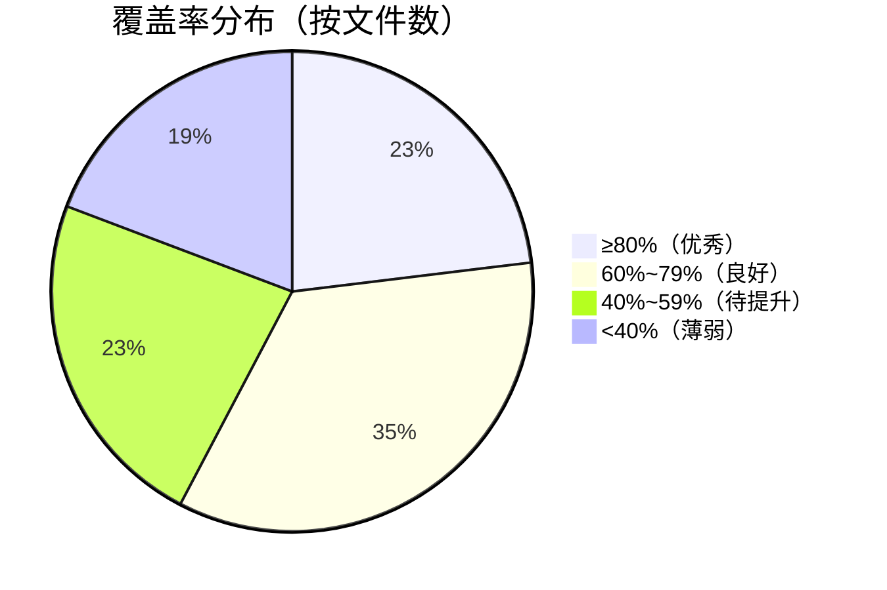
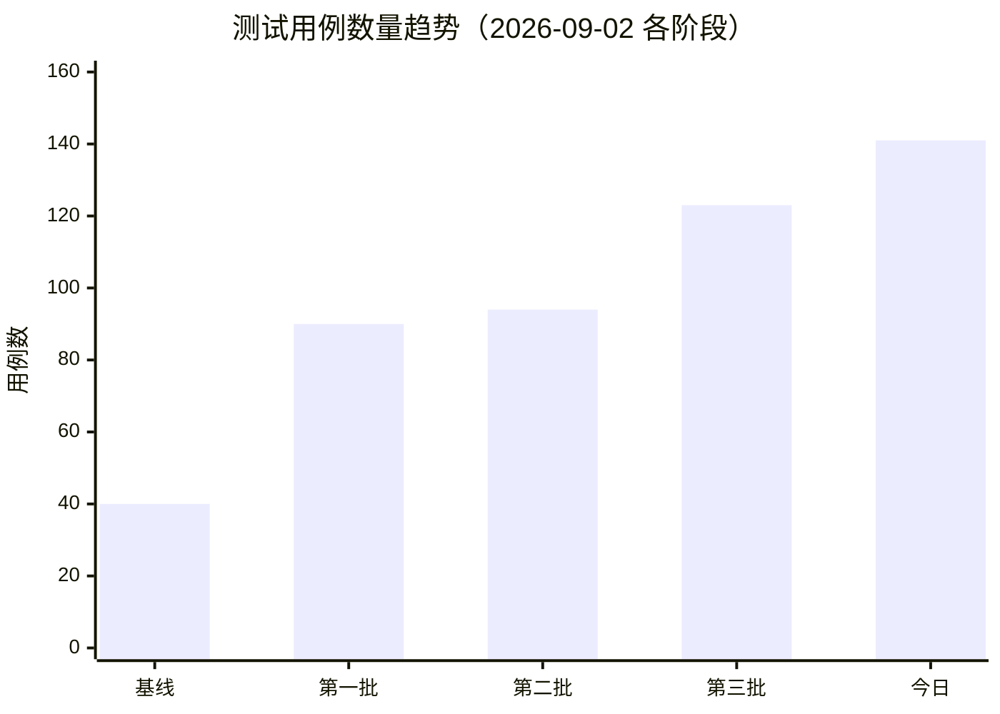

# Tool 测试摘要报告（2026-09-02）

> 关联计划：[TOOL_SKILL_OPTIMIZATION_PLAN.md](./TOOL_SKILL_OPTIMIZATION_PLAN.md)
> 数据来源：`pytest backend/tests/tools/` 实测 + `coverage.py` JSON 报告（`backend/data/coverage_tools.json`）

---

## 1. 测试结果总览

| 指标 | 数值 | 说明 |
|------|------|------|
| 总用例数 | **141** | 128 passed + 13 skipped |
| 失败 | **0** | 全部通过 |
| 跳过 | **13** | 均为真实网络/外部依赖场景（真实邮件发送、真实网站爬取等） |
| 覆盖目标模块 | `backend/tools` + `backend/data_collection` | |
| 总体覆盖率 | **63%** | 1219 statements / 452 missed |

### 测试数量趋势

| 阶段 | 用例数 | 增长 |
|------|--------|------|
| 计划启动前基线 | 40 | — |
| 第一批补充（SQL/DC/Web） | 90 | +125% |
| 第二批补充（性能+参数组合） | 94 | +4% |
| 第三批（Competitor + Email） | 123 | +31% |
| **今日：skip 项修复落地** | **141** | **+15%** |

```
用例数趋势
 40 ┤████
 90 ┤█████████
 94 ┤█████████▌
123 ┤████████████▎
141 ┤██████████████   ← 今日
```

---

## 2. 分文件覆盖率可视化

```
模块                                            覆盖率
─────────────────────────────────────────────────────────────
backend/tools/__init__.py          ▇▇▇▇▇▇▇▇▇▇ 100%
backend/tools/data_collection.py   ▇▇▇▇▇▇▇▇▌   85%
backend/tools/url_guard.py         ▇▇▇▇▇▇▏     71%
backend/tools/sql.py               ▇▇▇▇▇▇▇     70%
backend/tools/session.py           ▇▇▇▇▇▇▋     67%
backend/tools/report.py            ▇▇▇▇▇▊      58%
backend/tools/tool_registry.py     ▇▇▇▇▇▉      59%
backend/tools/competitor.py        ▇▇▇▇▇▏      52%
backend/tools/rag.py               ▇▇▇▇▇       50%
backend/tools/web.py               ▇▇▇▇▌       45%
backend/tools/crawler_runtime.py   ▇▇▇▇▎       43%
backend/tools/email.py             ▇▇▇▊        38%
backend/tools/export.py            ▇▇▎         23%
─────────────────────────────────────────────────────────────
backend/data_collection/pipeline   ▇▇▇▇▇▇▇▇▍   84%
static_fetcher.py                  ▇▇▇▇▇▇▇▇▇▍  94%
default_cleaner.py                 ▇▇▇▇▇▇▋     67%
json_parser.py                     ▇▇▇▇▇▇▎     63%
stats_analyzer.py                  ▇▇▇▇▇▇      61%
sqlalchemy_writer.py               ▇▇▇▇▇▇      61%
csv_parser.py                      ▇▇▇▇▌       45%
http_fetcher.py                    ▇▇▇▌        36%
scheduler.py                       ▇▇▇▌        36%
```

### 覆盖率分布（Mermaid）





---

## 3. 分测试文件明细

| 测试文件 | 覆盖对象 | 状态 |
|----------|----------|------|
| `test_sql_tool.py` | execute_sql_tool / sql_query_tool / registry / 性能基准 | ✅ 全过 |
| `test_data_collection_tool.py` | data_collection_tool 全链路（39 用例，0 skip） | ✅ 全过 |
| `test_web_tools.py` | web_search / web_crawl / URL 安全 | ✅（真实网络项合理跳过） |
| `test_competitor_tool.py` | competitor_analyze_tool（20 用例） | ✅ 全过 |
| `test_email_tool.py` | send_email_tool（28 用例） | ✅（真实 SMTP 项合理跳过） |

---

## 4. 今日修复项（对应计划 P0/P1）

### 4.1 DataCollection skip 项清零
| 测试 | 原跳过原因 | 处置 |
|------|-----------|------|
| `test_real_products_dataset_collection` | 需要真实数据集文件 | ✅ 移除（`datasets/products.json` 已存在，实测通过） |
| `test_http_api_source_collection` | 需要 Mock API 服务 | ✅ 改造为 `patch(HttpFetcher.fetch)` 纯 Mock，离线可跑 |
| `test_static_fetcher_with_missing_file` | `_build_pipeline` 未暴露 | ✅ 移除（上轮已修复），断言升级为验证 `**failed**` 友好错误报告 |
| 重复定义的 `test_dedup_keys_functionality` stub | 内部 bug | ✅ 删除冗余 stub |

### 4.2 真实缺陷修复：参数透传缺口
`data_collection_tool` 接收的 `dedup_keys` / `groupby_keys` / `write_mode` 此前**未传给** `pipeline.run()`，参数被静默忽略。已修复：

```python
result = pipeline.run(
    source=source,
    table=target_table,
    dedup_keys=dedup_key_list,      # ← 新增
    analysis_config=analysis_config, # ← 新增（来自 groupby_keys）
    write_mode=write_mode,           # ← 新增
)
```

### 4.3 性能测试稳定性修复
`test_execute_sql_small_dataset` 在带 coverage 插桩的满载运行下偶发超时（首次懒加载导入开销 >200ms 阈值）。已加入预热调用排除非稳态开销，复跑 4/4 通过。

---

## 5. 遗留与建议

1. **`backend/tools/export.py` 覆盖率仅 23%** — 建议下一批补充导出工具测试。
2. **`http_fetcher.py` 36%** — 重试分支未覆盖，可用 `side_effect` 模拟失败序列补充。
3. **`scheduler.py` 36%** — 定时采集调度无测试，属 Month 1 DataCollection Service 范围。
4. 性能基准用例建议在 `pytest.ini` 注册 `benchmark` 自定义 mark（当前有 4 条 `PytestUnknownMarkWarning`）。
5. 13 个 skip 均为外部依赖（真实网络/SMTP），属合理跳过，建议在 CI 中以 `--deselect` 或专用 mark 隔离。
