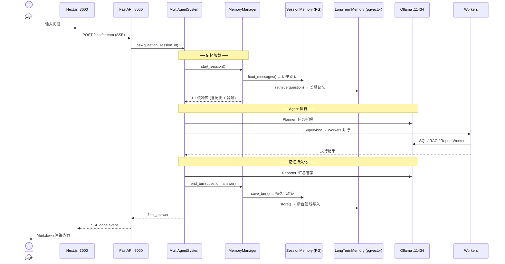
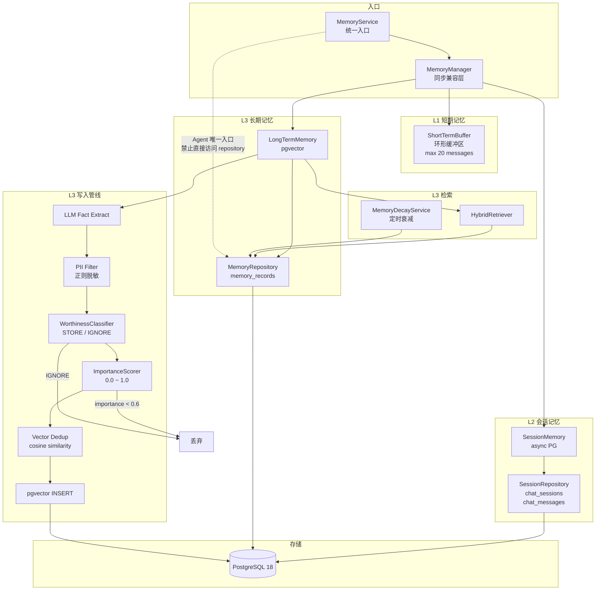
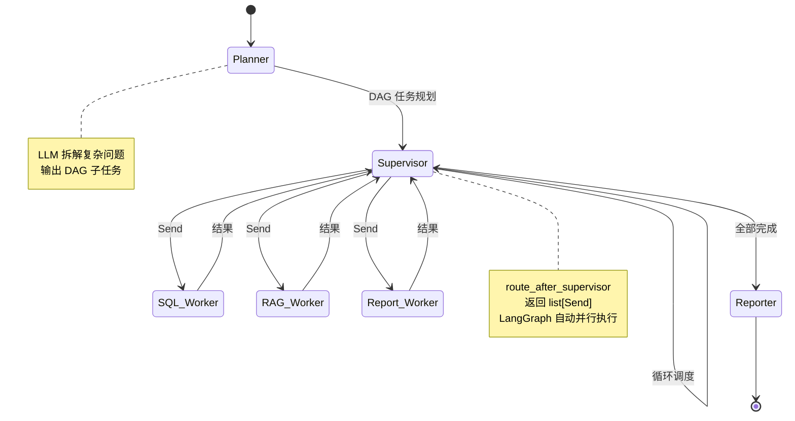
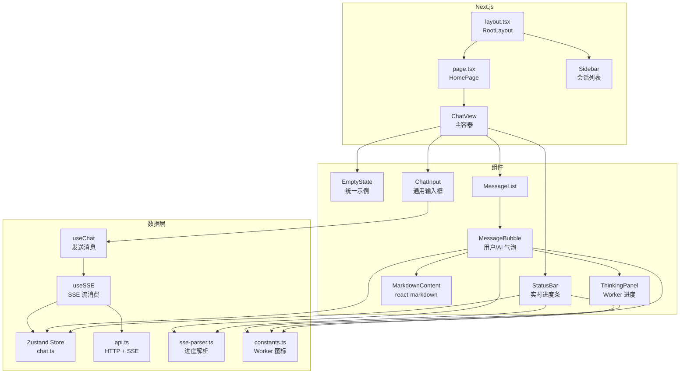
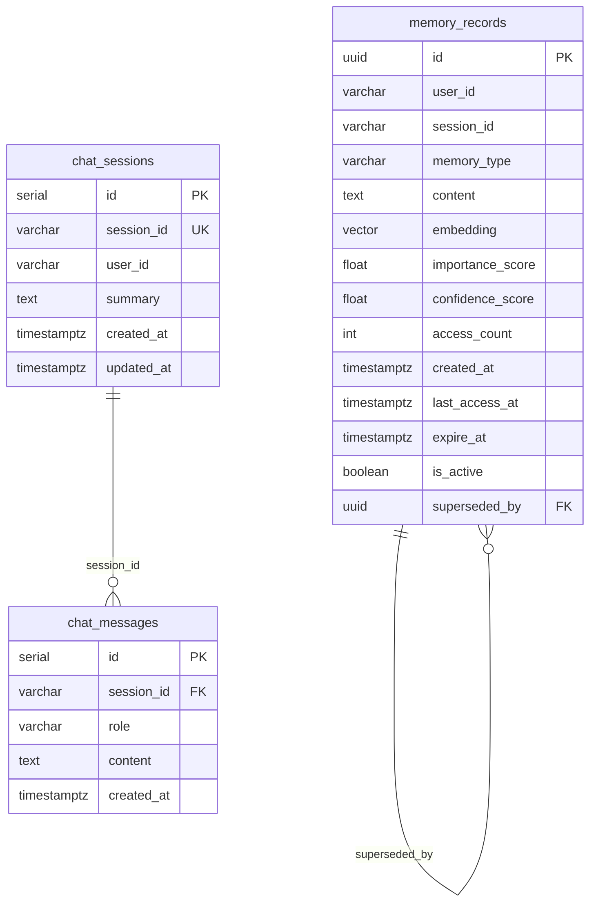
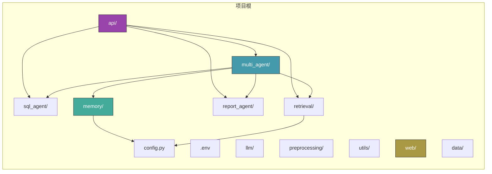

# Agent Platform — 架构图

> 所有图表使用 Mermaid 语法，GitHub / Gitee / VS Code 预览直接渲染。

## 1. 系统全景

```mermaid
graph TB
    subgraph 用户层
        UI[Next.js 前端<br/>端口 3000]
        API_直接[curl / HTTP Client]
    end

    subgraph 网关层
        FAST[FastAPI + Uvicorn<br/>端口 8000]
        CORS[CORS 中间件]
        HEALTH[/health]
        DOCS[/docs Swagger]
    end

    subgraph API路由
        CHAT[POST /chat<br/>SSE /chat/stream]
        SQL[POST /sql]
        RAG[POST /rag]
        REPORT[POST /report]
    end

    subgraph Agent层
        MAS[MultiAgentSystem<br/>multi_agent/graph.py]
        SQL_AG[SQLAgent<br/>sql_agent/]
        RAG_PL[RAGPipeline<br/>retrieval/pipeline.py]
        REP_GEN[ReportGenerator<br/>report_agent/]
    end

    subgraph 记忆系统
        MEM_SVC[MemoryService<br/>memory/service.py]
        L1[L1 ShortTermBuffer<br/>环形缓冲区]
        L2[L2 SessionMemory<br/>PostgreSQL async]
        L3[L3 LongTermMemory<br/>pgvector]
    end

    subgraph 数据层
        PG[(PostgreSQL 18<br/>:5432)]
        CHROMA[(ChromaDB<br/>向量检索)]
        OLLAMA[Ollama<br/>qwen2.5:4b :11434]
        DOCS_DISK[data/docs/<br/>文档文件]
    end

    UI -->|SSE Stream| CHAT
    API_直接 --> CHAT & SQL & RAG & REPORT
    CHAT --> MAS
    SQL --> SQL_AG
    RAG --> RAG_PL
    REPORT --> REP_GEN

    MAS --> MEM_SVC
    SQL_AG --> PG
    RAG_PL --> CHROMA & DOCS_DISK
    REP_GEN --> PG

    MEM_SVC --> L1 & L2 & L3
    L2 --> PG
    L3 --> PG
    MAS --> OLLAMA
    SQL_AG --> OLLAMA
    RAG_PL --> OLLAMA
```

## 2. 请求生命周期



## 3. 记忆系统架构



## 4. Multi-Agent 工作流 (LangGraph)



## 5. 前端组件树



## 6. 数据库 Schema



## 7. 项目目录总览


