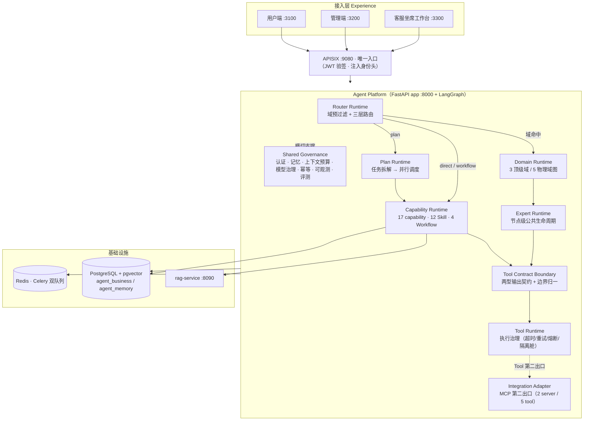
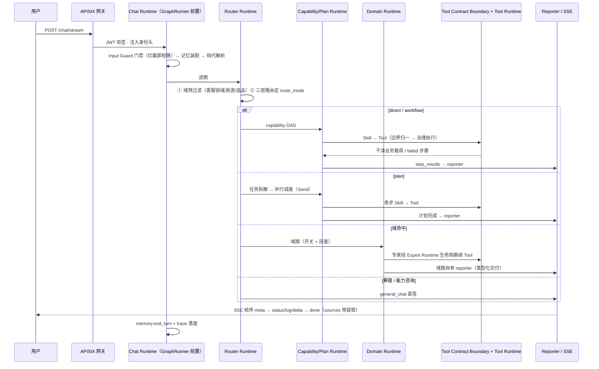

# Architecture Baseline — 生产架构基线（冻结版）

日期：2026-09-29（Architecture Simplification STOP A-H 收官，`PRODUCTION_ARCHITECTURE_BASELINE_FROZEN=true`）
性质：**平台维护阶段的架构基线**。此后功能迭代以本文为分层事实参考；本文不维护数量类口径（唯一权威 = 根 [README.md](../../README.md)「系统规模」），不维护明细映射（G2：以代码与 `capabilities.yaml` 为准）。

> 读法：新会话/新人顺序 = 根 README（一眼看懂）→ **本文**（分层与生命周期）→ 按需深读 [ai-runtime.md](ai-runtime.md)（编排细节）/ [system-overview.md](system-overview.md)（部署）/ [domain-service-map.md](domain-service-map.md)（专家×服务×凭据）。改资产前先读 [Extension-Guide.md](Extension-Guide.md)；动契约前先读 [Frozen-Contracts.md](Frozen-Contracts.md)。

---

## 1. 总体架构

## 2. Runtime 分层（九层职责与代码落点）

| Runtime 层 | 职责（一句话） | 代码落点 | 定型来源 |
|---|---|---|---|
| **Router Runtime** | 每请求拍板去向：域预过滤（客服锁域/旅游/选品）优先，三层路由（rule→vector→LLM）定 `route_mode` | `orchestration/graph/router_node.py`、`orchestration/router/` | STOP B（合并三 router） |
| **Domain Runtime** | 垂直业务域的独立子图：自带专家、校验与 reporter，开关+灰度控制 | `domains/`、`customer_service/`、`travel/`（planning/commerce/booking 三子流）、`selection_funnel/` | STOP E（语义边界收口） |
| **Capability Runtime** | Capability 的执行调度：capability→Skill 解析、direct/workflow 支线按 DAG 执行、失败留痕 | `orchestration/router/capabilities.yaml`（SSOT）、`orchestration/graph/direct_executor.py`、`skills/registry.py` | STOP C（元数据单源） |
| **Plan Runtime** | plan 支线专属：任务拆解 → 计划校验 → 纯规则 DAG 并行调度（Send） | `orchestration/graph/`（planner/critique/supervisor 链） | 既有，边界随 STOP 序列冻结 |
| **Expert Runtime** | 域内专家节点的公共执行生命周期（六段）+ THREAD_ISOLATED 唯一超时实现 | `core/node_runtime/`、`customer_service/experts/base.py`、`travel/experts/base.py` | STOP F |
| **Tool Contract Boundary** | Tool 输出契约：两型（text 给 LLM 读 / structured 封套给程序）显式声明 + 边界归一解包 + 失败语义 | `shared/tool_envelope.py`、`skills/base.py::_normalize_output`、`skills/validation.py`、各 Skill 的 `output_type` 声明 | STOP G |
| **Tool Runtime** | Tool 执行治理：超时/重试/熔断/隔离舱/错误映射/指标；`ToolResult.status` 是执行态，与业务态正交 | `core/tool_runtime/`（九件套） | 既有（Phase2 冻结） |
| **Integration Adapter** | Tool 对外的第二出口（内部链路不经此层；2026-10-02 起新增反向通路——外部 MCP server 经 `infra/mcp_client.py` 作 Tool 数据源） | `mcp_servers/`（REST /api/mcp · 标准协议 :8091 · internal_ai 三出口）＋ `infra/mcp_client.py`（外部数据源） | STOP G 审计确证边界；数据源方向首例 b42ab10（12306） |
| **Shared Governance** | 横切支撑：Authorization / Memory / Context Budget / Model Governance / Idempotency / Observability / Evaluation | `security/`、`memory/`、`context_budget/`、`infra/llm`、`observability/`、`evaluation/` | 既有 |

分层关系三条：

1. **调用方向固定**：`Router → Capability/Domain →（Expert）→ Tool Contract Boundary → Tool Runtime → Infrastructure`；Tool 不得 import Skill，MCP 不是第 5 层。
2. **执行态与业务态正交**：Tool Runtime 的 `ToolResult.status`（超时/熔断）≠ 封套 `status`（业务成败，Tool Contract Boundary 解析）≠ step `status`（步骤语义，validate_semantics 判定）。
3. **域图自带交付**：四个域图 reporter 各有类型化交付契约，不经主图 `step_results`；主图 reporter 只消费 `step_results`。

## 3. 请求生命周期（POST /chat/stream）

## 4. 数据流（四条主链）

| 数据流 | 路径 | 权威文档 |
|---|---|---|
| 聊天主链 | `/chat/stream` 同步执行不经队列；SSE 直返；checkpointer 默认关，开启后 thread_id 每轮唯一 | [ai-runtime.md](ai-runtime.md) |
| RAG 检索链 | 改写 → MultiQuery → 混合检索（向量+BM25）→ Rerank → Evidence Gate → 带引用生成 → META 尾拒答 | [RAG_DESIGN.md](../RAG_DESIGN.md) |
| NL2SQL 链 | SQLSkill → SQLAgent → Router → Generator → Validator（6 层）→ RowSecurity → Executor（只读角色） | [DATABASE.md](../DATABASE.md) |
| 异步任务链 | Celery 双队列 `agent`/`rag_index`；状态权威在 PG（agent_memory.tasks）；重试=从最近 checkpoint 自愈续跑 | [system-overview.md](system-overview.md) |

## 5. 扩展方式

新增 Domain / Capability / Skill / Tool / Workflow / MCP 的流程、接线点与验证命令：见 [Extension-Guide.md](Extension-Guide.md)（唯一入口；其上游细则 = `docs/2026-09-16-新增Agent-Skill-Tool-MCP操作手册.md`）。

## 6. 冻结边界

不可随意修改的契约清单（SSE / checkpoint / node id / route_mode / ToolRuntime / Tool Contract / MCP boundary / Expert Contract / state schema 等），逐条含守卫测试与变更流程：见 [Frozen-Contracts.md](Frozen-Contracts.md)。

## 7. 权威口径

- 数量类（节点/Skill/Capability/Tool/Workflow/域图/MCP/用例数）：根 [README.md](../../README.md)「系统规模」**唯一权威**，禁止第二处手抄（G2）。
- capability→Skill→Tool 明细：`backend/orchestration/router/capabilities.yaml` 与代码注册，文档不抄。
- 专家×第三方服务×凭据：[domain-service-map.md](domain-service-map.md)。
- 术语冻结：根 README「Architecture Vocabulary」表。
