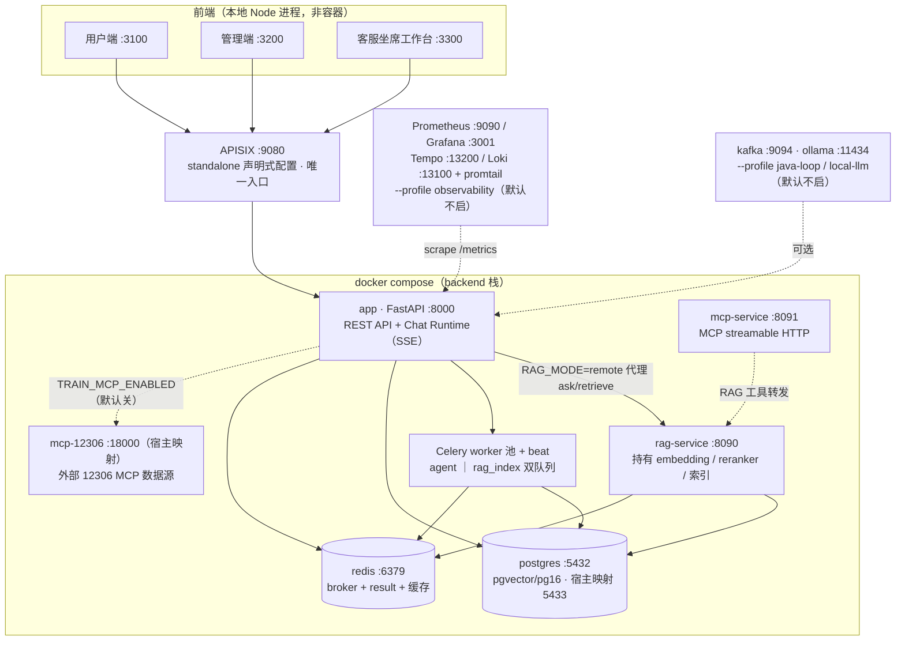

# System Overview — 部署拓扑与运行边界

> 本文承接 README 的部署细节：端口表、异步层、网关与认证、Java 边界。
> README 的三张架构图（System / Request Runtime / AI Runtime）只讲「系统是什么、请求怎么跑、AI 怎么编排」；
> 部署与运维口径以本文为准。分层术语定义见 [README §Architecture Vocabulary](../../README.md#architecture-vocabulary)。

## 部署拓扑

一张纯部署视角的图：只画进程/容器与连接，不展开编排内部（那属于 [ai-runtime.md](ai-runtime.md)）。

要点：

- **APISIX 是唯一对外入口**；`app` 仅绑 `127.0.0.1`，外部流量一律走 9080。
- **rag-service 与 app 同镜像不同进程**：`RAG_MODE=remote` 让 app 侧 RAGPipeline 退化为远端代理（ask / retrieve_knowledge / last_answer_meta 同签名），embedding / reranker / BM25 / 索引只在 rag-service 加载一份。
- **向量库唯一实现 = PostgreSQL pgvector**（`agent_memory.rag_vectors`，HNSW + cosine）；Chroma 与 `VECTOR_BACKEND` 开关已于 2026-09-17 删除。
- 小程序（frontend-mp）已退役冻结，移动端由用户端响应式 Web 承接。

## 运行拓扑与端口

| 端口 | 组件 | 说明 |
|------|------|------|
| **9080** | **APISIX 网关** | **唯一入口**：验签 Bearer / Redis 黑名单 / 限流 → 注入身份头 |
| 8000 | `app`（FastAPI） | 仅绑 `127.0.0.1`，外部流量一律走 9080 |
| 8090 | `rag-service` | 独立 RAG 服务（embedding / rerank / 索引持有者） |
| 8091 | `mcp-service` | MCP 服务（Tool 的第二出口） |
| 18000 | `mcp-12306` | 外部 MCP 数据源容器（12306 车票查询，`TRAIN_MCP_ENABLED` 默认关；宿主 `127.0.0.1:18000` → 容器 8000） |
| 3100 / 3200 / 3300 | 用户端 / 管理端 / 客服坐席工作台 | `next dev`（本地进程，非容器） |
| 5433 → 5432 | `postgres` | 宿主 5433 映射容器 5432；`agent_business` + `agent_memory` |
| 6379 | `redis` | Celery broker + result backend + 缓存 |
| 9090 / 3001 | Prometheus / Grafana | `--profile observability` |
| 9093 / 9095 | Alertmanager / alert-bridge | 告警评估触达 / 告警外投桥（AM webhook → 企微/飞书/钉钉，`ALERT_BRIDGE_*` 未配置时落桥日志），`--profile observability` |
| 13100 / 13200 | Loki / Tempo（宿主映射；容器内 3100/3200 与前端端口错位） | 容器 stdout 日志聚合 / 自研 trace 的 OTel 镜像链路后端（`otel_exporter.py` 经 OTLP HTTP 4318 推送，`OTEL_TRACE_OTLP_ENABLED` 开关），promtail 经 docker socket 采集，`--profile observability` |
| 9092 / 11434 | `kafka` / `ollama` | `--profile java-loop` / `--profile local-llm`，默认不启 |

**请求链路**：前端 rewrite → APISIX:9080 → `X-User-Id` 等身份头 → app（`IDENTITY_SOURCE=header` 只认头）。

**入口拓扑「四扇门」（多域隔离收官 2026-10-06）**：主聊天（`/chat/stream` 主图，域诉求可发 handoff 引导卡带参跳转）＋旅游专属页＋客服抽屉（`CSDrawer` 域锁）＋`/selection-funnel` 选品专属页（第四扇门）。三开关 `CS/TRAVEL/SELECTION_GLOBAL_ENTRY_MODE`（`execute|guide`，默认 execute=行为零变化）控制全局入口域命中后的执行/引导分派，细节见 `ai-runtime.md`「域入口模式与 handoff 引导」。

## 异步层

- `/chat/stream` 主链路**同步执行、不经队列**，SSE 直返（帧序 `meta → status/log/delta → done/error`）
- Celery 双队列 `agent` ｜ `rag_index`（`backend/tasks/celery_app.py::task_routes` 固定路由）
- 状态权威在 PostgreSQL（`agent_memory.tasks`），payload 仅 `task_id`；`acks_late` + `prefetch=1` + 软/硬双层超时
- 重试 = 从最近 LangGraph checkpoint 自愈式续跑；业务终态异常不重试

细节见 [OPTIMIZATION_P3_ASYNC_QUEUE_ARCHITECTURE.md](../OPTIMIZATION_P3_ASYNC_QUEUE_ARCHITECTURE.md)。

## 网关与认证

- Python 侧自建认证：`local_jwt.py`（HS512 + pbkdf2），`/auth/*` + `/sys/users/register`
- APISIX standalone 声明式配置进 Git（`apisix/apisix.yaml`），改宿主文件后 `docker compose restart apisix` 即生效，无需 build
- ⚠️ 网关伪头剥离**无条件执行**（不受 `GATEWAY_AUTH_MODE` 门控）；验收必须用回显桩看请求头，不能用「行为观察法」
- 身份头契约见 [contracts/identity-header-protocol.md](../contracts/identity-header-protocol.md)

## 与 Java 侧的边界

Java 侧（Spring Boot + SCG，Enterprise_OA）是**独立项目**，不在本仓库的启动链路里；`--profile java-loop` 只为联调保留。唯一联系是 Java 客服调 Python agent（`internal_ai` 路由，`X-Internal-Token` 鉴权）。割接清单见 [java-side-handover.md](../java-side-handover.md)。
