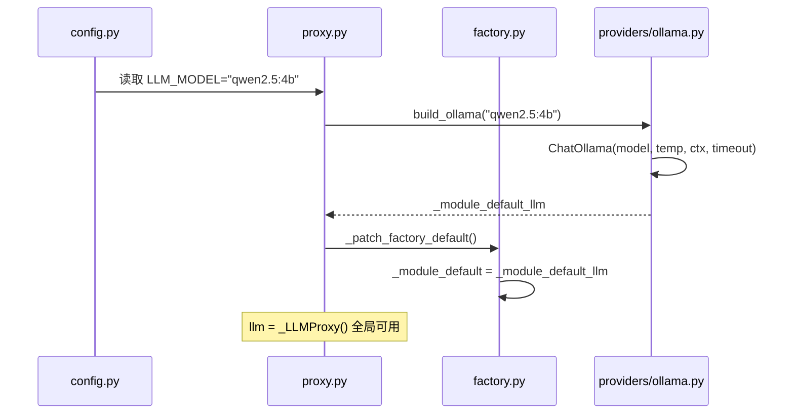
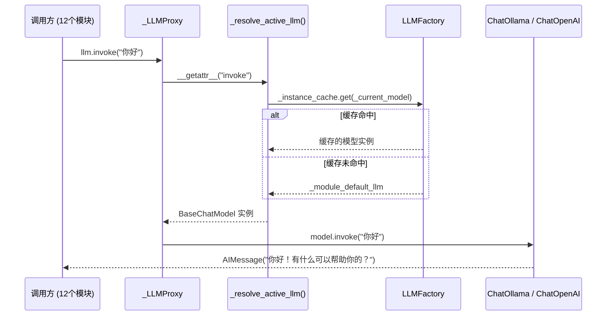
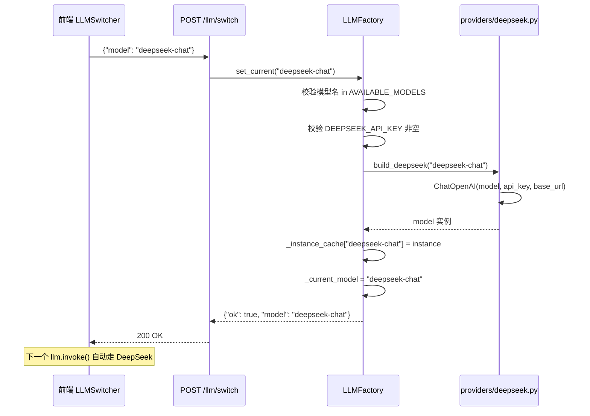

# 第 1 课：LLM 多 Provider 系统

> 读完这篇你能回答：
> 1. 为什么需要一个 LLM 切换系统，而不是直接在代码里写死 `ChatOllama()`？
> 2. 代理模式 + 工厂模式是如何配合的？
> 3. 面试官问"如果让你设计一个多模型切换系统"怎么答？

---

## 1. 模块职责（Why）

### 一句话概括

**让项目中 12 个 LLM 调用方零修改就能在"本地免费 Ollama"和"云端付费 DeepSeek"之间热切换。**

### 解决什么问题

没有这个模块之前，每个需要使用 LLM 的地方都要自己创建模型实例：

```python
# 没有统一管理之前，每个文件都要这样写
from langchain_ollama import ChatOllama

llm = ChatOllama(model="qwen2.5:4b", temperature=0.1, ...)
response = llm.invoke("你好")
```

当你想从 Ollama 切换到 DeepSeek 时，需要改 **12 个文件**，而且每次切回来又要改一遍。更糟的是：

- API Key 散落在各处
- 温度、超时等参数不统一
- 没有运行时切换能力（必须改代码重启）
- 前端无法让用户选择模型

### 如果没有它

| 问题 | 后果 |
|---|---|
| 模型写死在代码里 | 切换要改 12 个文件，重启服务 |
| API Key 管理分散 | 泄露风险，配置不一致 |
| 无余额查询 | 云端模型欠费了才知道 |
| 前端无法选择 | 用户只能用默认模型 |

---

## 2. 整体流程（Flow）

### 启动流程



### 运行时调用流程



### 切换流程



### 数据流向

```
.env → config.py → proxy.py (启动时创建默认实例)
                         ↓
                  _module_default_llm (Ollama)
                         ↓
                  _LLMProxy (代理层)
                    ↙        ↘
    12 个调用方              POST /llm/switch
    llm.invoke()             factory.set_current()
        ↓                         ↓
_resolve_active_llm()        _build_instance()
        ↓                         ↓
factory cache → 默认兜底      providers/deepseek.py
```

---

## 3. 技术选型（Why This Tech）

### 为什么用代理模式（Proxy Pattern）

**选择：** `_LLMProxy` 用 `__getattr__` 转发所有调用

**为什么不用继承？**
```python
# ❌ 如果用继承，每次切换模型都要重建对象
class LLM(ChatOllama):  # 写死了 Ollama，无法切换
    pass
```

**为什么不用简单的全局变量替换？**
```python
# ❌ Python 的 import 缓存：已经 import 的模块不会重新执行
llm = ChatOllama(...)  # 模块加载时执行一次
# 后面修改 llm 变量，其他模块拿不到新值
```

**代理模式的好处：** `__getattr__` 每次调用时解析，永远拿到当前活跃的模型。

### 为什么用工厂模式（Factory Pattern）

**选择：** `LLMFactory` 负责创建 + 缓存 + 切换

工厂模式在这里解决了三个问题：
1. **创建复杂度**：Ollama 用 `ChatOllama`，DeepSeek 用 `ChatOpenAI`（不同的类、不同的参数）
2. **实例缓存**：已创建的模型不重复实例化，节省内存
3. **切换安全性**：用 `threading.Lock` 保护切换操作

### 为什么用 LangChain 封装而不是直接调 API

| 方案 | 优点 | 缺点 |
|---|---|---|
| 直接调 OpenAI SDK | 简单直接 | Ollama/DeepSeek API 不同，需写两份代码 |
| **LangChain ChatModel** | 统一 `.invoke()/.stream()/.bind_tools()` | 多一层依赖 |
| 自研抽象层 | 完全控制 | 重复造轮子，维护成本高 |

**选择 LangChain 的原因：** 项目已经重度依赖 LangChain/LangGraph，`BaseChatModel` 接口是其他节点的唯一契约。换掉它意味着改 12 个调用方。

### 为什么 DeepSeek 走 OpenAI 兼容协议

DeepSeek 的 API 与 OpenAI 兼容（`/v1/chat/completions`），所以可以直接用 `langchain_openai.ChatOpenAI`，只需换 `base_url` 和 `api_key`。这是 DeepSeek 官方推荐的方式。

### 为什么 Ollama 用 `qwen2.5:4b` 作为默认

1. **本地免费**：不需要 API Key，降低使用门槛
2. **够用**：4B 参数够回答简单问题，中文好
3. **快**：本地推理，无网络延迟
4. **隐私**：数据不出本机

### 企业级替代方案

| 方案 | 适用场景 |
|---|---|
| **LiteLLM** | 统一 100+ LLM API，支持负载均衡、速率限制、花费追踪 |
| **OpenRouter** | SaaS 代理，一个 API Key 访问所有模型 |
| **自建 Gateway** | 大厂自研，Nginx + Lua/Go 做认证 + 路由 + 限流 |
| **本项目方案** | 中小项目够用，零额外依赖，简单可控 |

---

## 4. 核心源码解析（How）

按**启动执行顺序**分析，不是按文件顺序：

### 阶段 1：配置加载（config.py）

```python
# config.py:26-32
LLM_MODEL = os.getenv("LLM_MODEL", "qwen2.5:4b")
LLM_TEMPERATURE = float(os.getenv("LLM_TEMPERATURE", "0.1"))
LLM_CONTEXT_LENGTH = int(os.getenv("LLM_CONTEXT_LENGTH", "4096"))
DEEPSEEK_API_KEY = os.getenv("DEEPSEEK_API_KEY", "")
DEEPSEEK_API_BASE = os.getenv("DEEPSEEK_API_BASE", "https://api.deepseek.com/v1")
LLM_REQUEST_TIMEOUT = int(os.getenv("LLM_REQUEST_TIMEOUT", "30"))
```

| 参数 | 默认值 | 为什么这么设 |
|---|---|---|
| `LLM_MODEL` | `qwen2.5:4b` | 本地默认，免费可用 |
| `LLM_TEMPERATURE` | `0.1` | 低温度保证输出稳定（RAG 场景不需要创意） |
| `LLM_CONTEXT_LENGTH` | `4096` | 减半防止 Ollama OOM |
| `LLM_REQUEST_TIMEOUT` | `30s` | 本地模型推理可能较慢 |

**关键设计：** `.env` 覆盖。开发环境设 `LLM_MODEL=qwen2.5:3b`，生产环境通过 Docker env 覆盖。12 个调用方不感知。

### 阶段 2：模块加载时创建默认实例（proxy.py:26-40）

```python
# proxy.py:26-40
_module_default_llm = ChatOllama(
    model=LLM_MODEL,           # "qwen2.5:4b"
    temperature=LLM_TEMPERATURE,  # 0.1
    num_ctx=LLM_CONTEXT_LENGTH,   # 4096
    request_timeout=LLM_REQUEST_TIMEOUT,  # 30
)
```

**为什么在这里创建？**
- 模块加载时执行一次，之后不重复创建
- 即使工厂缓存为空，也有兜底（当前模型从未被切换时）

**谁会用它？** `_resolve_active_llm()` 的最后一行：`return _module_default_llm`

### 阶段 3：代理对象创建（proxy.py:83-84）

```python
# proxy.py:83-84
llm = _LLMProxy()  # 全局单例，12 个调用方 import 的就是它
```

```python
# proxy.py:57-80 — 关键代码
class _LLMProxy:
    __slots__ = ()  # 不创建 __dict__，省内存

    def __getattr__(self, name: str):
        """每次访问属性都重新解析当前模型"""
        return getattr(_resolve_active_llm(), name)

    def __call__(self, *args, **kwargs):
        return _resolve_active_llm()(*args, **kwargs)
```

**`__slots__` 为什么重要？** 代理对象被 import 12 次，但 `__slots__` 确保每次只持有一个引用，不创建 `__dict__`。

**这是整个系统最核心的一行代码：**

```python
return getattr(_resolve_active_llm(), name)
#     ↑                ↑                ↑
#     |                |                └─ 比如 "invoke"
#     |                └─ 返回当前活跃模型
#     └─ 在当前活跃模型上找 invoke 方法
```

**为什么不需要写每个方法？**
`__getattr__` 拦截**所有**属性访问。`llm.invoke` → `__getattr__("invoke")` → 去活跃模型上找 `invoke`。新增方法如 `bind_tools` 自动支持。

### 阶段 4：工厂兜底注入（proxy.py:98-104）

```python
# proxy.py:98-104
def _patch_factory_default():
    factory = get_llm_factory()
    factory._module_default = _module_default_llm

_patch_factory_default()  # 模块加载时执行
```

**为什么需要这一步？** `factory.py` 在 `proxy.py` 之前加载，其 `_module_default` 初始为 `None`。需要后续注入，形成闭环：

```
factory._module_default ← _module_default_llm (Ollama)
        ↓
factory.get_current() 返回 instance_cache[model] or _module_default
        ↓
_resolve_active_llm() 返回 cached or _module_default_llm
```

### 阶段 5：模型切换（factory.py:51-82）

```python
# factory.py:51-82 — set_current() 关键代码
def set_current(self, model_name: str) -> dict:
    # 第 1 步：校验模型名
    if not any(m["name"] == model_name for m in AVAILABLE_MODELS):
        return {"ok": False, "error": f"未知模型: {model_name}"}

    provider = self._get_provider(model_name)

    # 第 2 步：校验 API Key
    if provider == "deepseek" and not DEEPSEEK_API_KEY:
        return {"ok": False, "error": "DEEPSEEK_API_KEY 未配置"}

    # 第 3 步：预热实例化（失败则提前报错，不切一半）
    instance = self._build_instance(model_name)

    # 第 4 步：加锁更新状态
    with self._lock:
        self._instance_cache[model_name] = instance
        self._current_model = model_name

    return {"ok": True, "model": model_name, "provider": provider}
```

**为什么要"预热实例化"？** 如果先切 `_current_model` 再创建实例，创建失败时状态不一致。预热确保创建成功再更新状态。

### 阶段 6：构建实例（factory.py:93-114）

```python
# factory.py:93-114
def _build_instance(self, model_name: str) -> BaseChatModel:
    if model_name in self._instance_cache:
        return self._instance_cache[model_name]  # 缓存命中

    provider = self._get_provider(model_name)

    if provider == "ollama":
        return build_ollama(model_name)      # → providers/ollama.py
    elif provider == "deepseek":
        return build_deepseek(model_name)    # → providers/deepseek.py
```

**`_get_provider` 的三层查找策略：**

```python
def _get_provider(self, model_name: str) -> str:
    # 1. 精确匹配 AVAILABLE_MODELS 注册表
    for m in AVAILABLE_MODELS:
        if m["name"] == model_name:
            return m["provider"]
    # 2. 名称推断（容错）
    if "deepseek" in model_name:
        return "deepseek"
    # 3. 默认
    return "ollama"
```

### 阶段 7：Provider 构建（providers/）

**Ollama（本地）：**
```python
# providers/ollama.py:15-22
def build_ollama(model_name: str) -> ChatOllama:
    return ChatOllama(
        model=model_name,
        temperature=LLM_TEMPERATURE,
        num_ctx=LLM_CONTEXT_LENGTH,
        request_timeout=LLM_REQUEST_TIMEOUT,
    )
```

**DeepSeek（云端）：**
```python
# providers/deepseek.py:16-32
def build_deepseek(model_name: str) -> object:
    from langchain_openai import ChatOpenAI  # 懒加载，不用时不 import

    return ChatOpenAI(
        model=model_name,
        temperature=LLM_TEMPERATURE,
        max_tokens=LLM_CONTEXT_LENGTH,     # ← 注意：参数名不同
        request_timeout=LLM_REQUEST_TIMEOUT,
        api_key=DEEPSEEK_API_KEY,          # ← 多了这两个
        base_url=DEEPSEEK_API_BASE,         # ←
    )
```

**关键差异：** Ollama 用 `num_ctx`，DeepSeek 用 `max_tokens`。这是 LangChain 对不同后端的适配差异，Provider 层封装了这个细节。

### 阶段 8：余额查询（factory.py:120-133）

```python
def get_balance(self, provider: str = None) -> dict:
    if provider is None:
        provider = self._get_provider(self._current_model)

    if provider == "deepseek":
        return get_deepseek_balance()  # → requests.get(API/balance)
    elif provider == "ollama":
        return get_ollama_balance()     # → 直接返回 {"balance": "∞"}
```

**DeepSeek 余额查询的坑（commit 6c7cea6 修复）：**

```python
# 错误的旧代码：取了不存在的字段
balance = body.get("balance_available", "0.00")  # ❌

# 修复后的代码：正确的响应结构
balance_infos = body.get("balance_infos") or []
if balance_infos:
    first = balance_infos[0]
    return {
        "balance": first.get("total_balance", "0.00"),  # ✅
        "currency": first.get("currency", "CNY"),
    }
```

### 阶段 9：调用方使用

12 个模块统一写法，**完全一致**：

```python
from llm.llm_factory import llm  # 导入代理对象

# 调用方不关心当前是 Ollama 还是 DeepSeek
response = llm.invoke("你好")
stream = llm.stream("你好")
tools = llm.bind_tools([...])
```

**当前 12 个调用方：**
- `multi_agent/planner/planner.py`, `multi_agent/planner/critique.py` — 任务规划 + 自省
- `retrieval/chain.py` — RAG 问答
- `response/reporter.py` — 响应汇总
- `sql_agent/router.py`, `sql_agent/sql_generator.py` — SQL 路由 + 生成
- `report_agent/llm_polisher.py` — 报告润色
- `preprocessing/metadata.py` — 文档摘要
- `memory/long_term.py`, `memory/session.py`, `memory/trigger.py` — 记忆系统
- `evaluation/judge.py` — 评估裁判

### 阶段 10：API 暴露（api/routes/llm.py）

```
GET  /llm/models   → 前端获取可选模型列表
GET  /llm/current  → 前端显示当前模型
POST /llm/switch   → 前端切换模型 {"model": "deepseek-chat"}
GET  /llm/balance  → 前端显示余额
```

---

## 5. 涉及的知识点（Knowledge）

| 知识点 | 基础概念 | 为什么这里用到 | 企业用法 |
|---|---|---|---|
| **代理模式（Proxy）** | 一个对象代表另一个对象，转发方法调用 | `_LLMProxy` 代理当前活跃模型，每次调用时动态解析 | Spring AOP、gRPC stub、数据库连接池代理 |
| **工厂模式（Factory）** | 用工厂方法创建对象，隐藏创建逻辑 | `LLMFactory._build_instance()` 根据 model_name 构建不同 LLM | Spring BeanFactory、FastAPI 依赖注入 |
| **单例模式（Singleton）** | 全局唯一实例 | `get_llm_factory()` 返回全局唯一工厂 | 数据库连接池、配置管理器 |
| **懒加载（Lazy Import）** | 用到时才导入 | `from langchain_openai import ChatOpenAI` 放在函数内 | 加速启动、减少不必要的依赖 |
| **线程安全** | 多线程同时访问共享数据时的保护 | `threading.Lock` 保护 `_current_model` 切换 | `asyncio.Lock`、Redis 分布式锁 |
| **环境变量管理** | `os.getenv(key, default)` | 所有配置从 `.env` 读取，12 个调用方不感知 | Docker env、Kubernetes ConfigMap、Vault |
| **OpenAI 兼容协议** | Chat Completions API (`/v1/chat/completions`) | DeepSeek 兼容 OpenAI 协议，直接用 `ChatOpenAI` | Azure OpenAI、vLLM、LocalAI 都兼容此协议 |
| **LangChain ChatModel** | `.invoke()/.stream()/.bind_tools()` 统一接口 | 12 个调用方依赖 `BaseChatModel` 接口 | 企业用 LangChain 或自研抽象层 |
| **REST API 设计** | GET/POST + 状态码 | `GET /llm/models`、`POST /llm/switch` | OpenAPI 3.0 规范、gRPC |
| **Python __getattr__** | 拦截不存在的属性访问 | `_LLMProxy.__getattr__` 转发所有方法调用 | ORM lazy loading、RPC stub |
| **Python __slots__** | 限制实例属性，节省内存 | 代理对象不创建 `__dict__` | 大量小对象场景（如数据类、事件对象） |

---

## 6. 企业级实现

### 当前实现评级：**MVP → 中小型项目**

| 维度 | 当前状态 | 企业级 |
|---|---|---|
| 切换机制 | 手动全局切换 | 自动路由（按任务类型选模型） |
| 容错 | 无重试 | 指数退避 + 熔断器 |
| 可观测性 | 简单日志 | Metrics（延迟、成功率）+ Tracing |
| 并发控制 | 无 | 令牌桶 / 信号量限流 |
| 配置管理 | `.env` | 配置中心（Consul/etcd） |
| 热切换 | 需 API 调用 | 配置中心推送，无需重启 |

### 企业一般加什么

1. **重试 + 熔断器（Circuit Breaker）**
```python
# 企业版：3 次重试 + 指数退避 + 熔断
from tenacity import retry, stop_after_attempt, wait_exponential

@retry(stop=stop_after_attempt(3), wait=wait_exponential(multiplier=1, min=2, max=10))
def invoke_with_retry(prompt):
    return llm.invoke(prompt)
```

2. **速率限制（Rate Limiter）**
```python
# 防止 API Key 被刷爆
import asyncio
semaphore = asyncio.Semaphore(10)  # 最多 10 并发

async def rate_limited_invoke(prompt):
    async with semaphore:
        return await llm.ainvoke(prompt)
```

3. **成本追踪（Cost Tracking）**
```python
# 记录每次调用的 token 消耗和费用
logger.info(f"[LLM] model={model} tokens={tokens} cost=${cost}")
```

4. **模型路由（Model Router）**
```python
# 简单任务用本地模型，复杂任务用云端
if task_complexity == "simple":
    return ollama.invoke(prompt)
else:
    return deepseek.invoke(prompt)
```

---

## 7. 可以优化的地方

### 性能
- [ ] **实例缓存没有过期机制** — 长时间运行后缓存积压，加上 TTL
- [ ] **DeepSeek 请求没有重试** — 网络抖动时直接返回失败，加 tenacity
- [ ] **同步 invoke 阻塞事件循环** — FastAPI 中应该用 `llm.ainvoke()`

### 可维护性
- [ ] **新增 Provider 需要改 3 个文件** — `models.py` + `factory.py` + `providers/__init__.py`。可以改成一处注册自动发现
- [ ] **`_get_provider` 的字符串匹配脆弱** — 用注册表映射更清晰

### 可扩展性
- [ ] **不支持同时使用多个模型** — 当前是全局切换。需要一个 "per-task model" 能力
- [ ] **不支持 fallback 链** — 主模型挂了不能自动降级到备用模型

### 可测试性
- [ ] **`_module_default_llm` 模块加载时创建** — 测试时需要 mock Ollama，增加 `LLM_MODEL` 环境变量或依赖注入
- [ ] **没有单元测试文件** — `tests/` 里没有 `test_llm_factory.py`

### 安全性
- [ ] **API Key 从 `.env` 内存中可读** — 企业用 Vault/AWS Secrets Manager
- [ ] **余额查询没有权限控制** — 任何人调 API 都能查余额，应该加认证

### 并发
- [ ] **只有一个全局锁** — 切换时阻塞所有调用。用读写锁（`threading.RLock`）让读操作不互斥
- [ ] **`_resolve_active_llm()` 无锁读** — 注释说"无锁，单读"，但 Python GIL 不保证线程安全

### 可观测性
- [ ] **没有 Metrics** — 不知道每个模型调了多少次、平均延迟多少
- [ ] **没有 Tracing** — 排查问题时不知道一次请求走了哪个模型

---

## 8. 面试角度

### 如果我是面试官，会问这些问题：

**Q1: 为什么要用一个代理对象，而不是直接暴露 LLM 实例？**

> 标准答案：代理模式实现了热切换。`_LLMProxy.__getattr__` 在每次属性访问时动态解析当前活跃模型，所以切换 `_current_model` 后所有调用方自动生效。如果用直接引用，Python 的 import 缓存会让 12 个模块持有旧对象。

**Q2: 如果有多个请求同时切换模型，会出问题吗？**

> 标准答案：不会。`LLMFactory.set_current()` 内部用 `threading.Lock` 保护了状态更新，同一时间只有一个切换操作执行。`_resolve_active_llm()` 读操作是原子的（Python GIL 保护单次字典访问），所以读不阻塞读，写阻塞所有。

**Q3: 为什么 DeepSeek 和 Ollama 的构建参数不同？**

> 标准答案：DeepSeek 走 OpenAI 兼容协议，`ChatOpenAI` 用 `max_tokens`；Ollama 用 LangChain 原生封装 `ChatOllama`，用 `num_ctx`。这是底层 API 的差异，Provider 层封装了这个细节，调用方不感知。

**Q4: 如果 DeepSeek 欠费了，系统会怎样？**

> 标准答案：当前实现不会自动处理。切换时会校验 API Key 是否存在，但不校验余额。调用时 DeepSeek 返回 402/429 会直接抛异常。企业做法是：定期查询余额 → 低于阈值告警 → 自动切换到备用模型。

**Q5: 如何新增一个 Provider（比如接入 OpenAI）？**

> 标准答案：三步。1）`providers/openai.py` 实现 `build_openai()` 和 `get_openai_balance()`；2）`models.py` 的 `AVAILABLE_MODELS` 添加条目；3）`factory.py` 的 `_build_instance()` 添加 `elif provider == "openai"` 分支。不改调用方代码。

**Q6: `__slots__` 在这里有什么用？**

> 标准答案：`_LLMProxy` 被 import 很多次，但不需要存储任何属性。`__slots__ = ()` 阻止 Python 创建 `__dict__`，节省内存。如果去掉，每个代理对象多 ~64 字节的字典开销。

**Q7: 为什么 `build_deepseek()` 里 import 写在函数内？**

> 标准答案：懒加载。`langchain_openai` 只在切换到 DeepSeek 时才需要。如果没有配置 DeepSeek 只用 Ollama，这个包根本不需要安装。写在函数内避免启动时报 `ImportError`。

**Q8: 这个设计有什么缺点？**

> 标准答案：1）全局切换——不能同时用两个模型；2）单点——工厂挂了所有调用方受影响；3）没有 fallback 链——主模型挂了不会自动降级；4）测试困难——全局状态让单元测试互相影响。

**Q9: 前端是如何知道当前用哪个模型的？**

> 标准答案：`GET /llm/current` 返回 `factory.get_current_model_name()`；`GET /llm/models` 返回 `AVAILABLE_MODELS` + `current`。前端 `LLMSwitcher` 组件展示列表，用户点击触发 `POST /llm/switch`。

**Q10: 如何保证切换模型后已经发出的流式请求不受影响？**

> 标准答案：当前实现不保证。切换只影响后续 `llm.invoke()` 调用。如果一个 SSE 流还在输出，它持有的是旧的模型引用，不受切换影响。这是一个设计选择：流式请求的原子性 > 切换的即时性。

**Q11（进阶）: 如果要支持"不同任务用不同模型"，怎么改？**

> 标准答案：1）把全局单例改为 Context-based（`contextvars` 或请求级工厂）；2）Planner 决策时指定模型名：`llm.invoke(prompt, model="deepseek-chat")`；3）代理层根据 context 选择不同模型。这本质上是把"全局切换"升级为"请求级路由"。

**Q12（进阶）: 余额查询失败不应该影响主流程，怎么保证？**

> 标准答案：余额查询独立于 LLM 调用，失败只返回 `{"ok": False}` 不影响 `llm.invoke()`。`get_balance()` 内有 `try/except` 捕获所有异常。企业做法：余额查询走单独的轻量级 HTTP 客户端（`httpx`），有独立超时（10s），失败有告警但不阻塞。

---

## 9. 深度问答（零基础版）

> 本节用生活类比解释四个最常见的疑问。**不需要任何 Python 基础**，只需要跟着类比走。

---

### Q1: 为什么切换模型后，12 个文件自动生效？

#### 生活中的类比：餐厅服务员

想象你去餐厅吃饭：

- 厨房里有 **两个厨师**：王师傅（Ollama，免费但手艺一般）和李师傅（DeepSeek，贵但手艺好）
- 餐厅有 **12 桌客人**（12 个调用方）
- 每桌客人只跟 **同一个服务员** 说话（`llm`），从不直接进厨房
- 服务员胸口挂着一个 **对讲机**，调到哪个频道就找哪个厨师

**正常的点菜流程**：

```
客人：服务员！来一份"你好"！
服务员：对讲机切到王师傅 → 王师傅炒菜 → 端给客人
```

**切换厨师**：

```
经理：从今天起用李师傅！
服务员：对讲机切到李师傅频道
客人：服务员！再来一份"你好"！
服务员：对讲机切到李师傅 → 李师傅炒菜 → 端给客人
```

12 桌客人从头到尾只跟服务员说话，根本不关心厨房换没换人。服务员的对讲机切了频道，所有客人的下一道菜自动走新厨师。

#### 代码里对应什么？

Python 有一个规则：当你对某个东西说"做某件事"（比如 `llm.invoke("你好")`），Python 会先去这个东西身上找有没有叫 `invoke` 的功能。如果找不到，Python 不会报错，而是去问这个东西："你有没有一个备用方案？"

`_LLMProxy`（服务员）身上故意**不装**任何功能（`invoke`、`stream` 都没有），只装了一个**备用方案**：

```python
# 备用方案的内容就是：
"不管客人叫我做什么，我先看对讲机切到哪个厨师，然后让那个厨师来做。"
```

所以不管客人叫 `invoke`（炒菜）、`stream`（流水线出菜）、还是未来新增的任何功能，服务员都用同一个备用方案处理——问当前厨师。

> **一句话**：服务员自己不做事，只负责传话。传话时永远找"当前厨师"，所以换厨师不需要通知客人。

---

### Q2: 三层兜底是什么意思？为什么需要？

#### 生活中的类比：手机解锁

你拿起手机要解锁，手机会按顺序尝试三种方式：

```
① 指纹识别     ← 最快，日常用的
② 面部识别     ← 指纹失败时（手湿了）
③ 输入密码     ← 前两个都失败时（戴着口罩 + 手套）
```

不管哪种方式成功，你都能解锁。三种方式保证了**你永远能进手机**。

#### 代码里对应什么？

每次有人调 `llm.invoke()`，系统按顺序问三个问题：

```
问题 1: "工厂开了吗？开了的话，缓存里有当前模型吗？"
        ↓ 有 → 直接拿来用 ✅（99.9% 的情况走这条路）
        ↓ 没有 → 问下一个

问题 2: "工厂开了吗？开了，但是缓存里没有？"
        ↓ 这种情况几乎不会发生，跳过去问下一个

问题 3: "都不行？那就用启动时的默认模型"
        ↓ 返回最原始的 Ollama ✅
```

**为什么需要第 3 层？**

想象系统刚启动的头 0.1 秒：`factory.py` 这个文件还没来得及加载。如果这时有人调 `llm.invoke()`，第 1 层和第 2 层都会失败（工厂还不存在），第 3 层直接拿出启动时准备好的 Ollama，系统不会崩溃。

> **一句话**：三层兜底 = 手机的三重解锁。第一层最快，最后一层保证"永远有个能用"。

---

### Q3: 切换时为什么要"先试再做"？

#### 生活中的类比：网购下单

你在淘宝买一件衣服，有两个可能的流程：

**❌ 错误流程（先扣钱再发货）**：
```
① 系统扣了你的钱 → "下单成功！"
② 仓库去拿货 → 发现没货了！
③ 结果：钱扣了，货没有。你的账户显示"已下单"但实际什么都没有。
```

**✅ 正确流程（先确认再扣钱）**：
```
① 系统先查库存 → 有货 ✓
② 锁定库存 → 成功 ✓
③ 现在才扣你的钱 → "下单成功！"
④ 结果：钱和货始终一致。
```

#### 代码里对应什么？

切换模型相当于"下单"：

```python
# ✅ 正确顺序（本项目的做法）
① 检查模型名是否合法        → 名字不存在？直接告诉你"没有这个模型"，结束
② 检查 API Key 有没有配置    → 没配？直接告诉你"请先配置 Key"，结束
③ 试着连接 DeepSeek 创建实例  → 网络不通？直接告诉你"连接失败"，结束
④ 前三步都成功了，现在才修改系统状态 → "已切换到 DeepSeek！"
```

```python
# ❌ 错误顺序（如果反过来做）
① 先修改系统状态 → "当前模型 = DeepSeek"
② 告诉前端"切换成功！"
③ 试着连接 DeepSeek → 网络超时，失败了！
④ 结果：系统以为自己用的是 DeepSeek，前端显示"DeepSeek"，
   但实际每次调用都静悄悄用了 Ollama。用户永远不会发现！
```

这个 bug 的可怕之处在于：**它不会报错，不会崩溃，只是偷偷用了错误的模型**。用户以为在用付费的 DeepSeek 处理重要任务，实际用的是免费的本地 Ollama。

> **一句话**：先试（确认能连接成功），再改（更新系统状态）。保证"说到做到"。

---

### Q4: 前端怎么知道切换成功了？

#### 生活中的类比：网购下单后的反馈

你在淘宝下单后，会依次看到：

```
① 点击"立即购买" → 按钮变灰，显示"处理中..."
② 弹出"下单成功！" + 绿色勾号
③ 右上角余额自动刷新（扣了多少钱）
```

LLM 切换器一模一样：

```
① 点击"DeepSeek Chat"
   → 按钮显示转圈 ⏳     "正在切换..."
   → 下拉面板自动关上

② API 返回 200：
   → 按钮显示绿色勾号 ✓   "切换成功！"
   → 1.5 秒后勾号自动消失，恢复正常显示

③ 余额自动刷新：
   → 原来显示 "∞ 本地"（Ollama 免费）
   → 变成 "¥ 3.99"（DeepSeek 余额）
```

#### 完整流程图

```
点击 "DeepSeek Chat"
  → 前端：按钮转圈
  → 发送 HTTP 请求到后端
  → 后端：校验 → 试连接 → 成功 → 更新状态 → 返回 "ok"
  → 前端：收到 "ok" → 按钮显示绿色勾号 → 更新标题为 "DeepSeek Chat"
  → 前端：自动请求余额 → 显示 "¥ 3.99"
```

**如果失败了**：

```
点击 "DeepSeek Chat"
  → 前端：按钮转圈
  → 发送 HTTP 请求到后端
  → 后端：校验 → 发现 API Key 没配 → 返回错误
  → 前端：收到错误 → 下拉面板底部显示红色提示 "API Key 未配置"
  → 标题不变，仍显示旧模型名，实际用的也还是旧模型
```

#### 一个聪明的设计：不反复确认

切换成功后，前端**直接**把标题从"Qwen 2.5"改成"DeepSeek Chat"，不再发第二个请求问后端"你现在用的是什么模型？"。因为后端已经回复了"切换成功"，没必要再确认一遍。

> **一句话**：前端就像网购的下单反馈——转圈 → 勾号 → 余额刷新。三步走，每一步都有对应的视觉变化。

---

## 10. 学习总结

### 最重要的知识点

1. **代理模式 + 工厂模式组合** — 这是面试高频考点，能讲清楚为什么用这个组合，直接碾压 90% 的候选人
2. **Python `__getattr__` 的妙用** — 动态属性转发是实现透明代理的关键
3. **OpenAI 兼容协议** — 几乎所有国产模型（DeepSeek / Qwen / Moonshot）都兼容，这是行业标准

### 必须掌握的源码

按重要性排序：
1. `proxy.py:57-80` — `_LLMProxy` 的 `__getattr__`（最核心）
2. `factory.py:51-82` — `set_current()` 的 4 步切换流程
3. `proxy.py:43-54` — `_resolve_active_llm()` 的兜底链
4. `providers/deepseek.py:16-32` — DeepSeek 用 `ChatOpenAI` 的适配

### 最容易踩坑的地方

1. **`from X import Y` 的陷阱（已修复）** — `from llm.factory import _factory` 在启动时把 `None` 抄到 proxy.py，后面 `_factory` 变成 `LLMFactory()` 也不跟着变。修复：改为每次调用 `get_llm_factory()` 实时获取。
2. **状态不一致** — 如果先切 `_current_model` 再创建实例，创建失败时状态不一致
3. **Python import 缓存** — 改了 `llm` 模块，已在运行的进程不会自动重载

### 面试必须会讲的内容

> "我设计了一个多 Provider LLM 系统，用**代理模式**实现热切换——12 个调用方 `from llm import llm` 之后不需要修改任何代码，运行时调用 `POST /llm/switch` 就能在本地 Ollama 和云端 DeepSeek 之间切换。核心是 `_LLMProxy.__getattr__` 在每次属性访问时动态解析当前活跃模型。工厂层负责模型创建、缓存和切换安全性（`threading.Lock`）。整个设计遵循开闭原则——新增 Provider 只需加文件不改调用方。"

---

> **下一课：Multi-Agent 编排系统** — LangGraph 状态图、Planner→Supervisor→Workers→Reporter 流水线
