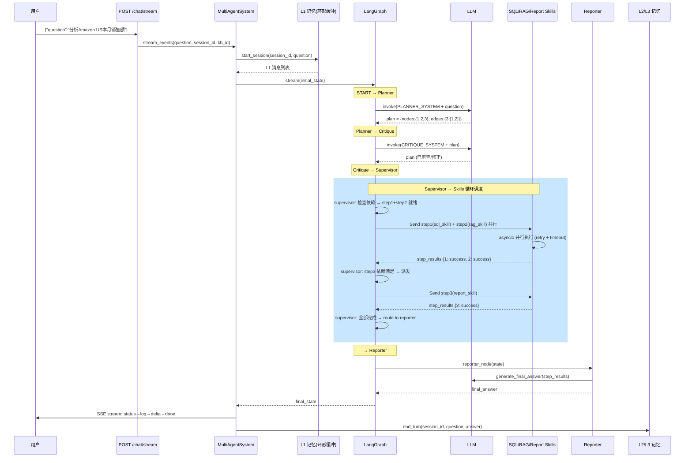
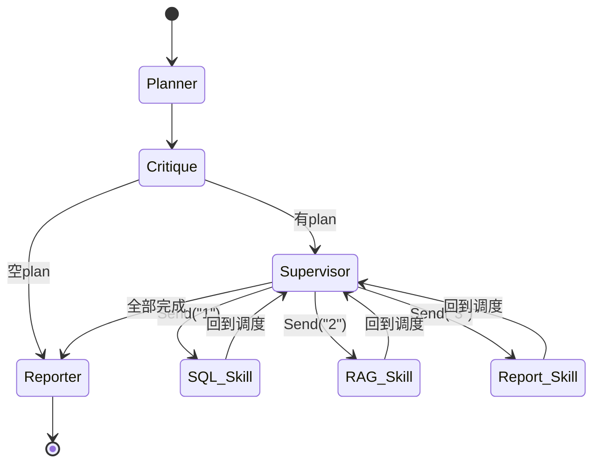

# 第 2 课：Multi-Agent 编排系统

> 读完这篇你能回答：
> 1. Planner → Supervisor → Skills → Reporter 的完整链路是怎样的？
> 2. LangGraph 的 StateGraph + Send API 如何实现并行任务调度？
> 3. 面试官问"如何设计一个多 Agent 协作系统"怎么答？

---

## 1. 模块职责（Why）

### 一句话概括

**把用户一个自然语言问题自动拆解为多个子任务（DAG），并行/串行执行，智能降级，汇总成一份完整答案。**

### 解决什么问题

没有这个系统之前，用户问"分析本月各渠道销售数据，对比广告ROAS，生成综合报告"时：

| 问题 | 后果 |
|---|---|
| 单次 LLM 调用无法回答 | 上下文不够，回答质量差 |
| 需要手动拆任务 | 用户自己查 SQL → 搜知识库 → 写报告 |
| 任务依赖无法管理 | SQL 数据没出来就生成报告，内容为空 |
| 并行任务串行执行 | 等待时间长 |

### 核心价值

```
用户说："最近7天Amazon US销售额，对比广告ROAS，生成报告"

        ┌─────────────────┐
        │    Planner      │  ← LLM 拆解任务
        │ "3个子任务"      │
        └────────┬────────┘
                 │
        ┌────────▼────────┐
        │   Critique      │  ← LLM 审查计划
        │ "修正1个路由错误"  │
        └────────┬────────┘
                 │
        ┌────────▼────────┐
        │   Supervisor    │  ← 调度执行
        │ 派发 step1 + 2   │
        └──┬──────────┬───┘
           │          │
    ┌──────▼──┐ ┌─────▼────┐  并行执行
    │SQL查询  │ │广告ROAS  │
    │销售额    │ │查询      │
    └────┬───┘ └─────┬────┘
         │           │
    ┌────▼───────────▼────┐
    │   Supervisor        │ ← 两步骤完成，派发报告
    │  派发 step3          │
    └─────────┬───────────┘
              │
    ┌─────────▼───────────┐
    │  Report Skill        │ ← 生成报告
    └─────────┬───────────┘
              │
    ┌─────────▼───────────┐
    │  Reporter            │ ← 汇总输出
    │  "本月Amazon US..."  │
    └─────────────────────┘
```

---

## 2. 整体流程（Flow）

### 完整的请求生命周期



### LangGraph 图拓扑



### State 数据流

```
question ──→ Planner ──→ plan ──→ Supervisor ──→ step_results ──→ Reporter ──→ final_answer
                 ↑                      ↑                ↑
            __init__                  Critique          Skills
            (初始化为空)            (可修正plan)      (填充output)
```

---

## 3. 技术选型（Why This Tech）

### 为什么用 LangGraph 而不是 LangChain AgentExecutor？

| 方案 | 优点 | 缺点 |
|---|---|---|
| LangChain AgentExecutor | 简单，开箱即用 | 无法控制并行/串行，不可观测 |
| **LangGraph StateGraph** | 显式图拓扑，精确控制流程，支持 Send 并行 | 学习曲线陡峭 |
| 手写状态机 | 完全控制 | 重复造轮子，无流式支持 |

**选择 LangGraph 的原因：**

1. **Send API** — 返回 `list[Send]` 自动并行执行多个 Skill，这是核心需求
2. **条件边（conditional_edges）** — Supervisor 根据依赖状态决定下一步
3. **共享 State** — 所有节点读写同一个 `AgentState`，天然解决数据传递
4. **Stream 模式** — `.stream()` 原生支持 SSE，每个节点完成触发事件

### 为什么用 DAG 而不是线性流水线？

```
线性: Step1 → Step2 → Step3  （30s + 20s + 10s = 60s）
DAG:  Step1 ──→ Step3        （max(30s, 20s) + 10s = 40s）
      Step2 ──┘
```

**DAG 的优势：**
- 无依赖步骤并行，减少总耗时
- 依赖关系显式声明（`edges`），Supervisor 自动等待
- 天然支持复杂场景（SQL → 报告、RAG → 报告、SQL + RAG → 报告）

### 为什么用 Plan-then-Execute 而不是 ReAct？

| 方案 | 思路 | 适用场景 |
|---|---|---|
| **Plan-then-Execute** | 先规划完整计划，再执行 | 确定性任务，步骤已知 |
| ReAct | 边想边做，每步决定下一步 | 探索性任务，不确定性高 |

**选择 Plan-then-Execute 的原因：**
- 跨境电商场景任务结构明确（查数据 → 搜知识 → 生成报告）
- 一次性规划便于 Critique 审查
- 可以提前判断并行性
- 更可控，不会出现 ReAct 的死循环

### 为什么加 Critique 节点？

**问题：** 小模型（qwen2.5:4b）可能将"查询销售额"误路由到 `rag.search` 而非 `sql.query`。

**Critique 的价值：**
- 以"审查员"视角重新审视计划
- 纠正路由错误（SQL ↔ RAG 误判）
- 修正不合理的依赖关系
- 作为 Planner 的安全网

**企业做法：** 大厂用更强的模型做 Planner（如 GPT-4），小模型做 Critique 辅助检查。或者用规则引擎做后处理。

### 为什么用 Send API 而不是 asyncio.gather？

```python
# ❌ asyncio.gather：LangGraph 不感知，失去流式追踪
results = await asyncio.gather(*[skill.execute() for skill in skills])

# ✅ Send API：LangGraph 管理并行，每个 Skill 完成触发事件
return [Send("sql_skill", {...}), Send("rag_skill", {...})]
```

**Send API 的额外好处：**
- LangGraph stream 自动产生事件（前端 SSE 可展示进度）
- 失败隔离：一个 Skill 失败不影响另一个
- 自然回到 Supervisor（不要手动管理回调）

---

## 4. 核心源码解析（How）

按**执行顺序**分析，不是按文件顺序：

### 阶段 1：入口（MultiAgentSystem.ask / stream_events）

```python
# graph/system.py:27-64
class MultiAgentSystem:
    def ask(self, question: str, session_id: str = "default", kb_id: str = "default") -> str:
        # 1. 记忆系统：加载 L1 会话历史
        l1 = self._memory.start_session(session_id, question)

        # 2. 组装初始状态
        initial_state: AgentState = {
            "question": question.strip(),
            "plan": {"nodes": {}, "edges": {}},  # 空计划，Planner 填充
            "step_results": {},                   # 空结果，Skills 填充
            "messages": list(l1.messages),        # L1 记忆注入
            "final_answer": "",                   # Reporter 填充
            "alerts": [],                         # 可观测性
            "_supervisor_loop_count": 0,          # 防死循环
        }

        # 3. 图执行
        final_state = self._graph.invoke(initial_state)
        # 4. 记忆持久化
        self._memory.end_turn(session_id, question, answer)
        return answer
```

**关键设计：** `initial_state` 在这里声明而不是在 Planner 里，因为记忆系统的消息需要在 Planner 之前注入。

### 阶段 2：图构建（builder.py:78-117）

```python
# graph/builder.py:78-117
def build_graph():
    wf = StateGraph(AgentState)

    # 注册节点
    wf.add_node("planner", planner_node)
    wf.add_node("critique", critique_node)
    wf.add_node("supervisor", supervisor_node)
    wf.add_node("sql_skill", _make_sync(sql_skill_node))    # async → sync
    wf.add_node("rag_skill", _make_sync(rag_skill_node))
    wf.add_node("report_skill", _make_sync(report_skill_node))
    wf.add_node("reporter", reporter_node)

    # 拓扑：线性阶段
    wf.add_edge(START, "planner")
    wf.add_edge("planner", "critique")
    wf.add_conditional_edges("critique", route_after_critique, {
        "supervisor": "supervisor", "reporter": "reporter"
    })

    # 循环阶段：Skill → Supervisor
    wf.add_edge("sql_skill", "supervisor")    # 执行完回到调度
    wf.add_edge("rag_skill", "supervisor")
    wf.add_edge("report_skill", "supervisor")

    # supervisor → route_after_supervisor:
    #   Send[] → Skills（并行）; "reporter" → Reporter
    wf.add_conditional_edges("supervisor", route_after_supervisor)
    wf.add_edge("reporter", END)

    return wf.compile()
```

**图的关键拓扑特征：**
- `planner → critique → supervisor` 是线性流水线（确定性）
- `supervisor ←→ skills` 是循环（不确定性，直到全部完成）
- `supervisor → reporter` 是退出条件
- `critique → reporter` 是短路（空计划直接汇总）

### 阶段 3：Planner — 任务规划（planner.py:29-101）

```python
# planner/planner.py:29-101
def planner_node(state: dict) -> dict:
    question = state.get("question", "")
    kb_id = state.get("kb_id", "default")

    # 1. 构建 Prompt（注入 capability schema）
    prompt = PLANNER_SYSTEM.format(
        capabilities_schema=_format_capabilities_schema(),
        cap_example=tool_registry.get_available_capabilities()[0],
    )

    # 2. 调用 LLM
    resp = llm.invoke([("system", prompt), ("human", user_msg)])

    # 3. 4 层 JSON 修复管道
    plan = _extract_json(resp.content)

    # 4. 规范化（校验 capability 合法性）
    plan = _normalize_plan(plan)

    # 5. 后置规则过滤
    plan = _filter_plan(plan, question)        # 移除冗余 RAG
    plan = _ensure_knowledge_step(plan, question)  # 知识类问题补 RAG

    # 6. 空计划兜底 → 默认 RAG 检索
    if not plan.get("nodes"):
        plan = _fallback_plan(question)

    # 7. KB 隔离：注入 kb_id
    for node in plan["nodes"].values():
        if node.get("capability") == "rag.search":
            node["params"]["kb_id"] = kb_id

    return {"plan": plan}
```

**4 层 JSON 修复管道的设计哲学：**

```
Layer 0: 直接 json.loads()       ← 最快路径，大部分情况命中
Layer 1: 截取最外层 {}          ← LLM 在 JSON 外多写了文字
Layer 2: 修复常见错误           ← 中文引号、尾逗号、缺失 key 引号
Layer 3: 正则暴力提取           ← 最后手段，匹配嵌套 {}
```

**为什么需要这么多层？** 本地小模型（qwen2.5:4b）经常产出格式不完美的 JSON。每层尝试不同策略，全失败才触发兜底 `_fallback_plan`。

**后置规则过滤 vs LLM 决策：**

```python
# _filter_plan: 规则过滤 — SQL 计划中不需要 RAG 步骤
# 为什么用规则而不是信任 LLM？
# → 小模型容易误判，规则是确定性的安全网

# _ensure_knowledge_step: 反向补全 — 知识类问题没有 RAG 步骤时自动加
# 为什么？小模型可能把"FBA发货SOP"误判为数据库问题
```

### 阶段 4：Critique — 计划审查（critique.py:48-128）

```python
# planner/critique.py:48-128
def critique_node(state: dict) -> dict:
    # 快速返回条件
    if not ENABLE_PLAN_CRITIQUE:
        return {"plan": plan, "_plan_critiqued": False}
    if node_count <= 1:
        return {"plan": plan, "_plan_critiqued": False}  # 单步骤不需要审查

    # LLM 审查
    response = llm.invoke([("system", CRITIQUE_SYSTEM), ("human", plan_json)])

    corrected = _extract_json(response.content)
    corrected = _normalize_plan(corrected)

    # 比较是否修改了
    plan_changed = (original_json != corrected_json)

    return {"plan": corrected, "_plan_critiqued": True, "_plan_changed": plan_changed}
```

**设计哲学 — "最小修改"：**
- Prompt 要求只修正明显错误，不重新设计计划
- 信任原计划，减少误判
- 失败时返回原计划，不阻塞流程

### 阶段 5：Supervisor — 调度核心（scheduler.py:25-182）

这是整个系统最复杂的节点：

```python
# supervisor/scheduler.py:25-182
def supervisor_node(state: dict) -> dict:
    plan = state.get("plan", {})
    nodes = plan.get("nodes", {})     # 所有步骤
    edges = plan.get("edges", {})     # 依赖关系
    step_results = dict(state.get("step_results", {}))

    # === 1. 循环上限检查 ===
    loop_count = state.get("_supervisor_loop_count", 0)
    if loop_count >= MAX_SUPERVISOR_LOOPS:  # 10
        # 强制终止：所有 pending/running → failed
        return {"_all_steps_done": True, ...}

    # === 2. 依赖检查 + 状态更新 ===
    for step_id, node_info in nodes.items():
        sr = step_results.get(step_id, {})
        if sr.get("status") != "pending":
            continue  # 已处理

        deps = edges.get(step_id, [])
        dep_failed = any(results[d].status == "failed" for d in deps)
        deps_met   = all(results[d].status == "success" for d in deps)

        if dep_failed:
            # 前置失败 → 跳过当前步骤
            step_results[step_id] = {"status": "skipped", ...}
        elif deps_met:
            # 依赖满足 → 标记 running，加入派发列表
            ready_dispatch.append({"worker": skill_name, "step_id": step_id})

    # === 3. 完成判断 + 降级 ===
    if not ready_dispatch and all_done:
        # 全部步骤完成 → 检查是否需要降级
        step_results, ready_dispatch = execute_degradation(...)
        if not ready_dispatch:
            return {"_all_steps_done": True}  # → route to reporter

    return {"_ready_dispatch": ready_dispatch, ...}
```

**route_after_supervisor — Send API 的关键：**

```python
# supervisor/scheduler.py:185-216
def route_after_supervisor(state: dict) -> str | list:
    ready = state.get("_ready_dispatch", [])
    if ready:
        sends = []
        for item in ready:
            sends.append(Send(item["worker"], {
                "question": state["question"],
                "plan": state["plan"],
                "current_step_id": item["step_id"],  # ← Skill 知道自己是哪个步骤
                ...
            }))
        return sends  # LangGraph 自动并行执行所有 Send
    return "reporter"  # 全部完成 → 进入 Reporter
```

**Send API 的工作原理：**
- 返回 `list[Send]` → LangGraph 为每个 Send 创建独立执行分支
- 所有 Skill 并行运行（asyncio 真正并行）
- 每个 Skill 完成后回到 `supervisor_node`
- supervisor 重新评估：还有 pending 步骤？继续派发 / 全部完成？→ reporter

### 阶段 6：BaseSkill — 执行引擎（skills/base.py:54-145）

```python
# skills/base.py:54-145
class BaseSkill(ABC):
    async def execute(self, state: dict, ...) -> dict:
        step_id = state.get("current_step_id")
        params = step_info.get("params", {})

        # 重试循环
        for attempt in range(max_retries + 1):  # 最多 3 次
            try:
                # asyncio.wait_for 防卡死
                output = await asyncio.wait_for(
                    asyncio.to_thread(self._tool_fn.invoke, params),
                    timeout=60  # 60 秒超时
                )
                sr["status"] = "success"
                sr["output"] = output
                break

            except asyncio.TimeoutError:
                last_error = f"步骤执行超时"

            except Exception as e:
                last_error = str(e)
                # 不可重试错误 → 直接退出
                if not _is_retryable(str(e)):
                    break

                # 指数退避
                delay = 1.5 ** (attempt + 1)
                await asyncio.sleep(delay)

        return {"step_results": step_results}
```

**三重防护机制：**
1. **重试（Retry）**：网络抖动自动重试，1.5× 指数退避
2. **超时（Timeout）**：60s 强制终止，防止 LLM 卡死
3. **不可重试检测**：语法错误/权限问题不重试，直接失败

**async → sync 适配：**

```python
# graph/builder.py:65-71
def _make_sync(async_fn):
    def wrapper(state: dict) -> dict:
        return asyncio.run(async_fn(state))
    return wrapper

# 为什么？
# self._graph.invoke(initial_state) 是同步调用
# 但 Skill.execute() 是 async（内部 asyncio.wait_for + asyncio.to_thread）
# _make_sync 做桥接：每个 Skill 在自己的 asyncio.run() 中执行
```

### 阶段 7：降级链（degradation.py）

```python
# supervisor/degradation.py:19-23
DEGRADATION_CHAIN = {
    "sql.query":       ["rag.search"],      # SQL 无数据 → 搜知识库
    "rag.search":      ["sql.query"],       # 知识库无结果 → 查数据库
    "report.generate": ["rag.search"],      # 报告缺数据 → 搜知识库
}
```

**触发条件：** 步骤成功但 `is_empty` 或 `row_count == 0`
**限制：** 每步最多降级 1 次（`MAX_DEGRADATION_PER_STEP = 1`）
**生成：** 动态添加 `{step_id}_fallback` 步骤到计划中

### 阶段 8：Reporter — 结果汇总（reporter/reporter.py:16-26）

```python
def reporter_node(state: dict) -> dict:
    answer = generate_final_answer(
        question=question,
        step_results=step_results,
        context_filter=True,  # 启用上下文过滤
    )
    return {"final_answer": answer}
```

Reporter 是一个薄适配器，实际代码在 `response/` 模块中。它的核心逻辑：
1. 汇总所有 `step_results` 的 `output`
2. 调用 LLM 生成最终的自然语言回答
3. 提取引用来源（sources）

### 阶段 9：SSE 流式输出（system.py:75-272）

```python
# graph/system.py:75-272
def stream_events(self, question, session_id, kb_id, stop_event):
    for event in self._graph.stream(initial_state):
        if stop_event.is_set():
            return  # 前端断开，优雅退出

        node_name, node_output = _parse_event(event)

        # --- event: status ---
        yield {"event": "status", "data": {"node": node_name}}

        # --- event: log ---
        if node_name == "planner":
            yield {"event": "log", "data": {"message": f"任务分解完成，{n}个子任务"}}
        elif node_name in {"sql_skill", "rag_skill", "report_skill"}:
            yield {"event": "log", "data": {"message": f"完成: {desc}"}}

    # --- event: delta --- (逐句发送最终答案)
    for sentence in split_sentences(final_answer):
        yield {"event": "delta", "data": {"content": sentence}}

    # --- event: done ---
    yield {"event": "done", "data": {"elapsed": elapsed, "sources": sources}}
```

**4 种 SSE 事件：**

| 事件 | 含义 | 前端展示 |
|---|---|---|
| `status` | "任务规划"→"计划审查"→..."结果汇总" | Sidebar 进度条 |
| `log` | "SQL 查询完成 (1.2s)" | ThinkingPanel 日志 |
| `delta` | 最终答案逐句输出 | ChatView 打字效果 |
| `done` | 完成 + 来源引用 | SourceCard 引用卡片 |

### 阶段 10：State 的 Reducer 模式

```python
# state.py:11-24
def _merge_step_results(left: dict, right: dict) -> dict:
    """Reducer: 并行 Worker 的结果合并。right 覆盖 left 中同 key。"""
    merged = dict(left)
    merged.update(right)
    return merged

class AgentState(TypedDict):
    step_results: Annotated[dict[str, StepResult], _merge_step_results]
    _degraded_steps: Annotated[set[str], operator.or_]  # set union
    messages: Annotated[list, add_messages]               # LangGraph 内置
```

**为什么需要自定义 Reducer？**

LangGraph 的默认行为是"后来的覆盖前面的"。当两个 Skill 并行执行时：
```python
# 默认行为（不适用于 step_results）
Skill1 返回 {"step_results": {"1": {...}}}  # ← 会覆盖整个 dict
Skill2 返回 {"step_results": {"2": {...}}}  # ← 结果 {"2": {...}} 丢失了 "1"

# _merge_step_results 的行为
Skill1 返回 {"step_results": {"1": {...}}}
Skill2 返回 {"step_results": {"2": {...}}}
# → merge: {"1": {...}, "2": {...}}  ✅ 两个结果都保留
```

---

## 5. 涉及的知识点（Knowledge）

| 知识点 | 基础概念 | 为什么这里用到 | 企业用法 |
|---|---|---|---|
| **LangGraph StateGraph** | 有向图，节点=函数，边=数据流 | 整个工作流的骨架 | Agent 编排、数据处理Pipeline |
| **Send API** | 并行派发多个节点，各自独立执行 | Supervisor → Skills 并行调度 | MapReduce、分片任务 |
| **DAG 任务调度** | 有向无环图，拓扑排序 | Plan 的 nodes + edges 就是 DAG | Airflow、Prefect、Dagster |
| **Plan-then-Execute** | 先规划再执行 | Planner 先出 plan，Supervisor 再调度 | 确定性工作流（CI/CD、数据Pipeline） |
| **ReAct** | Reason + Act 交替 | 当前不使用（Plan-then-Execute 更适合） | 探索性Agent（AutoGPT、LangChain Agent） |
| **TypedDict + Reducer** | Python 类型注解 + 自定义合并逻辑 | AgentState 的状态管理 | GraphQL Resolver、Event Sourcing |
| **asyncio + to_thread** | 异步事件循环 + 同步转异步 | Skill 内部异步，LangGraph sync invoke | FastAPI 后台任务、数据处理 |
| **Exponential Backoff** | 重试间隔指数增长 | Skill 重试：1.5s → 2.25s → 3.38s | gRPC、微服务间调用 |
| **SSE (Server-Sent Events)** | HTTP 单向流，`text/event-stream` | 前端实时展示工作流进度 | 实时日志、进度条、通知 |
| **Circuit Breaker** | 失败过多时停止调用 | 当前未实现，但在降级链中有雏形 | 微服务容错（Hystrix、Resilience4j） |
| **Prompt Engineering** | 系统提示词 + few-shot 示例 | PLANNER_SYSTEM 含 5 个完整示例 | 所有 LLM 应用的基础 |
| **JSON Repair** | 修复 LLM 产生的不规范 JSON | 4 层修复管道 | LangChain `JsonOutputParser`、instructor 库 |
| **Capability Pattern** | 能力注册表，接口与实现分离 | ToolRegistry 是 Planner 与 Skill 的契约 | 微服务注册中心、插件系统 |

---

## 6. 企业级实现

### 当前实现评级：**中小型项目 → 接近企业级**

| 维度 | 当前状态 | 企业级 |
|---|---|---|
| 任务调度 | DAG + Send 并行 | Airflow DAG + 动态任务生成 |
| 错误恢复 | retry + timeout + 降级 | DLQ + 人工介入 + 自动补偿 |
| 可观测性 | alerts + SSE log 事件 | OpenTelemetry Tracing + Metrics |
| 状态管理 | AgentState TypedDict（内存） | 持久化到 DB，支持断点恢复 |
| 模型路由 | 无（全局模型） | 按任务类型、复杂度自动选模型 |
| 多租户 | kb_id 参数 | 租户隔离 + 配额管理 |

### 企业一般加什么

1. **持久化状态 + 断点续跑**
```python
# 企业版：Supervisor 每轮调度后 checkpoint
await save_checkpoint(graph_id, current_state)
# 挂了重启后：load_checkpoint → resume
```

2. **分布式 Skill 执行**
```python
# 企业版：Skill 不在同一进程，通过消息队列通信
# Supervisor → Celery/RQ → Worker Pool → 结果回写
Send("sql_skill", {...})  # 变成：publish_task("sql_queue", {...})
```

3. **人工审批节点**
```python
# 企业版：高危操作（删数据）需要人工确认
if capability == "sql.delete":
    return Send("human_approval", {...})  # 暂停等待人工
```

---

## 7. 可以优化的地方

### 性能
- [ ] **Planner + Critique 串行消耗两次 LLM 调用** — 小模型可考虑跳过 Critique（`ENABLE_PLAN_CRITIQUE=False`）
- [ ] **每次 Skill 结束都回到 Supervisor** — 如果 3 个 Skill 并行且无后续步骤，可以直接到 Reporter

### 可维护性
- [ ] **降级链硬编码在 degradation.py** — 应该和 ToolRegistry 统一管理，新增 Skill 自动注册降级链
- [ ] **Planner Prompt 过长（132 行）** — 拆分为基础 Prompt + 动态注入的数据 Schema

### 可扩展性
- [ ] **不支持动态添加 Skill** — 要改 builder.py 的 add_node + add_edge
- [ ] **不支持条件分支（if-else）** — Plan 只能是 DAG，不能有"如果查询为空则走另一条路"
- [ ] **步骤 ID 是数字字符串** — 不支持嵌套子计划

### 可测试性
- [ ] **没有集成测试** — 应该 mock LLM，测试完整图流程
- [ ] **Supervisor 逻辑复杂** — 应该拆分为多个纯函数便于单测

### 安全性
- [ ] **SQL 注入** — 当前 Planner 生成的 SQL 参数直接给 sql_skill，sql_agent 有防护但不是端到端
- [ ] **Prompt 注入** — 用户在 question 中可以注入指令

### 并发
- [ ] **Send API 的并发数无上限** — 如果 Plan 有 20 个并行步骤，资源可能耗尽
- [ ] **_merge_step_results 不是线程安全的** — 如果 LangGraph 内部多线程，dict.update 不是原子操作

### 可观测性
- [ ] **没有 Tracing** — 不知道每个步骤在 LLM 内部花了多少 token
- [ ] **Alerts 只在内存中** — 应该持久化，支持事后分析

---

## 8. 面试角度

**Q1: 为什么选择 LangGraph 而不是 LangChain 自带的 Agent？**

> 标准答案：LangChain Agent 的黑盒模式无法精确控制并行/串行。LangGraph 的 StateGraph 让每一步都是显式节点，我可以精确控制 Dependency Graph。特别是 Send API，让我可以声明式地并行派发任务，而不是手动管理 asyncio.gather。

**Q2: 如何保证多个并行 Worker 的结果不互相覆盖？**

> 标准答案：AgentState 的 `step_results` 字段使用了自定义 Reducer `_merge_step_results`。两个并行 Worker 返回各自的结果后，Reducer 自动合并字典（right 覆盖 left 中同 key），确保所有结果都被保留。

**Q3: 如果 Planner 产出了不合理计划怎么办？**

> 标准答案：两层防护。1）Critique 节点用另一个 LLM 以审查员视角审视计划；2）后置规则过滤器（`_filter_plan`）用确定性规则纠正明显错误。两层都失败时走兜底 RAG 检索。

**Q4: 如何处理 Skill 执行失败？**

> 标准答案：三重防护。1）BaseSkill 内置 retry（指数退避，最多 3 次）；2）asyncio.wait_for 超时（60s）；3）Supervisor 降级链 — SQL 无数据自动切换到知识库检索，反之亦然。

**Q5: DAG 的依赖关系如何表达和执行？**

> 标准答案：Plan 的 `edges: {"3": ["1", "2"]}` 表示步骤 3 依赖步骤 1 和 2。Supervisor 每轮检查：依赖全部 success → 派发；任一依赖 failed → 跳过该步骤。无依赖步骤自动并行（Send API）。

**Q6: 前端如何实时显示工作流进度？**

> 标准答案：`_graph.stream()` 每个节点完成触发一个事件，后端转为 SSE 的 4 种事件类型（status/log/delta/done）。前端 `useSSE` hook 消费事件流，Sidebar 展示当前阶段，ThinkingPanel 展示详细日志，ChatView 逐句输出最终答案。

**Q7: 为什么要拆成 Planner + Supervisor 两层而不是一个 Agent？**

> 标准答案：关注点分离。Planner 只管"做什么"（语义理解），Supervisor 只管"怎么调度"（依赖解析、降级、并发）。如果混在一起，任务规划和执行逻辑耦合，修改调度策略需要改写整个 Agent。

**Q8: `_make_sync` 为什么要用 `asyncio.run()`？**

> 标准答案：Skill 内部需要异步（`asyncio.wait_for` + `asyncio.to_thread`），但 LangGraph 的 `self._graph.invoke()` 是同步调用。`_make_sync` 在每个 Skill 执行时创建一个新的事件循环 `asyncio.run()`，桥接 async 和 sync。

**Q9: 如何防止 Supervisor 死循环？**

> 标准答案：`_supervisor_loop_count` 每轮 +1，超过 `MAX_SUPERVISOR_LOOPS=10` 强制终止。所有未完成的 pending/running 步骤标记为 failed，防止无限调度。

**Q10: 如果这个系统要支持 100 个用户同时使用，瓶颈在哪？**

> 标准答案：1）LLM 调用是最慢的（秒级），需要并发限制 + 队列；2）Send API 的并行 Skill 都跑在同一个进程，CPU 密集型任务（如大量 SQL）会阻塞；3）State 全在内存，无状态服务需要外部存储（Redis/DB）。解决方案：LLM 调用加令牌桶限流，Skill 执行改为消息队列异步处理，State 持久化到 PostgreSQL。

**Q11（进阶）: Plan 的 JSON 解析失败率有多高？为什么需要 4 层修复？**

> 标准答案：本地小模型（qwen2.5:4b）约 10-15% 的 JSON 格式不完美。Layer 0 直接解析覆盖 ~85% 的情况，Layer 1-2 覆盖 ~10%（截取+修复），Layer 3 暴力提取覆盖剩余 ~5%。全失败触发兜底 RAG 检索，保证用户体验不中断。

**Q12（进阶）: 降级链和重试有什么区别？**

> 标准答案：重试是"同样的操作再做一次"（网络抖动），降级是"换一种方式达成目标"（SQL 没数据→搜知识库）。重试在 Skill 层（BaseSkill.execute），降级在 Supervisor 层（execute_degradation）。重试关注瞬时故障，降级关注语义失败。

---

## 9. 学习总结

### 最重要的知识点

1. **LangGraph StateGraph + Send API** — 这是整个系统的骨架，理解了它就理解了所有 LLM Agent 编排
2. **Plan-then-Execute vs ReAct** — 两种 Agent 范式，各有适用场景
3. **Reducer 模式** — 解决并行状态合并的核心机制
4. **降级链设计** — 优雅降级是生产系统的标志

### 必须掌握的源码

按重要性排序：
1. `graph/builder.py:78-117` — 图的完整拓扑
2. `supervisor/scheduler.py:25-216` — Schedule + Route 两个核心函数
3. `planner/planner.py:29-101` — Planner 的 7 步流水线
4. `skills/base.py:54-145` — Skill 执行引擎（重试+超时）
5. `graph/system.py:75-272` — SSE 流式输出的完整流程

### 最容易踩坑的地方

1. **Send API 必须返回 `list[Send]` 或 `str`** — 不能返回其他类型
2. **Reducer 对并行节点至关重要** — 不加自定义 Reducer 结果会互相覆盖
3. **`_degraded_steps` 必须返回新 set** — `operator.or_` Reducer 依赖返回值，原地 `.add()` 无效
4. **async→sync 适配** — 每个 Skill 在自己的 `asyncio.run()` 中执行，不能共享事件循环

### 面试必须会讲的内容

> "我设计了一个基于 LangGraph 的 Multi-Agent 编排系统。核心架构是 Planner → Critique → Supervisor ↔ Skills → Reporter。Planner 用 LLM 把用户问题拆解为 DAG（子任务 + 依赖关系），Critique 用另一个 LLM 审查纠正，Supervisor 管理依赖解析和并行调度（LangGraph Send API），每个 Skill 有重试+超时+降级三重防护。前端通过 SSE 实时消费工作流进度。整个设计遵循关注点分离——Planner 只管语义理解，Supervisor 只管机制调度。"

---

> **下一课：RAG 检索系统** — 索引 → 检索 → 重排序 → 引用的全链路
