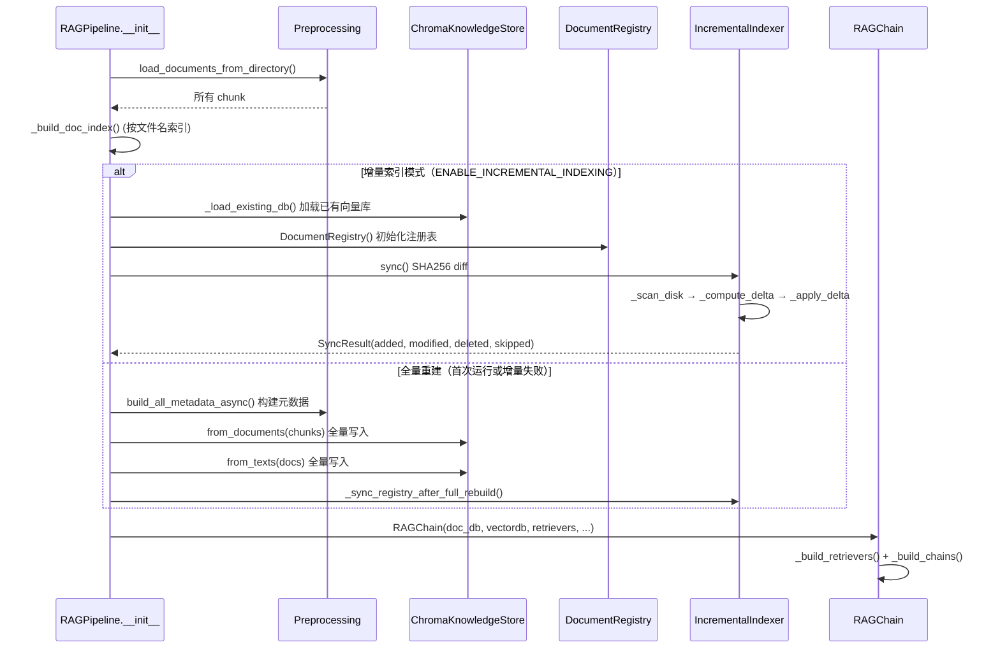
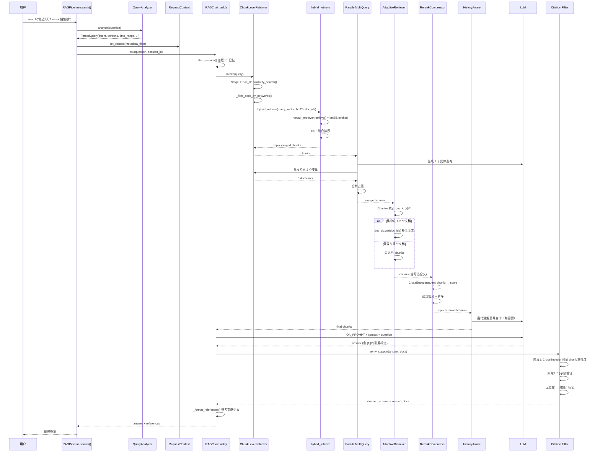

# 第 3 课：RAG 检索系统

> 读完这篇你能回答：
> 1. RAG 检索的全链路是什么样的？每一步解决什么问题？
> 2. 为什么需要混合检索 + 重排序 + 引文验证三层过滤？
> 3. 面试官问"如何设计一个企业级 RAG 系统"怎么答？

---

## 1. 模块职责（Why）

### 一句话概括

**把用户问题送进向量库找到最相关的文档片段，经过混合检索→自适应补全→重排序→引文验证，返回有来源支撑的答案。**

### 解决什么问题

| 问题 | 没有 RAG 时 | 有 RAG 后 |
|---|---|---|
| 信息过载 | LLM 训练数据过时，不知道最新 SOP | 检索最新知识库文档 |
| 幻觉 | LLM 编造不存在的流程 | 每句话标注来源 [1][2] |
| 知识隔离 | 所有用户看到相同答案 | kb_id 隔离（政策/技术/财务） |
| 检索质量 | 单一向量检索漏掉关键词匹配 | 向量+BM25 混合+重排序 |

### 检索全链路总览

```
用户问题
   │
   ▼
QueryAnalyzer（~5ms，零LLM）
  - 实体提取（人名/SKU/平台）
  - 意图分类（7种跨境电商意图）
  - 时间范围解析
   │
   ▼
ChunkLevelRetriever（两阶段）
  Stage 1: Doc 级 → 找相关文档
  Stage 2: Chunk 级 → 找相关片段（向量+BM25 混合+RRF融合）
   │
   ▼
ParallelMultiQueryRetriever（3个角度并发查询）
   │
   ▼
AdaptiveRetriever（智能补全）
  - 集中在1-2个文档 → 补全全文
  - 分散多个文档 → 只用chunks
   │
   ▼
RerankCompressor（CrossEncoder 精排）
   │
   ▼
HistoryAwareRetriever（多轮对话指代消解）
   │
   ▼
LLM 生成答案（标注引用 [1][2]）
   │
   ▼
Citation Filter（反向验证）
  - chunk 级支撑验证
  - 句子级支撑验证
  - 无支撑 → 标记 [推断]
```

---

## 2. 整体流程（Flow）

### 初始化流程



### 查询流程



---

## 3. 技术选型（Why This Tech）

### 为什么用 ChromaDB 而不是 pgvector？

| 方案 | 优点 | 缺点 |
|---|---|---|
| **ChromaDB** | 零配置，嵌入式，适合单机 | 不支持分布式，大数据量性能差 |
| pgvector | PostgreSQL 原生，企业级 | 需要额外安装扩展 |
| Milvus | 分布式，十亿级向量 | 运维复杂度高 |
| FAISS | 极快，Meta 开源 | 无持久化，纯内存 |

**选择 ChromaDB 的原因：**
- 当前文档量 < 5000 篇，ChromaDB 完全够用
- 零配置部署（`pip install chromadb` 一条命令）
- 通过 `KnowledgeStore` 抽象，将来切 pgvector 业务层零修改

**何时切换到 pgvector：** 文档量 > 5000、需多节点部署、或需原生的版本/有效期过滤时。`PgVectorKnowledgeStore` 已预留接口。

### 为什么用混合检索（向量 + BM25）？

**问题：** 纯向量检索对精确关键词匹配不敏感。

| 查询 | 向量检索 | BM25 |
|---|---|---|
| "FBA发货SOP" | ✅ 语义理解 | ✅ 精确匹配 FBA + SOP |
| "退货退款流程" | ✅ 理解同义词 | ✅ 精确匹配关键词 |
| "SKU编码ABC123" | ❌ 编码无语义 | ✅ 精确匹配 |

**互补原理：**
- 向量检索 = 语义相似度（"大概意思是什么"）
- BM25 = 关键词匹配（"有没有这个词"）
- RRF（Reciprocal Rank Fusion）= 融合两种排序，取前 k 个

### 为什么需要 Reranker？

**问题：** 向量检索返回前 k 个结果后，里面可能有噪音。

```
检索召回 20 个 chunks → 但实际上只有 5 个真正相关
                         └→ Reranker 用 CrossEncoder 精确打分
                         过滤掉 15 个低分 chunks → 最终给 LLM 5 个高质量的
```

**为什么不用 Embedding 直接精排？**
- Bi-Encoder（Embedding）：query 和 doc 独立编码，快但不精确
- CrossEncoder（Reranker）：query+doc 联合输入模型，精确但慢

```
Embedding: query → [768] vec  ─┐
           doc   → [768] vec  ─┤ → cosine similarity → 快但不精确
                               
CrossEncoder: [query, doc] → 模型 → score → 精确但每次都要过模型
```

**策略：** Embedding 粗筛（20 个）→ CrossEncoder 精排（5 个）。兼顾速度和精度。

### 为什么需要 Citation Filter（引文验证）？

**问题：** LLM 生成的答案中，可能：
1. 用了不相关的 chunk 编造内容
2. 引用了错误的来源编号
3. 回答中某句话没有任何 chunk 支撑

**Citation Filter 做反向验证：**
1. 以问题为 query，验证每个 chunk 是否真的相关
2. 以句子为单位，验证每个句子是否有 chunk 支撑
3. 无支撑的句子标记 `[推断]`

这是 RAG 系统的"安全网"——防止 LLM 在检索结果上产生幻觉。

### 为什么用增量索引而不是每次全量重建？

```
全量重建: 500 个文档 × (加载 + 分块 + embed) = 5 分钟
增量索引: SHA256 diff → 只处理 3 个变更文档 = 3 秒
```

**原理：**
1. `_scan_disk()` → 计算每个文件的 SHA256
2. `DocumentRegistry`（SQLite）记录上次索引时的 hash
3. 对比 → 分类为 ADDED / MODIFIED / DELETED / UNCHANGED
4. 只处理前三种

### 为什么用 QueryAnalyzer（规则引擎）而不是 LLM？

| 方案 | 耗时 | 成本 | 准确率 |
|---|---|---|---|
| LLM 分析 | 2-5s | 每次消耗 token | 高 |
| **规则引擎** | ~5ms | 零 | 中高（确定性） |

**选择规则引擎的原因：**
- 跨境电商领域关键词明确（"Amazon"、"FBA"、"ACoS"）
- 规则是确定性的，不会出错
- 零成本零延迟，对用户体验不可感知

---

## 4. 核心源码解析（How）

### 阶段 1：Pipeline 初始化（pipeline.py:46-73）

```python
# pipeline.py:46-73
class RAGPipeline:
    def _init(self):
        self._load_and_chunk()         # 1. 加载文档 + 分块
        self._build_doc_index()        # 2. 按文件名建索引
        self._init_embedding()         # 3. 加载 BGE 模型

        if ENABLE_INCREMENTAL_INDEXING:
            used_incremental = self._init_vector_dbs_incremental()  # 4a. 增量
        else:
            used_incremental = False

        if not used_incremental:
            self._build_metadata()           # 构建元数据
            self._init_vector_dbs_full()     # 全量写入向量
            self._sync_registry_after_full_rebuild()  # 同步注册表

        self._init_retrievers()   # 5. 构建检索器链
```

**为什么双重向量库？**
- `vectordb`（Chunk 级）：存每个片段的向量，用于精确检索
- `doc_db`（Doc 级）：存每个文档的全文向量，用于"找到相关文档"→"再找相关片段"

**为什么先找文档再找片段（两阶段检索）？**
- 直接 chunk 检索：可能召回同一文档的 20 个片段，信息冗余
- 两阶段：先锁定 1-3 个文档 → 再在这些文档内找片段 → 结果更聚焦

### 阶段 2：增量索引（indexer.py:87-112）

```python
# indexer.py:87-112
def sync(self) -> SyncResult:
    disk_files = self._scan_disk()       # 扫描磁盘，计算 SHA256
    registry_rows = self.registry.list_all()  # 读取注册表
    delta = self._compute_delta(disk_files, registry_rows)  # Diff
    self._apply_delta(delta, disk_files, registry_rows)     # 处理
    return SyncResult(added=..., modified=..., deleted=..., skipped=...)
```

**SHA256 的作用：**
```python
# 对比 hash 而不是 mtime
if disk[p][0] != registry[p]["file_hash"]:
    modified.add(p)  # 内容变了
else:
    unchanged.add(p)  # 内容未变（即使 mtime 变了）
```

### 阶段 3：QueryAnalyzer（query_analyzer.py:160-238）

```python
# query_analyzer.py:160-238 — 纯规则分析，~5ms
def analyze(self, query: str) -> ParsedQuery:
    # 实体提取（复用 preprocessing/）
    pq.persons = extract_person_names(query)        # 人名
    pq.sku_codes = extract_sku_codes(query)          # SKU 编码
    pq.organizations = _extract_platforms(query)     # 平台（Amazon/Shopify...）

    # 时间解析
    pq.time_range_start, pq.time_range_end = _resolve_time_range(["最近一周"])

    # 意图分类（7 种）
    pq.intent = classify_intent(query)
    # entity_query | order_query | inventory_query | ad_query |
    # fact_query | report_query | summary_query

    return pq
```

**关键设计：`to_metadata_filter()`** — 把分析结果转为 ChromaDB 过滤条件：

```python
def to_metadata_filter(self) -> dict:
    f = {}
    if self.persons:          f["person_names"] = self.persons[0]
    if self.organizations:    f["organization"] = self.organizations[0]
    if self.doc_types:        f["doc_type"] = self.doc_types[0]
    if self.time_range_start: f["time_start"] = ...; f["time_end"] = ...
    return f
```

这个 filter 直接传给 ChromaDB 的 `similarity_search(filter=...)`，在向量检索的同时做元数据过滤。

### 阶段 4：ChunkLevelRetriever 两阶段检索（retrievers.py:79-159）

```python
# retrievers.py:79-159
def _get_relevant_documents(self, query):
    # === Stage 1: Doc 级检索 ===
    # 从 contextvars 读取 RequestContext 的 metadata_filter
    # 或按人名匹配 person_index 倒排索引
    # 或按关键词匹配 doc_db
    # → 得到 doc_ids

    # === Stage 2: Chunk 级检索 ===
    # 对每个查询变体，调 hybrid_retrieve()
    # 限制在 doc_ids 范围内检索
    # → 得到 all_docs

    # === 降级 ===
    if not all_docs:
        # Stage 2 无结果 → 回退到文档全文
        return self._fallback_to_doc_fulltext(query, doc_ids)
```

**为什么有两层降级？**
1. Chunk 级无结果 → 回退到 Doc 全文（给 LLM 至少能看到完整文档）
2. 全文也无结果 → 返回空列表（LLM 回答"查不到相关内容"）

### 阶段 5：混合检索 RRF（hybrid.py:8-49）

```python
# hybrid.py:8-49
def hybrid_retrieve(query, vector_retriever, bm25_retriever, k=5, rrf_k=60):
    vector_docs = vector_retriever.retrieve(query, k=k, doc_ids=doc_ids)
    bm25_docs = bm25_retriever.invoke(query)

    # RRF 融合
    rank_map = {}
    for rank, doc in enumerate(vector_docs, start=1):
        cid = doc.metadata.get("chunk_id")
        rank_map[cid] = rank_map.get(cid, 0) + 1 / (rrf_k + rank)
    for rank, doc in enumerate(bm25_docs, start=1):
        cid = doc.metadata.get("chunk_id")
        rank_map[cid] = rank_map.get(cid, 0) + 1 / (rrf_k + rank)

    # 按融合分排序，返回 top-k
    sorted_cids = sorted(rank_map.items(), key=lambda x: x[1], reverse=True)
    return [doc_dict[cid] for cid, _ in sorted_cids[:k]]
```

**RRF 公式：** `score = 1 / (k + rank)`

| 排名 | 向量 | BM25 | RRF 融合 |
|---|---|---|---|
| #1 | DocA (1/61=0.0164) | DocB (1/61=0.0164) | DocA: 0.0164, DocB: 0.0164 |
| #2 | DocB (1/62=0.0161) | DocA (1/62=0.0161) | DocA: 0.0325, DocB: 0.0325 |

**为什么 k=60？** k 越大，排名差异影响越小，更偏向"两边都认为重要的"文档。

### 阶段 6：AdaptiveRetriever 智能补全（retrievers.py:222-257）

```python
# retrievers.py:222-257
def _get_relevant_documents(self, query):
    chunks = self.base_retriever.invoke(query)  # 先走完整链拿到 chunks

    # 统计 doc_id 分布
    doc_counter = Counter()
    for c in chunks:
        doc_counter[c.metadata.get("doc_id")] += 1

    # 判断：集中在 ≤2 个文档中？
    clustered = [did for did, count in doc_counter.items()
                 if count / total >= self.cluster_threshold]

    if clustered and len(clustered) <= 2:
        # 集中 → 补全这些文档的全文
        full_docs = self.doc_db.get(where={"doc_id": {"$in": clustered}})
        return full_docs + chunks   # 全文在前，chunks 在后

    # 分散 → 只给 chunks
    return chunks
```

**为什么需要"全文在前，chunks 在后"？**
LLM 的 attention 对前面的内容权重更高。全文在前意味着 LLM 先看到完整上下文，再看到细节片段。

### 阶段 7：重排序（reranker.py:24-87）

```python
# reranker.py:24-87
def rerank(query, docs, top_k=3):
    # 构建 (query, doc) 对
    pairs = [(query, doc.page_content) for doc in docs]

    # CrossEncoder 批量打分
    scores = safe_call_with_timeout(reranker.predict, timeout=RERANK_TIMEOUT, ...)

    # 排序 + 过滤低分
    scored_docs = sorted(zip(docs, scores), key=lambda x: x[1], reverse=True)
    scored_docs = [(doc, score) for doc, score in scored_docs
                   if score > RERANK_SCORE_THRESHOLD]

    # 写入 metadata（供参考文献展示）
    for doc, score in scored_docs:
        doc.metadata["rerank_score"] = round(float(score), 4)

    return scored_docs[:top_k]
```

**`safe_call_with_timeout` 的价值：**
CrossEncoder 模型推理可能很慢（大文档），30s 超时防止阻塞整个请求。

### 阶段 8：Citation Filter（chain.py:258-367）

```python
# chain.py:258-367 — 三段式验证
def _verify_support(answer, docs, question):
    # 阶段 1: chunk 验证 — 每个 chunk 是否与问题相关？
    pairs = [(question, doc.page_content[:800]) for doc in docs]
    scores = reranker.predict(pairs)
    verified = [doc for doc, score in zip(docs, scores)
                if score > CITATION_SUPPORT_THRESHOLD]

    # 阶段 2: 句子验证 — 每个句子是否被任一 chunk 支撑？
    for sentence in split_sentences(answer):
        for doc in verified:
            score = reranker.predict([(sentence, doc.page_content[:500])])
            if max_score < CITATION_SUPPORT_THRESHOLD:
                sentence = f"[推断] {sentence}"  # 标记无支撑
```

**为什么需要两阶段？**
- 阶段 1 排除整体无关的 chunk（"这段 SOP 完全不相关"）
- 阶段 2 验证每个句子（"答案第 3 句没有来源支撑"）

这是工程上最容易被忽略但最提升质量的一步。

### 阶段 9：KnowledgeStore 抽象（knowledge_store.py:21-99）

```python
# knowledge_store.py:21-99 — 抽象接口 + Chroma 实现 + pgvector 预留
class KnowledgeStore(ABC):
    @abstractmethod
    def similarity_search(self, query, k=5, filter=None) -> list: ...
    @abstractmethod
    def get(self, where=None) -> dict: ...
    @abstractmethod
    def add_documents(self, documents) -> list[str]: ...
    @abstractmethod
    def delete(self, ids=None, where=None) -> int: ...

class ChromaKnowledgeStore(KnowledgeStore): ...
class PgVectorKnowledgeStore(KnowledgeStore): ...  # 预留
```

**接口设计的价值：**
- `RAGPipeline` 只依赖 `KnowledgeStore` 接口
- 切换向量库只需改一处：`ChromaKnowledgeStore → PgVectorKnowledgeStore`
- 其余全部代码（Retriever/Build/Delete/Search）不用改

### 阶段 10：检索链组装（chain.py:163-216）

```python
# chain.py:163-216 — LCEL 管道
def _build_chains(self):
    # Citation Filter: 注入文档序号
    stuff_chain = (
        RunnableLambda(_index_docs)
        | create_stuff_documents_chain(llm, QA_PROMPT, document_prompt=DOCUMENT_PROMPT)
    )

    # 检索链 = ChunkLevel → MultiQuery(并发) → Adaptive → Rerank → HistoryAware
    retriever = self.chunk_retriever_base
    retriever = ParallelMultiQueryRetriever.from_llm(retriever, llm)
    retriever = AdaptiveRetriever(base_retriever=retriever, doc_db=self.doc_db)
    retriever = ContextualCompressionRetriever(
        base_compressor=RerankCompressor(), base_retriever=retriever)
    if ENABLE_HISTORY_AWARE_RETRIEVAL:
        retriever = create_history_aware_retriever(llm, retriever, CONTEXTUALIZE_PROMPT)

    self.chain = create_retrieval_chain(retriever, stuff_chain)
```

**LCEL (LangChain Expression Language) 的优势：**
- `|` 管道符连接每一步，可读性高
- 自动处理 `callbacks` 传递
- `stream()` 支持逐 token 流式输出

---

## 5. 涉及的知识点（Knowledge）

| 知识点 | 基础概念 | 为什么这里用到 | 企业用法 |
|---|---|---|---|
| **RAG** | 检索增强生成：检索+生成 | 整个系统的核心范式 | 客服知识库、法律文档、医疗问答 |
| **Embedding** | 文本→向量的数值表示 | BGE 模型把文档和查询转为向量 | OpenAI text-embedding-3、Cohere embed |
| **向量数据库** | 存储+检索高维向量 | ChromaDB 存 chunk 和 doc 向量 | pgvector、Milvus、Pinecone、Weaviate |
| **BM25** | 基于词频的关键词检索 | 弥补向量检索对精确关键词的不足 | Elasticsearch 默认算法 |
| **RRF** | 融合多个排序列表 | 融合向量排名 + BM25 排名 | 搜索引擎结果合并 |
| **CrossEncoder** | query+doc 联合输入模型 | 精排（Embedding 粗筛 + CE 精排） | 搜索推荐、问答系统 |
| **LCEL** | LangChain 表达式语言，管道符连接 | 组装检索-生成链 | LangChain 生态的标准写法 |
| **增量索引** | SHA256 diff，只处理变更 | 避免每次重启都全量重建 | Git diff、Rsync、数据库 CDC |
| **KnowledgeStore 抽象** | 接口与实现分离 | 隔离 ChromaDB，预留 pgvector | Repository 模式、DAO 层 |
| **Context Variables** | 请求级别的隐式传参 | metadata_filter 透传到检索器 | Flask g、FastAPI Depends |
| **MultiQuery** | 一个查询生成多个变体 | 提高召回率（不同角度检索） | 搜索引擎查询扩展 |

---

## 6. 企业级实现

### 当前实现评级：**中小型项目 → 部分接近企业级**

| 维度 | 当前状态 | 企业级 |
|---|---|---|
| 检索策略 | 向量+BM25+RRF+重排序 | 同，但把 BM25 换 Elasticsearch |
| 引文验证 | ✅ Citation Filter（两阶段） | 外加人工审核流程 |
| 向量库 | ChromaDB（单机） | pgvector/Milvus（分布式） |
| 增量更新 | ✅ SHA256 diff | CDC + 消息队列 |
| 多租户 | kb_id 参数 | 租户隔离 + 独立索引 |
| 可观测性 | 日志 | Metrics（召回率、延迟、无结果率） |

### 企业一般加什么

1. **Elasticsearch 替代 BM25**
```python
# 企业版：ES 提供 BM25 + metadata 过滤 + 全文搜索一体化
results = es.search(index="knowledge", query={
    "bool": {
        "must": {"match": {"content": query}},
        "filter": {"term": {"kb_id": kb_id}}
    }
})
```

2. **A/B 测试检索策略**
```python
# 企业版：对比两套检索参数的效果
if user_in_experiment_group():
    retriever = v2_retriever  # 新策略
else:
    retriever = v1_retriever  # 旧策略
```

3. **检索质量监控**
```python
# 企业版：追踪关键指标
metrics.record("rag.recall@5", recall)
metrics.record("rag.mrr", mrr)
metrics.record("rag.no_result_rate", no_result_count / total)
metrics.record("rag.avg_latency_ms", avg_latency)
```

---

## 7. 可以优化的地方

### 性能
- [ ] **Embedding 计算是瓶颈** — 可考虑模型量化（FP16→INT8）或缓存常用查询
- [ ] **CrossEncoder 调用次数多** — Citation Filter 阶段每个句子都要跑一次，可批量处理
- [ ] **ChromaDB 文件锁** — 读写并发时性能下降

### 可维护性
- [ ] **检索链路排错困难** — 不知道是哪个环节丢失了关键文档
- [ ] **Prompt 模板硬编码** — 应该从配置文件加载

### 可扩展性
- [ ] **不支持多模态检索** — 图片、PDF 扫描件无法检索
- [ ] **不支持实时文档更新推送** — 当前靠重启服务触发增量索引

### 可测试性
- [ ] **没有检索质量回归测试** — 应该有一个 golden dataset 验证每次改动不降质
- [ ] **Mock ChromaDB 困难** — KnowledgeStore 抽象可以生成 mock

### 安全性
- [ ] **无用户级权限过滤** — kb_id 隔离靠 URL 参数，可以被修改

### 可观测性
- [ ] **没有检索链路追踪** — 不知道每个检索阶段花了多少时间
- [ ] **没有召回率监控** — 不知道"无结果"的比例

---

## 8. 面试角度

**Q1: RAG 检索为什么需要混合检索，只用向量检索不行吗？**

> 标准答案：向量检索擅长语义相似度，但对精确关键词不敏感。比如"SKU编码ABC123"，向量模型没见过这个编码，无法理解语义；但 BM25 可以精确匹配。两者互补：向量做语义召回，BM25 做关键词召回，RRF 融合排序。

**Q2: 为什么需要 Reranker？直接用 Embedding 的相似度排序不行吗？**

> 标准答案：Embedding 是 Bi-Encoder（query 和 doc 独立编码），速度快但不精确。CrossEncoder（query+doc 联合输入模型）精确但慢。策略是"粗筛+精排"：Embedding 粗筛 20 个→CrossEncoder 精排保留 5 个。

**Q3: Citation Filter 解决什么问题？**

> 标准答案：LLM 可能在检索结果上产生幻觉——引用了不相关的 chunk，或者编造了无来源的内容。Citation Filter 用 CrossEncoder 反向验证：1）每个 chunk 是否真的与问题相关；2）答案中每个句子是否真的被 chunk 支撑。无支撑的标记 [推断]。

**Q4: 增量索引的 SHA256 diff 原理是什么？**

> 标准答案：扫描磁盘文件计算 SHA256 → 对比 SQLite 注册表上次存储的 hash → 分类为新增/修改/删除/未变 → 只处理前三类。这样 500 个文档改 3 个，只需要 3 秒而不是 5 分钟。

**Q5: 为什么用 ChromaDB 而不是 pgvector？**

> 标准答案：当前文档量 < 5000，ChromaDB 嵌入式零配置够用。通过 KnowledgeStore 抽象接口隔离实现，将来切 pgvector 不影响任何业务代码。

**Q6: ChunkLevelRetriever 的两阶段检索是什么？**

> 标准答案：Stage 1（Doc 级）先找出可能相关的文档（通过关键词、人名、metadata filter），限制范围到 1-3 个文档；Stage 2（Chunk 级）在这些文档内找相关片段。这样做的好处是避免同一文档的 20 个片段全被召回，结果更聚焦。

**Q7: AdaptiveRetriever 的"自适应"体现在哪？**

> 标准答案：分析 top chunks 的文档分布。如果集中在 1-2 个文档（占比 >30%），说明用户关注特定文档，补全全文给 LLM 更好理解上下文。如果分散在多个文档，只给 chunks，避免上下文过长稀释关键信息。

**Q8: MultiQuery 的并发检索怎么实现的？**

> 标准答案：`ParallelMultiQueryRetriever` 继承 LangChain 的 `MultiQueryRetriever`，覆盖 `retrieve_documents` 为 `ThreadPoolExecutor` 并发版本。LLM 生成 3 个变体查询 → 3 个线程同时检索 → 合并去重。把串行 3× 时间降为 1×。

**Q9: contextvars 在检索中起什么作用？**

> 标准答案：`RequestContext` 通过 `contextvars` 在请求级隐式传递 `metadata_filter`。`QueryAnalyzer` 分析出的 filter（人名/平台/文档类型）注入 context，`ChunkLevelRetriever` 从 context 读取，不需要函数签名里显示传递。类似 Flask 的 `g` 对象。

**Q10: 如果用户问"上次那个 FBA 的流程"，如何理解"上次"？**

> 标准答案：`HistoryAwareRetriever` 用 LLM 重写查询。根据对话历史，将"上次那个 FBA 的流程"改写为"Amazon FBA发货标准操作流程SOP"。这样检索器拿到的是完整的独立查询，而非依赖对话上下文。

**Q11（进阶）: 如何评估 RAG 系统的检索质量？**

> 标准答案：三个核心指标：Recall@k（前 k 个结果是否包含正确答案）、MRR（正确答案的平均倒数排名）、NDCG@k（考虑排名位置的加权分数）。需要人工标注的 golden dataset，每个问题标注应该被检索到的文档 ID。

**Q12（进阶）: Chunk 大小怎么选？**

> 标准答案：太小（<200 tokens）丢失上下文，太大（>1000 tokens）稀释相关性。一般 400-800 tokens。本项目由 `preprocessing/chunking.py` 的类型感知分块器决定——政策类文档按段落分，报告类按标题分。实际经验：500 tokens 左右最佳。

---

## 9. 学习总结

### 最重要的知识点

1. **混合检索（向量+BM25）** — RAG 系统的基础，面试必问
2. **粗筛+精排（Embedding + CrossEncoder）** — 平衡精度和速度的核心策略
3. **Citation Filter（引文验证）** — 防止 RAG 幻觉的最后一道防线
4. **增量索引（SHA256 diff）** — 生产环境必须考虑的工程问题
5. **KnowledgeStore 抽象** — 接口隔离，为未来迁移做准备

### 必须掌握的源码

按重要性排序：
1. `chain.py:163-216` — 检索链组装（全链路一览）
2. `retrievers.py:79-159` — ChunkLevelRetriever 两阶段检索
3. `hybrid.py:8-49` — RRF 混合检索
4. `reranker.py:24-87` — CrossEncoder 重排序
5. `indexer.py:87-176` — 增量索引 SHA256 diff
6. `chain.py:258-367` — Citation Filter 三段式验证

### 最容易踩坑的地方

1. **Chunk 大小** — 太大上下文污染，太小信息不完整
2. **RRF 的 k 参数** — 太小会偏向排名靠前的，太大差异不明显
3. **CrossEncoder 超时** — 大文档推理慢，必须加 timeout
4. **metadata_filter 语法** — ChromaDB 的 `$and`/`$in` 语法与 MongoDB 不同

### 面试必须会讲的内容

> "我设计了一个完整的 RAG 检索系统。检索链路是：QueryAnalyzer 规则分析→ChunkLevelRetriever 两阶段检索（Doc→Chunk）→混合检索（向量+BM25+RRF）→ParallelMultiQuery 并发多角度→AdaptiveRetriever 智能补全→CrossEncoder 重排序。生成后的 Citation Filter 用 CrossEncoder 反向验证每个句子是否有来源支撑。这还没完——增量索引用 SHA256 diff 只处理变更文档，KnowledgeStore 抽象使得切向量库业务层零修改。整个系统的设计哲学是'每层过滤 10%，最终给 LLM 的就是最好的 5 个 chunk'。"

---

> **下一课：SQL Agent 安全系统** — 6 层校验 + 行级安全 + 参数化查询
