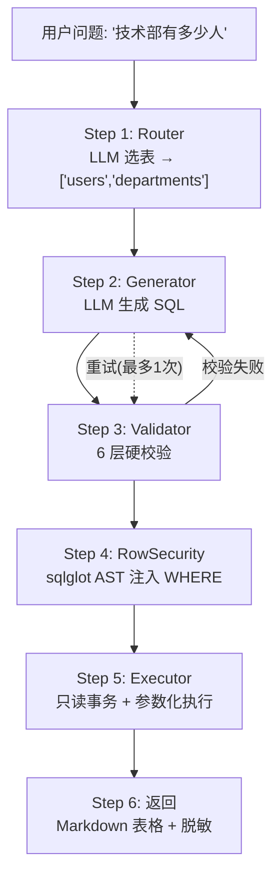
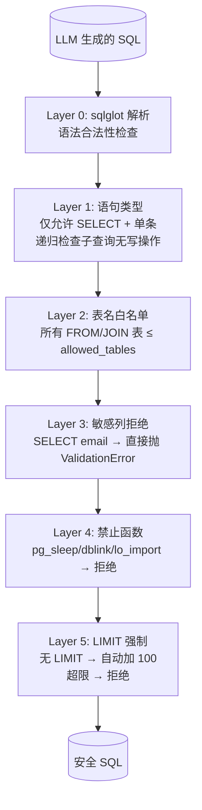
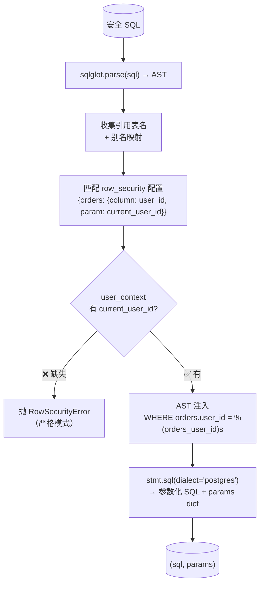

# 第 4 课：SQL Agent 安全系统

> 读完这篇你能回答：
> 1. 6 层安全校验分别是哪 6 层？为什么每层都不可省略？
> 2. sqlglot AST 重写是如何实现参数化行级安全的？
> 3. 面试官问"如何防止 LLM 生成危险的 SQL"怎么答？

---

## 1. 模块职责（Why）

### 一句话概括

**让用户用自然语言查询数据库，同时用 6 层硬校验确保 LLM 生成的 SQL 不会删库、不会泄露数据、不会拖垮服务器。**

### 解决什么问题

| 风险 | LLM 可能做什么 | 防护措施 |
|---|---|---|
| **删库** | `DELETE FROM orders;` | Layer 1: 只允许 SELECT |
| **越权访问** | `SELECT * FROM salaries;` | Layer 2: 表名白名单 |
| **隐私泄露** | `SELECT email FROM customers;` | Layer 3: 敏感列直接拒绝 |
| **SQL 注入变种** | `pg_sleep(10)` | Layer 4: 禁止函数黑名单 |
| **全表扫描** | `SELECT * FROM orders;` (无 LIMIT) | Layer 5: 强制 LIMIT 100 |
| **提权** | 读写服务器文件 | Layer 6: 只读事务 + 参数化 |
| **行越权** | 查询其他租户的数据 | RowSecurity: AST 注入 WHERE |

### 核心设计哲学

```
"不信任 LLM 的承诺"

LLM 说"我只生成 SELECT" → 不信，校验
LLM 说"我不会查敏感列" → 不信，校验
LLM 说"我会加 LIMIT"   → 不信，强制加

每一层都是硬拦截，不是"提示"也不是"建议"。
```

---

## 2. 整体流程（Flow）

### 完整 6 步流程



### 6 层校验详细流程



### 行级安全注入流程



### 执行流程

```mermaid
sequenceDiagram
    participant Agent as SQLAgent
    participant Exec as Executor
    participant PG as PostgreSQL

    Agent->>Exec: execute_sql(sql, db_config, params={orders_user_id: 101})
    Exec->>PG: psycopg2.connect()
    Exec->>PG: autocommit = False
    Exec->>PG: BEGIN; SET TRANSACTION READ ONLY
    Exec->>PG: SET LOCAL statement_timeout = 5000ms
    Exec->>PG: cur.execute(sql, params)
    Note over Exec,PG: user_id=101 通过参数通道传递<br/>不进 SQL 文本
    PG-->>Exec: 查询结果
    Exec->>Exec: _mask_row() 列级脱敏
    Exec->>Exec: _to_markdown_table() 格式化
    Exec-->>Agent: Markdown 表格
```

---

## 3. 技术选型（Why This Tech）

### 为什么用 sqlglot 而不是正则表达式？

| 方案 | 优点 | 缺点 |
|---|---|---|
| 正则表达式 | 简单快 | 误判率高：`SELECT * FROM delete_log` 会被误判为 DELETE |
| **sqlglot AST** | 语法树精确分析 | 多一层依赖 |
| sqlparse | 比正则强 | 不如 sqlglot 精确，不支持 AST 重写 |

**选择 sqlglot 的原因：**

```python
# 正则的致命缺陷
re.search(r'\bDELETE\b', "SELECT * FROM delete_log")  # True! 误判

# sqlglot 精确识别
parsed = sqlglot.parse("SELECT * FROM delete_log")
isinstance(parsed[0], exp.Select)  # True ✅
isinstance(parsed[0], exp.Delete)  # False ✅
```

**更关键的是 AST 重写能力：** RowSecurity 需要向 WHERE 中注入条件，正则不可能安全做到。sqlglot 可以精确操作 AST 节点：

```python
# 用 sqlglot 精确定位 WHERE 子句并注入条件
existing_where = stmt.find(exp.Where)
if existing_where:
    combined = exp.And(this=existing_where.this, expression=row_filter)
    existing_where.set("this", combined)
else:
    stmt = stmt.where(row_filter)
```

### 为什么行级安全用参数化而不是字符串拼接？

| 方案 | SQL 示例 | 安全性 |
|---|---|---|
| ❌ 字符串拼接 | `f"WHERE user_id = {current_user}"` | SQL 注入风险 |
| ❌ LLM prompt 要求 | "请只查当前用户的数据" | LLM 可能忘记/被绕过 |
| ✅ **参数化** | `WHERE user_id = %(orders_user_id)s` | 值不进 SQL 文本 |

**参数化的本质：**
```
SQL 文本:  SELECT * FROM orders WHERE user_id = %(orders_user_id)s
参数字典:  {"orders_user_id": 101}
PostgreSQL 看到: SELECT * FROM orders WHERE user_id = $1  (101 单独传)
```

即使用户 ID 是恶意字符串 `'1; DROP TABLE users;--'`，它也只是参数值，永远不会被执行。

### 为什么用 psycopg2 而不是 SQLAlchemy？

| 方案 | 优点 | 缺点 |
|---|---|---|
| SQLAlchemy ORM | 抽象层厚，功能多 | 多一层学习成本 |
| **psycopg2** | PostgreSQL 原生，细粒度控制 | 手写 SQL |
| asyncpg | 异步，更快 | 需要 async 环境 |

**选择 psycopg2 的原因：**
- 需要精确控制事务（`SET TRANSACTION READ ONLY`）
- `RealDictCursor` 直接返回 dict，方便脱敏和 Markdown 格式化
- `SET LOCAL statement_timeout` 需要事务级别控制

### 为什么 Schema 配置集中在一个文件？

`schema_config.py` = **唯一真相来源（Single Source of Truth）**

```python
# 所有安全策略在这里定义
SCHEMA_CONFIG = {
    "tables": {...},           # 15 张表的完整定义
    "sensitive_columns": [...], # 哪些列不能查
    "masked_columns": {...},    # 哪些列要脱敏
    "row_security": {...},      # 哪些表需要行级过滤
    "banned_functions": [...],  # 哪些函数禁止
    "max_limit": 100,           # 最多返回多少行
    "query_timeout": 5.0,       # 查询超时
}
```

**价值：**
- 修改安全策略只改这一个文件
- `schema_loader.py` 做缓存和快速查找
- `sql_validator.py` 和 `executor.py` 通过 loader 读取，不直接依赖 config

---

## 4. 核心源码解析（How）

### 阶段 1：入口编排（sql_agent.py:38-102）

```python
# sql_agent.py:38-102
def ask(self, question, current_user_id=None):
    # Step 1: Router 选表
    table_names = select_tables(question)
    if not table_names:
        return "未找到相关数据表"

    # Step 2-5: 生成 + 校验 + 行级安全 + 执行（支持重试）
    for attempt in range(self.max_retries + 1):
        # Step 2: LLM 生成 SQL
        sql = generate_sql(question, table_names)

        # Step 3: 6 层硬校验
        safe_sql, _, _ = sql_validator.validate(sql)

        # Step 4: 行级安全注入（参数化）
        safe_sql, rs_params = inject_row_filter(safe_sql, user_context)

        # Step 5: 参数化执行 + 脱敏 + 格式化
        result = execute_sql(safe_sql, self.db_config, params=rs_params)
        return result
```

**关键设计：校验失败时重试**
```python
except ValidationError as e:
    if attempt < self.max_retries:
        # 把错误信息喂给 LLM 作为反馈
        question = question + f"\n(之前生成的 SQL 因为 {e} 被拒绝，请避免同样问题)"
        continue  # 重新走 Step 2-5
```

这是 Agent 的"自我纠错"机制——LLM 知道自己哪里错了，下次生成时避开。

### 阶段 2：Router 选表（router.py:30-75）

```python
# router.py:30-75
def select_tables(question):
    if len(all_tables) <= 2:
        return all_tables  # 表少时直接返回全部，省一次 LLM 调用

    # LLM 从 15 张表中选出 1-2 张
    resp = llm.invoke(ROUTER_PROMPT.format(table_list=..., question=question))
    selected = json.loads(extract_json_array(resp.content))

    # 白名单校验：LLM 返回的表名必须真的在配置中
    valid = [t for t in selected if t in all_tables]

    if not valid:
        return all_tables  # LLM 乱说 → 兜底全部表

    return valid
```

**为什么不让 LLM 直接看所有列？** Router 只看表名+描述，不看列。列信息只在 Generator 阶段暴露给选中的表。这样：
- 减少 token 消耗（15 张表的完整 schema 可能有 2000+ tokens）
- 减少 LLM "看到不该看的列"的风险

### 阶段 3：Validator 5 层硬校验（sql_validator.py）+ 执行层保护（executor.py）

```python
# sql_validator.py:175-217 — validate() 主入口
def validate(self, sql):
    parsed = sqlglot.parse(sql, read="postgres")

    # Layer 1: 类型校验 — 必须是 SELECT，单条
    self._check_statement_type(parsed)

    # Layer 2: 表名白名单
    table_names = self._extract_table_names(parsed)
    self._check_table_allowlist(table_names)

    # Layer 3: 敏感列拒绝
    self._check_sensitive_columns(parsed, table_names)

    # Layer 4: 禁止函数
    self._check_banned_functions(parsed)

    # Layer 5: LIMIT 强制
    parsed, _ = self._ensure_limit(parsed)

    # 标准化 SQL
    safe_sql = parsed[0].sql(dialect="postgres")
    return safe_sql, table_names, parsed[0]
```

**每层的关键代码：**

**Layer 1 — 防止 DROP/INSERT/UPDATE/DELETE：**
```python
def _check_statement_type(self, parsed):
    if len(parsed) > 1:
        raise ValidationError("禁止多条语句")  # 防止 SELECT 1; DROP TABLE users;
    if not isinstance(stmt, exp.Select):
        raise ValidationError("只允许 SELECT")

    # 递归检查子查询：SELECT * FROM (DELETE ... RETURNING *) 也不行
    self._check_no_write_in_subqueries(stmt)
```

**Layer 3 — 敏感列直接拒绝：**
```python
def _check_sensitive_columns(self, parsed, table_names):
    for column in stmt.find_all(exp.Column):
        full_ref = f"{table}.{column}"
        if full_ref in self.sensitive_columns:
            raise ValidationError(f"禁止查询敏感列: '{full_ref}'")
```

**Layer 5 — LIMIT 不可绕过：**
```python
def _ensure_limit(self, parsed):
    limit_clause = stmt.find(exp.Limit)
    if limit_clause:
        if current > self.max_limit:
            raise ValidationError(f"LIMIT {current} 超过最大值 {self.max_limit}")
    else:
        stmt = stmt.limit(self.max_limit)  # 自动加 LIMIT 100
```

### 阶段 4：RowSecurity — AST 注入（row_security.py:38-146）

```python
# row_security.py:38-146 — 核心函数
def inject_row_filter(sql, user_context):
    # 1. sqlglot 解析 AST
    parsed = sqlglot.parse(sql, read="postgres")
    stmt = parsed[0]

    # 2. 收集表名 + 别名
    real_to_alias = {}
    for table in stmt.find_all(exp.Table):
        real_to_alias[table.name] = table.alias_or_name

    # 3. 匹配受保护的表
    protected_tables = [t for t in referenced_tables
                        if schema_loader.get_row_security(t)]

    # 4. 严格模式：缺少必需的 user_context 参数 → 拒绝
    required_params = {schema_loader.get_row_security(t)["param"]
                       for t in protected_tables}
    missing = required_params - set(user_context.keys())
    if missing:
        raise RowSecurityError(f"缺少参数 {missing}")

    # 5. 为每个受保护表构建参数化条件
    for tname in protected_tables:
        column = rs_config["column"]
        param_value = user_context[rs_config["param"]]

        # 占位符名 = 表名_列名
        placeholder_key = f"{tname}_{column}"
        params[placeholder_key] = param_value

        # 构建 AST 节点: orders.user_id = %(orders_user_id)s
        condition = exp.EQ(
            this=exp.Column(this=column, table=alias),
            expression=exp.Placeholder(this=placeholder_key),
        )
        extra_conditions.append(condition)

    # 6. 合并条件，注入 WHERE
    combined = extra_conditions[0]
    for cond in extra_conditions[1:]:
        combined = exp.And(this=combined, expression=cond)

    existing_where = stmt.find(exp.Where)
    if existing_where:
        combined = exp.And(this=existing_where.this, expression=combined)
        existing_where.set("this", combined)
    else:
        stmt = stmt.where(combined)

    # 7. 生成最终 SQL + 参数
    new_sql = stmt.sql(dialect="postgres")
    return new_sql, params
```

**为什么用 AST 操作而不拼接字符串？**

```python
# ❌ 字符串拼接的陷阱
sql = f"SELECT * FROM orders WHERE {existing} AND user_id = {current_user}"
# 问题：1) SQL 注入  2) 子查询中的 WHERE 也会被误匹配

# ✅ AST 操作
stmt.where(condition)  # 精确操作顶层 WHERE
existing_where.set("this", combined)  # 精确替换已有条件
```

**严格模式（P0 修复点）：**
```python
# 旧版本：缺参数时静默跳过 → 安全漏洞
if param_value is None:
    continue  # ❌ 不注入任何条件 → 能查所有人的数据

# 新版：缺参数时抛错
if missing:
    raise RowSecurityError(...)  # ✅ 不满足安全条件就拒绝查询
```

### 阶段 5：Executor 只读执行（executor.py:27-113）

```python
# executor.py:27-113
def execute_sql(sql, db_config, params=None, timeout=None):
    conn = psycopg2.connect(**db_config)
    conn.autocommit = False  # ← 关键：关闭 autocommit 才能 SET TRANSACTION

    with conn.cursor(cursor_factory=RealDictCursor) as cur:
        # 三重保护
        cur.execute("BEGIN")
        cur.execute("SET TRANSACTION READ ONLY")  # 1. 只读事务
        cur.execute("SET LOCAL statement_timeout = %s", (int(timeout * 1000),))  # 2. 超时

        cur.execute(sql, params)  # 3. 参数化执行

        rows = cur.fetchall()
        result_dicts = [dict(r) for r in rows]
        masked_results = [_mask_row(r, columns) for r in result_dicts]  # 脱敏
        md = _to_markdown_table(columns, masked_results)  # 格式化

        conn.commit()  # 提交只读事务（释放锁）
        return md
```

**为什么 `conn.autocommit = False` 是 P0 修复点？**
```python
# autocommit=True 时，每条 SQL 隐式提交
# SET TRANSACTION READ ONLY 只对"当前事务"有效
# 但 autocommit 意味着每条 SQL 是一个独立事务
# → SET TRANSACTION 之后立即提交，READ ONLY 失效！

# 修复：关掉 autocommit
conn.autocommit = False
cur.execute("BEGIN")
cur.execute("SET TRANSACTION READ ONLY")  # 对当前事务有效
cur.execute(sql)  # 在只读事务中执行
```

**列级脱敏：**
```python
def _mask_value(value, column_key):
    # "customers.email": (2, 1) → "ab***m"
    prefix_len, suffix_len = mask_config
    masked = value[:prefix_len] + "***" + value[-suffix_len:]
    return masked
```

### 阶段 6：SchemaConfig — 唯一真相源

```python
# schema_config.py — 安全配置集中地
SCHEMA_CONFIG = {
    "sensitive_columns": [
        "customers.email",  # 这些列将直接拒绝查询
    ],
    "masked_columns": {
        "customers.email": (2, 1),  # ab***m
        "customers.name":  (1, 0),  # 张**
    },
    "row_security": {
        # 预留：按租户/渠道隔离
    },
    "max_limit": 100,        # 最多 100 行
    "query_timeout": 5.0,    # 5 秒超时
    "banned_functions": [
        "sleep", "pg_sleep",          # 休眠攻击
        "lo_import", "lo_export",     # 文件系统访问
        "pg_read_file",               # 读服务器文件
        "dblink", "dblink_exec",      # 跨库访问
    ],
}
```

---

## 5. 涉及的知识点（Knowledge）

| 知识点 | 基础概念 | 为什么这里用到 | 企业用法 |
|---|---|---|---|
| **sqlglot** | Python SQL 解析器，支持 AST 操作 | 精确解析+改写 SQL（校验+行级安全） | SQL 方言转换、SQL 美化、SQL 审计 |
| **AST** | 抽象语法树，代码的结构化表示 | 精确操作 WHERE 子句注入安全条件 | 代码分析、编译器、linter |
| **参数化查询** | SQL 与参数分离，值不进 SQL 文本 | RowSecurity 注入的用户 ID 通过 params 传递 | 所有 SQL 访问的基础安全实践 |
| **只读事务** | `SET TRANSACTION READ ONLY` | 防止 INSERT/UPDATE/DELETE | 报表系统、数据导出 |
| **statement_timeout** | PostgreSQL 会话级超时 | 防止慢查询消耗数据库资源 | 所有面向用户的查询都应设置 |
| **列级脱敏** | 保留格式的遮蔽（如 `ab***m`） | 保护 email、姓名等 PII | 数据导出、日志脱敏、测试数据 |
| **Single Source of Truth** | 配置集中管理 | schema_config.py 定义所有安全策略 | ConfigMap、Feature Flag |
| **白名单 vs 黑名单** | 白名单=只允许这些，黑名单=禁止这些 | 表名白名单（未知表=拒绝） | 网络安全、API 鉴权 |
| **LLM Agent 自我纠错** | 校验失败后把错误信息反馈给 LLM | 校验失败重试：LLM 知道哪里错了 | LangChain Agent、AutoGPT |

---

## 6. 企业级实现

### 当前实现评级：**中小型项目 → 安全层面接近企业级**

| 维度 | 当前状态 | 企业级 |
|---|---|---|
| SQL 注入防护 | ✅ 参数化 + 6 层校验 | 同 |
| 行级安全 | ✅ AST 注入参数化 | 外加 ABAC（基于属性的访问控制） |
| 敏感列防护 | ✅ 白名单拒绝 | 外加动态数据脱敏（根据角色不同脱敏程度） |
| 资源保护 | ✅ LIMIT + timeout | 外加连接池限制 + 查询排队 |
| 审计 | 日志 | SQL 审计日志持久化到 DB |
| 多租户 | 预留接口 | 租户级连接池隔离 |

### 企业一般加什么

1. **SQL 审计日志**
```python
# 记录每一条执行的 SQL
audit_log.insert({
    "user_id": current_user,
    "question": original_question,
    "generated_sql": safe_sql,
    "params": params,
    "result_rows": len(rows),
    "elapsed_ms": elapsed,
})
```

2. **查询代价预估（EXPLAIN）**
```python
# 企业版：执行前先 EXPLAIN 估算代价
plan = cur.execute(f"EXPLAIN {sql}", params)
estimated_cost = parse_explain(plan)
if estimated_cost > MAX_COST:
    raise ValidationError("查询代价过高，请简化条件")
```

3. **动态脱敏策略**
```python
# 企业版：不同角色不同脱敏规则
if user.role == "admin":
    return raw_value  # 管理员看完整数据
elif user.role == "operator":
    return _mask_value(value, (2, 1))  # 运营看脱敏数据
```

---

## 7. 可以优化的地方

### 安全性
- [ ] **没有查询次数限制** — 用户可以疯狂刷查询。加 rate limiter
- [ ] **row_security 配置为空** — 当前只预留了接口，未启用实际的租户隔离

### 性能
- [ ] **Router 每次都调 LLM** — 常见问题可以缓存表选择结果
- [ ] **VALIDator 解析两次 SQL** — sql_validator 解析一次，row_security 又解析一次

### 可测试性
- [ ] **缺少注入攻击测试** — 应该构造恶意 SQL 验证所有 Layer 都能拦截
- [ ] **缺少行级安全测试** — 当前 `test_row_security.py` 存在但覆盖率不够

### 可维护性
- [ ] **错误信息可以更友好** — "禁止查询敏感列" 用户看不懂，应该提示"该信息需要更高权限"

### 可观测性
- [ ] **缺少 Metrics** — 不知道校验拒绝率、重试率、平均查询时间

---

## 8. 面试角度

**Q1: 为什么不能信任 LLM 生成安全的 SQL？**

> 标准答案：LLM 是一个概率模型，它的"承诺"（prompt 中说"只生成 SELECT"）没有强制力。Prompt 注入、模型幻觉、新版本行为变化都可能导致生成危险 SQL。6 层硬校验是确定性的安全网——每层都是代码级的 if/else 判断，不依赖概率。

**Q2: 6 层校验分别防什么？**

> 标准答案：Layer 0 防语法错误（sqlglot parse），Layer 1 防写操作（只允许 SELECT），Layer 2 防越权访问（表名白名单），Layer 3 防隐私泄露（敏感列拒绝），Layer 4 防注入变种（禁止函数），Layer 5 防全表扫描（强制 LIMIT），Layer 6 执行层（只读事务 + 参数化 + 超时）。

**Q3: 行级安全为什么用 sqlglot AST 注入而不是 prompt 要求？**

> 标准答案：Prompt 要求 LLM "只查当前用户的数据" 是不可靠的——LLM 可能忘记、漏掉 JOIN 表、或被 prompt 注入绕过。AST 注入是确定性的：无论 LLM 生成什么 SQL，代码层面精确追加 `WHERE user_id = %(param)s`，用参数化防止 SQL 注入。

**Q4: 参数化查询和字符串拼接的本质区别？**

> 标准答案：参数化查询将 SQL 结构和数据分离。PostgreSQL 收到 SQL 文本和参数值后，先编译 SQL 结构（生成执行计划），再把参数值插入。参数值永远不会被当作 SQL 代码执行。字符串拼接的风险是：恶意值可能包含 SQL 片段（如 `'1; DROP TABLE users;--'`），拼接后变成可执行代码。

**Q5: 为什么需要 `conn.autocommit = False`？**

> 标准答案：`SET TRANSACTION READ ONLY` 只对当前事务有效。如果 `autocommit=True`，每条 SQL 是一个独立事务，`SET TRANSACTION` 执行后立即提交，后续的 `cur.execute(sql)` 不在只读事务中。P0 修复：关闭 autocommit，显式 `BEGIN → SET TRANSACTION → SELECT → COMMIT`。

**Q6: 敏感列和脱敏列的区别？**

> 标准答案：敏感列 = 完全不可查询（如 email），直接抛 ValidationError 拒绝。脱敏列 = 可以查询但返回值时遮蔽（如 `ab***m`）。敏感列从 prompt 中完全隐藏，LLM 不知道它们存在；脱敏列出现在 prompt 中，LLM 可以用它们做 JOIN 条件，但最终结果被遮蔽。

**Q7: LLM 选错了表怎么办？**

> 标准答案：两层防护。Router 返回的表名会过白名单（`valid = [t for t in selected if t in all_tables]`），LLM 编造的表名被过滤。如果有效表但没有数据，execute_sql 返回空结果，不会泄露其他表的数据。最坏情况：查不出数据，用户换种方式问。

**Q8: `SET LOCAL statement_timeout` 的 LOCAL 是什么意思？**

> 标准答案：LOCAL 表示超时设置只对当前事务有效，事务提交/回滚后恢复默认值。这样不会影响连接池中其他请求。

**Q9: 校验失败后重试的 prompt 是怎么设计的？**

> 标准答案：把具体错误信息追加到原问题后：`question + "\n(之前生成的 SQL 因为 {e} 被拒绝，请避免同样问题)"`。LLM 看到自己犯了什么错误，下次生成时避开。最多重试 1 次（`max_retries=1`），防止死循环。

**Q10: schema_config.py 为什么叫"唯一真相源"？**

> 标准答案：所有安全策略（敏感列、脱敏规则、禁用函数、行级安全）集中在一个文件的 `SCHEMA_CONFIG` 字典中。修改任何安全策略只需改这一个文件，Validator 和 Executor 通过 SchemaLoader 统一读取。如果配置分散在多个文件，容易出现"Validator 拦截了但 Executor 没拦截"的不一致。

**Q11（进阶）: 如果 LLM 生成的 SQL 用 CTE 绕过了表名白名单怎么办？**

> 标准答案：sqlglot 解析 AST 后递归遍历所有节点（`stmt.find_all(exp.Table)`），包括 CTE 内部的表引用。CTE 本身不创建新表名——`WITH cte AS (SELECT * FROM orders)` 中 `orders` 仍然会被提取出来做白名单校验。如果 CTE 引用白名单外的表，校验失败。

**Q12（进阶）: 行级安全的 AST 注入如何处理子查询中的 WHERE？**

> 标准答案：当前实现只注入顶层 WHERE（`stmt.find(exp.Where)` 找到第一个 WHERE 子句）。子查询中的 WHERE 不会被注入行级条件。这是设计选择：行级安全应该在最外层过滤，子查询返回的数据被外层 WHERE 再次过滤。如果子查询也需要行级安全（如 `SELECT * FROM (SELECT * FROM orders) sub`），当前处理正确——因为 `orders` 在 FROM 子句中，外层的 `stmt` 会找到它并注入条件。

---

## 9. 学习总结

### 最重要的知识点

1. **6 层硬校验 = 纵深防御** — 每层解决一类攻击，层层递进
2. **sqlglot AST 操作** — 精确解析+改写 SQL，比正则安全 100 倍
3. **参数化查询** — SQL 安全的最基本也是最重要的实践
4. **只读事务的正确姿势** — autocommit=false + BEGIN + SET TRANSACTION

### 必须掌握的源码

1. `sql_validator.py:175-217` — validate() 的 5 层校验 + 1 层解析（sqlglot parse）
2. `row_security.py:38-146` — inject_row_filter 的 AST 注入全流程
3. `executor.py:27-81` — 三重保护（READ ONLY + timeout + params）
4. `sql_agent.py:71-100` — 校验失败后的自我纠错循环

### 最容易踩坑的地方

1. **autocommit 陷阱** — 开着 autocommit 时 SET TRANSACTION 无效
2. **sqlglot 的 `find()` 只找第一个** — 要找所有用 `find_all()`
3. **参数化占位符必须是合法标识符** — psycopg2 的 `%(name)s` 不接受特殊字符

### 面试必须会讲的内容

> "我设计了一个 SQL Agent 安全系统，核心理念是'不信任 LLM 的承诺'。6 层硬校验：1) sqlglot 解析AST，2) 只允许 SELECT 单条，3) 表名白名单，4) 敏感列拒绝，5) 禁止函数黑名单（pg_sleep/dblink），6) 强制 LIMIT 100。行级安全用 sqlglot AST 注入参数化 WHERE 条件——user_id 不进 SQL 文本。执行层三重保护：只读事务 + statement_timeout + 参数化查询。每层都是硬拦截，不是建议。"

---

> **下一课：三段记忆系统** — 环形缓冲 → PostgreSQL 持久化 → pgvector 语义检索
