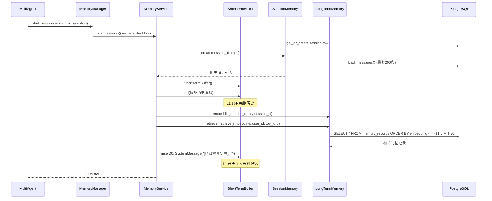
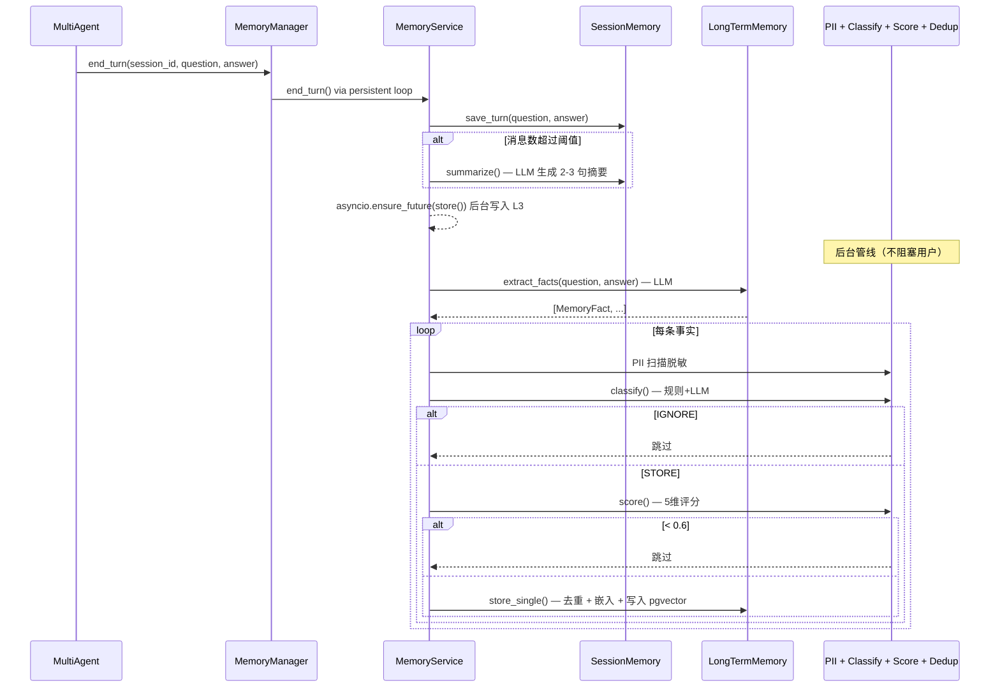
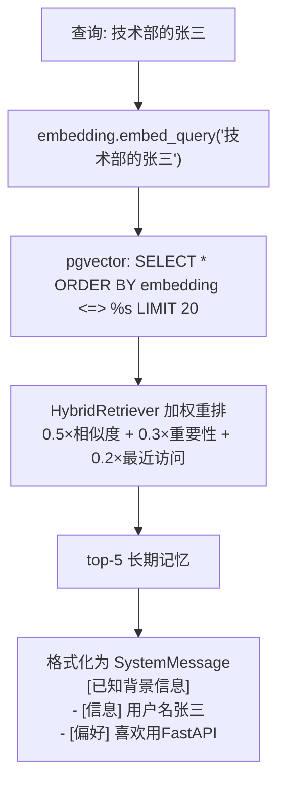

# 第 5 课：三段记忆系统

> 读完这篇你能回答：
> 1. L1/L2/L3 三层分别解决什么问题？它们如何协作？
> 2. MemoryManager 的 sync→async 桥为什么用持久事件循环而不是 `asyncio.run()`？
> 3. 面试官问"如何在 LLM 应用中实现长期记忆"怎么答？

---

## 1. 模块职责（Why）

### 一句话概括

**让 AI 记住"你是谁"、"你们聊过什么"、"你的偏好和决定"，跨会话持久化，每次对话开始时自动注入上下文。**

### 三层分工

| 层 | 名称 | 存储 | 生命周期 | 容量 | 解决什么问题 |
|---|---|---|---|---|---|
| **L1** | 短期记忆 | 内存 `list` | 单次 ask() | 20 条消息 | 多轮对话上下文 |
| **L2** | 会话记忆 | PostgreSQL | 一个会话 | 200 条 + 自动摘要 | 会话历史持久化 |
| **L3** | 长期记忆 | pgvector | 跨会话永久 | 无上限 | 用户画像/偏好/决策 |

### 记忆的生命周期

```
每次对话:
  开始 → L1 从 L2+L3 加载历史 → 注入 SystemMessage
  对话中 → L1 环形缓冲累积消息
  结束 → 问题+回答写入 L2 → 后台提取事实 → PII→分类→打分→去重→写入 L3

会话关闭再打开:
  开始 → L2 加载完整历史 → L3 检索相关记忆 → 注入到新对话
```

---

## 2. 整体流程（Flow）

### 会话开始



### 会话结束 + 后台写入



### 记忆检索流程



---

## 3. 技术选型（Why This Tech）

### 为什么 L1 用环形缓冲而不是完整历史？

| 方案 | 优点 | 缺点 |
|---|---|---|
| 完整历史 | 不丢信息 | token 爆炸，超出 LLM 上下文窗口 |
| **环形缓冲 (20条)** | 保证上下文窗口内 | 旧消息被淘汰 |
| 滑动窗口 + 摘要 | 兼顾 | 实现复杂 |

**选择环形缓冲的原因：**
- LLM 上下文窗口只有 4096 tokens（`LLM_CONTEXT_LENGTH`）
- 20 条消息 ≈ 2000-3000 tokens，留足空间给检索结果
- 旧消息的"精华"已经通过 L2→L3 流程提取为长期记忆

### 为什么 L3 用 pgvector 而不是 ChromaDB？

| 方案 | 优点 | 缺点 |
|---|---|---|
| ChromaDB | 零配置 | 和 RAG 共享一个数据库，耦合 |
| **pgvector** | PostgreSQL 原生，统一存储 | 需要安装扩展 |
| FAISS | 极快 | 无持久化，纯内存 |

**选择 pgvector 的原因：**
- **统一存储层** — L2 和 L3 都在 PostgreSQL 中，一个连接搞定
- **ACID 保证** — 记忆写入和会话持久化在同一个事务中
- **成熟的运维** — pgvector 已被企业广泛使用

### 为什么 MemoryManager 用持久事件循环而不是 `asyncio.run()`？

```python
# ❌ asyncio.run() 每次调用创建+销毁事件循环
def start_session(self, ...):
    return asyncio.run(self._service.start_session(...))
# 问题：SQLAlchemy async engine 的连接池绑定到事件循环
# 循环销毁 → 连接池损坏 → 下次调用时连接失效

# ✅ 持久事件循环：一个线程，一个循环，进程生命周期内复用
def __init__(self):
    self._executor = ThreadPoolExecutor(max_workers=1)
    self._executor.submit(self._init_loop)  # 创建持久 loop

def _run(self, coro):
    def _execute():
        loop = asyncio.get_event_loop()
        result = loop.run_until_complete(coro)
        # 给后台任务（L3 store）一个 drain 的机会
        pending = asyncio.all_tasks(loop)
        if pending:
            loop.run_until_complete(asyncio.gather(*pending))
        return result
    return self._executor.submit(_execute).result(timeout=120)
```

### 为什么 L3 写入是后台异步的？

```python
# service.py:91 — end_turn 最后一行
asyncio.ensure_future(self.store(question, answer, session_id, user_id))
```

**原因：** 事实提取调用 LLM，PII 扫描 + 分类 + 评分 + 去重 + 嵌入 + 写入，整个管线可能需要 2-5 秒。用户不需要等这些完成——回答已经返回了。后台静默写入，失败不影响用户体验。

### 为什么需要 5 维评分 + 分类 + 去重？

每一条记忆经过 **5 道关卡**才能进入 L3：

| 关卡 | 做什么 | 拒绝示例 |
|---|---|---|
| Extract | LLM 提取事实 | "好的收到" → NONE |
| PII | 脱敏 | 身份证号 → [身份证号] |
| Classify | 规则+LLM判断是否值得存 | "天气不错" → IGNORE |
| Score | 5维评分 ≥ 0.6 | 闲聊 → 0.2 → 淘汰 |
| Dedup | 余弦相似度去重 | "我叫张三" 出现 3 次 → 存 1 次 |

这保证了 L3 不会变成垃圾场——只有真正有价值的信息才会存下来。

---

## 4. 核心源码解析（How）

### 阶段 1：MemoryManager 初始化（manager.py:19-45）

```python
# manager.py:19-45
class MemoryManager:
    def __init__(self):
        self._service = MemoryService()
        self._executor = ThreadPoolExecutor(max_workers=1)
        self._executor.submit(self._init_loop).result(timeout=10)  # 预热持久 loop
        atexit.register(self._shutdown)  # 进程退出时清理
```

**为什么 `max_workers=1`？** 所有 DB 操作共享一个连接池，多线程并发会竞争连接。1 个工作线程 = 1 个事件循环 = 串行执行，简单安全。

### 阶段 2：start_session — 三层加载（service.py:30-65）

```python
# service.py:30-65
async def start_session(self, session_id, user_id="default"):
    # Step 1: 确保 chat_sessions 行存在
    srepo = SessionRepository(db_session)
    await srepo.get_or_create(session_id, user_id)

    # Step 2: L2 → L1: 加载会话历史
    l2 = await SessionMemory.create(session_id, srepo, user_id)
    l1 = ShortTermBuffer()
    history = await l2.load_messages()  # 最多 200 条
    for msg in history:
        l1.add(msg)

    # Step 3: L3 → L1: 检索长期记忆 + 注入 SystemMessage
    retriever = HybridRetriever(mrepo)
    l3 = LongTermMemory(mrepo)
    emb = l3.embedding.embed_query(session_id)
    records = await retriever.retrieve(session_id, emb, user_id, top_k=5)
    if records:
        prompt_text = LongTermMemory.format_for_prompt(facts)
        l1._messages.insert(0, SystemMessage(content=prompt_text))
        # SystemMessage 插入到最前面，作为 LLM 的"背景知识"

    return l1
```

**为什么 SystemMessage 插入头部？** LangChain 的 prompt 中，`SystemMessage` 出现在对话历史之前。LLM 先看到"[已知背景信息] 用户叫张三，是后端工程师"，再看到对话历史。这样 LLM 的每一次回答都能利用这些背景。

### 阶段 3：L1 环形缓冲（short_term.py:13-44）

```python
# short_term.py:13-44
class ShortTermBuffer:
    def add(self, msg):
        self._messages.append(msg)
        if len(self._messages) > self._max:  # 默认 20
            self._messages = self._messages[-self._max:]  # 保留最后 20 条
```

**为什么是 `[-self._max:]` 而不是 `[self._max:]`？** 保留最新的消息——最近的对话最重要。旧消息的"精华"已经通过 L2→L3 提取了。

### 阶段 4：L2 会话持久化（session.py:14-64）

```python
# session.py:14-64
class SessionMemory:
    @classmethod
    async def create(cls, session_id, repo, user_id):
        inst = cls(session_id, user_id)
        inst._message_count = await repo.message_count(session_id)
        return inst

    async def summarize(self):
        # 取最近 200 条消息
        rows = await self._repo.load_messages(self.session_id, limit=200)
        conversation = "\n".join(f"{role}: {content}" for role, content in ...)
        resp = llm.invoke(SUMMARY_PROMPT.format(conversation=conversation))
        self._summary = resp.content  # LLM 生成 2-3 句摘要
```

**摘要触发时机：** `needs_summarization` 当 `message_count >= 200` 时触发。摘要本身也存入 PostgreSQL（通过 repo）。

### 阶段 5：L3 后台写入管线（service.py:124-156）

```python
# service.py:124-156 — 5 道关卡
async def store(self, question, answer, session_id, user_id):
    # 1. Extract: LLM 提取事实
    facts = l3.extract_facts(question, answer)

    for fact in facts:
        # 2. PII: 扫描脱敏（在 extract_facts 内部已完成）
        # 3. Classify: 规则+LLM 判断是否值得存
        if self._trigger.classify(fact.content, fact.fact_type) == "IGNORE":
            continue
        # 4. Score: 5 维评分 ≥ 0.6
        fact.importance_score = self._importance.score(fact.fact_type, fact.content)
        if not self._importance.should_store(fact.importance_score):
            continue
        # 5. Dedup + Write: 余弦相似度去重
        ok = await l3.store_single(fact, user_id, session_id)
```

### 阶段 6：事实提取（long_term.py:52-60）

```python
# long_term.py:52-60
def extract_facts(self, question, answer):
    resp = llm.invoke(FACT_EXTRACTION_PROMPT.format(conversation=...))
    return self._parse_facts(resp.content)
```

**提取格式：**
```
user_fact|用户名张三
preference|喜欢使用FastAPI框架
decision|决定用PostgreSQL替换SQLite
```

**解析容错（3 种格式）：**
```python
# Format 1: 管道分隔（标准格式）
"user_fact|用户名张三"  → 直接解析

# Format 2: 中文冒号（LLM 自由格式）
"类型: user_fact, 内容: 用户名张三"  → 正则提取

# Format 3: 纯文本（兜底）
"用户名是张三"  → 作为 knowledge 类型存储
```

### 阶段 7：去重逻辑（long_term.py:118-144）

```python
# long_term.py:118-144
async def store_single(self, fact, user_id, session_id):
    emb = self.embedding.embed_query(fact.content)

    # 向量相似度搜索已有记忆
    existing = await self._repo.find_similar(emb, user_id, threshold=0.85)
    if existing:
        # 高相似度 (>0.95) → 替换旧记忆
        sim = cosine_similarity(emb, existing.embedding)
        if sim >= 0.95 and existing.memory_type == fact.fact_type:
            await self._repo.supersede(str(existing.id), str(record.id))
            return True
        # 中等相似度 (0.85-0.95) → 跳过去重
        return False

    # 全新 → 写入
    await self._repo.insert(record)
    return True
```

### 阶段 8：加权检索（retriever.py:11-36）

```python
# retriever.py:11-36
async def retrieve(self, query, embedding, user_id, top_k=5):
    # Step 1: pgvector 语义检索 top-20
    candidates = await self._repo.search_hybrid(embedding, user_id, top_k=20)

    # Step 2: 多因子加权重排
    for record in candidates:
        sim = cosine_similarity(embedding, record.embedding)          # 权重 0.5
        recency = max(0.0, 1.0 - days_since_access / 365.0)          # 权重 0.2
        final = 0.5 * sim + 0.3 * record.importance_score + 0.2 * recency

    return top_k by final_score
```

**多因子加权公式：** `0.5×相似度 + 0.3×重要性 + 0.2×最近访问`

这样"最近被查过的、重要的、语义相关的"记忆排在最前面。

### 阶段 9：记忆衰减（decay.py:9-21）

```python
# decay.py:9-21
async def run(self):
    n_180 = await self._repo.apply_decay(180, 0.9)   # >180天：×0.9
    n_90  = await self._repo.apply_decay(90, 0.95)    # >90天：×0.95
    n_archived = await self._repo.archive_stale(0.2)  # <0.2：归档
```

**衰减策略：** 长期不访问的记忆重要性逐渐降低，降到 0.2 以下归档。需要定期手动运行（`python -c "asyncio.run(MemoryService().run_decay())"`）。

---

## 5. 涉及的知识点（Knowledge）

| 知识点 | 基础概念 | 为什么这里用到 | 企业用法 |
|---|---|---|---|
| **环形缓冲** | 固定大小，超出淘汰旧数据 | L1 内存限制，防止 token 爆炸 | 日志缓冲、消息队列 |
| **pgvector** | PostgreSQL 向量扩展 | L3 语义检索记忆 | 知识库、推荐系统、相似搜索 |
| **Agent Memory** | LLM 的记忆能力 | 跨会话记忆用户画像 | LangChain Memory、Mem0、MemGPT |
| **PII 脱敏** | 个人信息保护 | 记忆库不能存身份证/手机号 | 数据治理、GDPR 合规 |
| **Exponential Decay** | 重要性随时间衰减 | 不活跃的记忆自动降权 | 缓存过期、推荐衰减、信用分 |
| **Hybrid Retrieval** | 多因子加权检索 | 相似度+重要性+最近访问 | 搜索引擎 ranking |
| **async→sync Bridge** | 异步和同步代码的桥接 | MemoryManager 给同步 Agent 提供异步服务 | FastAPI 后台任务、Celery |
| **ensure_future** | 创建不阻塞的异步任务 | L3 写入不等待完成 | 发邮件、写日志、推送通知 |
| **LLM 摘要** | 用 LLM 压缩长文本 | 会话太长时自动生成摘要 | 客服摘要、会议记录、文档总结 |

---

## 6. 企业级实现

### 当前实现评级：**中小型项目 — 架构设计接近企业级**

| 维度 | 当前状态 | 企业级 |
|---|---|---|
| L1 短期 | ✅ 环形缓冲 | 同 |
| L2 会话 | ✅ PostgreSQL 持久化 | 同 |
| L3 长期 | ✅ pgvector 语义检索 | 同 + 分层存储（热/温/冷） |
| 衰减策略 | ✅ 手动触发 | 定时任务自动执行 |
| PII | ✅ 正则脱敏 | 外加模式识别（身份证Luhn算法） |
| 检索 | ✅ 多因子加权 | 外加用户行为特征 |

### 企业一般加什么

1. **自动衰减调度** — 定时任务（cron/Celery Beat），无需手动运行
2. **用户画像** — 不只是事实，还包括行为特征、偏好向量
3. **记忆溯源** — 每条记忆记录来源（哪次对话），支持追溯
4. **分层存储** — 热数据（最近7天）在 pgvector，冷数据归档到 S3

---

## 7. 可以优化的地方

### 性能
- [ ] **L3 写入管线串行** — 每条事实依次 LLM→分类→评分→嵌入→写入，可并行
- [ ] **embedding 懒加载** — 每次 `start_session` 都重新创建 embedding 模型

### 可维护性
- [ ] **MemoryManager 的线程模型脆弱** — 依赖 `atexit`，进程异常退出时清理可能不完整
- [ ] **`_run()` 的 timeout=120 硬编码** — 应该从 config 读取

### 安全性
- [ ] **PII 扫描只覆盖中文场景** — 英文姓名、SSN、地址未覆盖
- [ ] **无访问控制** — 任何 session 都能读取任意 user_id 的记忆

### 可观测性
- [ ] **没有 L3 写入成功率监控** — 后台静默失败无法感知
- [ ] **没有记忆库膨胀监控** — L3 可能无限增长

---

## 8. 面试角度

**Q1: 为什么需要三层记忆，而不是一层？**

> 标准答案：不同层级解决不同问题。L1 解决短期上下文（当前对话不丢上下文），L2 解决会话持久化（下次打开接着聊），L3 解决跨会话知识积累（记住用户是谁）。如果只有一层，要么内存爆炸，要么丢失短期上下文，要么跨会话完全不记得。

**Q2: MemoryManager 为什么用持久事件循环而不是 `asyncio.run()`？**

> 标准答案：SQLAlchemy async engine 的连接池绑定到事件循环。`asyncio.run()` 每次创建+销毁循环，连接池也会被销毁，导致下次调用时连接失效。持久事件循环在进程生命周期内保持连接池存活。

**Q3: 如何防止 L3 变成垃圾场？**

> 标准答案：5 道关卡过滤：LLM 提取（过滤闲聊）、PII 脱敏（保护隐私）、规则+LLM 分类（判断是否值得存）、5 维评分（<0.6 淘汰）、余弦去重（重复内容不重复存）。

**Q4: `asyncio.ensure_future` 为什么不 await？**

> 标准答案：L3 写入管线需要 2-5 秒（LLM 提取+PII+评分+嵌入+写入），用户已经收到回答，不需要等这些完成。后台静默写入，失败不影响用户体验。

**Q5: HybridRetriever 的加权公式为什么是 0.5+0.3+0.2？**

> 标准答案：相似度最重要（0.5），确保语义相关的记忆优先；重要性次之（0.3），用户角色/偏好等关键信息应该优先召回；最近访问再次（0.2），最近被用过的记忆可能更相关。权重可以按场景调整。

**Q6: 记忆衰减为什么要手动触发而不是自动？**

> 标准答案：衰减涉及 UPDATE 大量数据库行，可能影响在线服务性能。手动触发可以在业务低谷期执行。企业做法是用定时任务（cron）在凌晨执行。

**Q7: PII 脱敏为什么是"替换"而不是"丢弃"？**

> 标准答案：保留语义骨架。如"张三的身份证号是[身份证号]"，记忆系统仍知道"张三有身份证号"这个事实，但不存具体号码。如果直接丢弃整条记忆，会丢失"张三有身份信息"这个知识。

**Q8: L2 摘要什么时候触发？**

> 标准答案：`SESSION_MAX_MESSAGES`（默认 200 条）时触发。取最近 200 条消息给 LLM，生成 2-3 句摘要。摘要存入数据库，下次加载会话时返回摘要而非全部消息，节省 token。

**Q9: L3 的去重逻辑为什么有两级阈值？**

> 标准答案：0.85-0.95（中等相似）→ 跳过去重，认为不是重复；≥0.95（高度相似）→ 替换旧记忆（supersede）。这避免了"新信息稍微改了一个字就被丢弃"，同时确保"完全相同的记忆会被更新"。

**Q10: `start_session` 为什么先创建 `chat_sessions` 行？**

> 标准答案：`chat_messages` 表有外键约束引用 `chat_sessions`。如果 session 行不存在，插入消息会失败。`get_or_create` 确保兜底。

**Q11（进阶）: 如果 L3 记忆库有 100 万条记录，检索性能如何保证？**

> 标准答案：pgvector 的 IVFFlat 索引可以将检索复杂度从 O(N) 降到 O(√N)。`search_hybrid` 先用 embedding 粗筛（索引加速），再在 20 个候选中做多因子加权重排。企业量级还会加分区表（按 user_id）。

**Q12（进阶）: 如何防止用户通过对话注入虚假记忆？**

> 标准答案：当前实现没有防护——用户说"我是CEO"就会被存为 user_fact。企业做法：1）记忆带来源标注（可信度），2）重要事实需要多次确认才升级可信度，3）关键身份信息走认证系统而非对话记忆。

---

## 9. 学习总结

### 最重要的知识点

1. **三层记忆架构** — 每层解决不同问题，协作不重叠
2. **async→sync 桥的持久事件循环** — 连接池与事件循环生命周期的关系
3. **后台写入管线** — 5 道关卡保证记忆质量
4. **多因子加权检索** — 不只依赖向量相似度

### 必须掌握的源码

1. `service.py:30-65` — start_session 三层加载
2. `service.py:124-156` — store 后台 5 道管线
3. `manager.py:19-45` — 持久事件循环初始化
4. `retriever.py:11-36` — 多因子加权检索
5. `long_term.py:118-144` — 去重 + supersede 逻辑

### 最容易踩坑的地方

1. **`asyncio.run()` 破坏连接池** — 每次创建新循环 = 每次重建连接池
2. **`ensure_future` 的异常被吞** — 后台任务失败不抛异常，需要独立错误处理
3. **embedding 模型重复加载** — 每个 `LongTermMemory` 实例懒加载一次

### 面试必须会讲的内容

> "我设计了一个三段记忆系统。L1 是环形缓冲（20 条，防 token 爆炸），L2 是 PostgreSQL 会话持久化（200 条触发自动摘要），L3 是 pgvector 长期记忆（5 道关卡保证质量：提取→PII→分类→评分→去重）。MemoryManager 用持久事件循环做 sync→async 桥，因为 SQLAlchemy 连接池绑定到循环生命周期。检索用多因子加权（0.5×相似度+0.3×重要性+0.2×最近访问），确保召回的记忆既相关又重要。"

---

> **下一课：报告生成系统** — 模板引擎 + 数据获取 + LLM 润色
