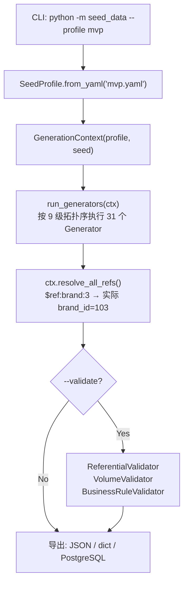

# 第 7 课：种子数据框架

---

## 1. 模块职责（Why）

**一句话：** 用 YAML Profile 驱动 31 个 Generator，生成 9 大跨境电商领域的模拟数据，用于开发/测试/演示。

没有它：每个开发者手写 INSERT 语句 → 数据不一致 → 外键断裂 → 测试跑不通。

## 2. 整体流程



### 9 级拓扑序（严格遵守 FK 依赖）

| 层级 | 实体 | 依赖 |
|---|---|---|
| 0 | Brand, Category, Channel, Warehouse, Supplier | 无 |
| 1 | Product | 层级 0 |
| 2 | SKU, Customer, KnowledgeDoc | 层级 1 |
| 3 | Listing, KnowledgeChunk, CustomerAddress | 层级 2 |
| 4 | Order, OrderItem, OrderEvent | Customer, Channel, SKU |
| 5 | InventoryLevel, InventoryTransaction, InventoryHealth | SKU, Warehouse |
| 6 | Review | Customer, SKU, Order |
| 7 | Logistics (4 个实体) | Supplier, Warehouse, Order |
| 8 | Advertising (6 个实体) | AdAccount→Campaign→AdGroup→Ad→SKU |
| 9 | Report | 独立 |

## 3. 技术选型

| 选择 | 为什么 |
|---|---|
| **YAML Profile** | 业务人员也能改规模参数，不需要懂 Python |
| **$ref 占位符** | Generator 不直接拿 FK 值，而是输出 `$ref:brand:3`，由 Factory 统一解析。解耦生成器和数据上下文 |
| **4 种 Profile** | tiny(500)/mvp(5000)/medium(50000)/full(500000) — 按需选择 |
| **确定性随机** | `seed=42` 保证每次生成相同数据，测试可复现 |

## 4. 核心源码解析

### Generator 基类（core/generator.py）

```python
class BaseGenerator(ABC):
    entity_name: str  # 如 "brand", "sku"

    def generate_one(self, ctx) -> dict:
        """生成一条实体，FK 用 $ref:entity:index 占位符"""
        return {
            "brand_id": ctx.next_id("brand", "B"),      # B001, B002...
            "name": self.rng.choice(BRANDS),
            "product_id": "$ref:product:0",  # 占位符，后面统一解析
        }

    def generate_many(self, ctx, count=None):
        if count is None:
            count = self.profile.entity_count(self.entity_name)
        return [self.generate_one(ctx) for _ in range(count)]
```

### $ref 解析

```python
# core/factory.py:57-76
def _resolve_fks(self, raw):
    for key, value in raw.items():
        if isinstance(value, str) and value.startswith("$ref:"):
            resolved[key] = self.ctx.resolve_ref(value)
            # "$ref:brand:3" → ctx.entities["brand"][3]["brand_id"] → "B004"
```

### Profile 配置（profiles/mvp.yaml）

```yaml
name: mvp
description: MVP 演示数据 (~5000 entities)
seed: 42
entities:
  brand:     { count: 20, fixed: true }
  product:   { count: 50 }
  sku:       { count: 150 }
  order:     { count: 500 }
  ...
distributions:
  order:
    status: { DELIVERED: 0.70, SHIPPED: 0.12, CANCELLED: 0.05, ... }
```

### 验证器

| 验证器 | 检查什么 |
|---|---|
| ReferentialValidator | 所有 FK 引用是否有效（order.product_id 指向已存在的 product） |
| VolumeValidator | 数量是否接近 Profile 预期（容差 50%） |
| BusinessRuleValidator | 业务规则（如"已发货的订单必须有 shipped_at"） |

## 5. 知识点

Generator 模式、YAML 驱动配置、FK 拓扑排序、$ref 占位符延迟解析、确定性随机种子、工厂模式。

## 6. 企业级评估：**中小型项目**

企业会加：Faker 库替代手写数据、数据库直写（批量 INSERT）、GDPR 脱敏种子数据、多语言数据。

## 7. 优化方向

- [ ] Generator 的数据字典硬编码（品牌名、城市名）→ 应外置为 CSV/JSON
- [ ] 串行生成 31 个实体较慢 → 同层级可并行

## 8. 面试必问

**Q1: 为什么用 $ref 占位符而不是直接写 FK 值？**

> Generator 生成实体时，被引用的实体可能还没生成。$ref 延迟到所有实体生成完再统一解析，避免时序依赖。

**Q2: 如何保证测试可复现？**

> 确定性随机种子（`seed=42`）。相同的 seed + 相同的 Profile → 相同的数据 → 测试结果一致。

## 9. 学习总结

- **核心设计**：Profile 驱动 → Generator 按拓扑序执行 → $ref 延迟解析 → 验证 → 导出
- **面试必讲**：YAML Profile 的业务友好 + $ref 的时序解耦 + 确定性种子的可复现

---

> 下一课：评估框架
