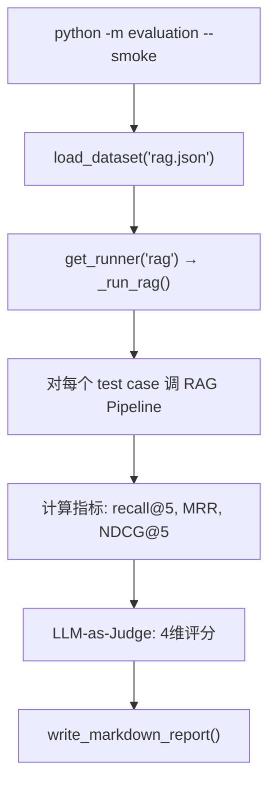

# 第 8 课：评估框架

---

## 1. 模块职责（Why）

**一句话：** 零项目依赖的可移植评估框架。复制到任何项目，注册 Runner 即可评估 RAG/SQL/E2E 质量。

**核心设计：** 框架层（models/metrics/report/registry）与项目 Runner 层分离。换一个项目只需换 Runner，框架不变。

## 2. 整体流程



## 3. 技术选型

| 选择 | 为什么 |
|---|---|
| **纯函数指标** | 无副作用，可直接用于 pytest 参数化测试 |
| **LLM-as-Judge** | 4 维评分（完整性/忠实性/简洁性/引用质量）替代人工评估 |
| **Runner 注册表** | 插件式注册，新增评估模块只需 `register_runner()` |
| **可移植设计** | `set_llm_callable()` 注入 LLM，框架不绑定任何特定 LLM |

## 4. 核心源码解析

### 4 维 LLM-as-Judge（evaluation/judge.py）

```python
class JudgeResult(BaseModel):
    scores: dict[str, int]  # {"completeness": 4, "faithfulness": 5, ...}
    total: float            # 加权综合分 (1.0-5.0)
    reasoning: str          # 评分理由
    confidence: str         # low/medium/high
```

**4 个维度：**
| 维度 | 衡量什么 |
|---|---|
| completeness | 是否完整回答了问题 |
| faithfulness | 是否忠实于检索到的文档（不编造） |
| conciseness | 是否简洁无冗余 |
| citation_quality | 引用标注是否准确 |

### 指标计算（evaluation/metrics.py）

```python
def recall_at_k(actual, expected, k):
    """预期集中有多少出现在实际结果的前 K 个中"""
    return len(set(actual[:k]) & set(expected)) / len(expected)

def mrr(actual, expected):
    """第一个相关结果排名的倒数均值"""
    for i, item in enumerate(actual, 1):
        if item in expected_set:
            return 1.0 / i  # 排第1=1.0, 排第2=0.5, 排第3=0.33...
    return 0.0

def ndcg_at_k(actual, expected, k):
    """考虑位置权重的排序质量（排名靠前的相关结果得分更高）"""
    # NDCG = DCG / IDCG (归一化)
```

### Runner 注册（evaluation/registry.py）

```python
def register_runner(name, fn, needs_live=False):
    """注册评估 Runner"""
    _runners[name] = RunnerEntry(name=name, fn=fn, needs_live=needs_live)
```

## 5. 知识点

信息检索指标（Recall/MRR/NDCG）、LLM-as-Judge、可移植框架设计、插件式注册表、Jaccard 相似度。

## 6. 企业级评估：**中小型项目**

企业加：Golden Dataset 版本管理、CI/CD 集成（每次 PR 自动跑评估）、A/B 对比报告、历史趋势追踪。

## 7. 面试必问

**Q: Recall@5 = 0.8 和 MRR = 0.3 说明什么？**

> 80% 的相关文档出现在前 5 个结果中，但第一个相关结果平均排在第 3 位（1/0.33≈3）。召回不错但排序不佳——需要优化 Reranker。

**Q: 为什么用 LLM-as-Judge 而不是人工评估？**

> 人工评估成本高（每个 case 需要几分钟），不可规模化。LLM-as-Judge 可以批量跑 100 个 case。但 LLM 自己的偏见需要监控——定期抽检人工复核。

## 8. 学习总结

- **核心设计**：框架层与 Runner 层分离，可移植到任何项目
- **面试必讲**：Recall/MRR/NDCG 三个指标的含义 + LLM-as-Judge 的 4 维评分
