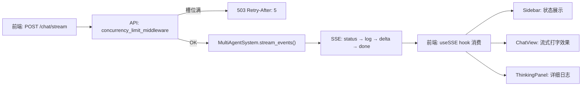
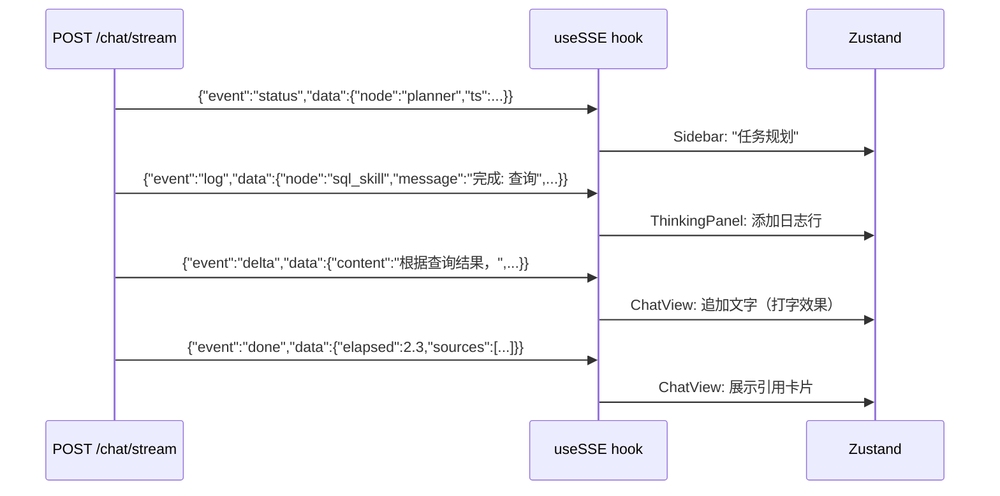

# 第 9 课：API 层 + 前端

---

## 1. 模块职责（Why）

**API 层：** FastAPI 提供 REST + SSE 端点，CPU 保护中间件防止过载关机。

**前端：** Next.js + Zustand + SSE 实时流，零管理后台依赖的轻量 UI。

## 2. 整体流程



### SSE 流式协议（4 种事件）



## 3. 技术选型

| 选择 | 为什么 |
|---|---|
| **FastAPI** | Python 异步原生，SSE 支持好，自动生成 OpenAPI 文档 |
| **SSE vs WebSocket** | SSE 单向（服务器→客户端），比 WebSocket 简单，不需要心跳 |
| **Next.js** | React 全栈框架，SSR + 静态生成 |
| **Zustand** | 比 Redux 轻量，API 简单，适合中小项目 |
| **Semaphore 并发控制** | `asyncio.Semaphore(1)` 限制同时处理 1 个请求，防止 CPU 过载 |
| **503 + Retry-After** | 槽位满时直接拒绝（不排队），避免雪崩效应 |

## 4. 核心源码解析

### CPU 保护中间件（api/server.py:32-52）

```python
_request_semaphore = asyncio.Semaphore(1)  # 同时只能处理 1 个请求

@app.middleware("http")
async def concurrency_limit_middleware(request, call_next):
    if request.url.path in _SKIP_PATHS:  # /health 不受限
        return await call_next(request)

    if not _request_semaphore.locked():
        async with _request_semaphore:
            return await call_next(request)

    # 槽满 → 503，不排队（防止请求堆积）
    return JSONResponse(status_code=503, content={"error": "ServerBusy"},
                        headers={"Retry-After": "5"})
```

**为什么不排队？** Ollama 本地推理吃满 CPU，排队会导致所有请求超时。直接拒绝 + 提示"5 秒后重试"更好。

### SSE Stream 消费（web/src/hooks/useSSE.ts）

```typescript
for await (const evt of streamChat({question, session_id}, controller.signal)) {
    // 4 种事件分发
    switch(evt.event) {
        case "status":  // Sidebar 进度
        case "log":     // ThinkingPanel 日志
        case "delta":   // ChatView 打字效果
        case "done":    // 完成 + 来源引用
        case "error":   // 错误中止
    }
}
```

### 全局异常处理（api/server.py:63-88）

```python
@app.exception_handler(StarletteHTTPException)
async def http_exception_handler(request, exc):
    """业务层 HTTPException（如 503/404/422）保持原状态码"""
    return JSONResponse(status_code=exc.status_code, content={"detail": exc.detail})

@app.exception_handler(Exception)
async def global_exception_handler(request, exc):
    """非预期异常统一返回 500"""
    return JSONResponse(status_code=500, content={"error": "InternalServerError"})
```

**关键设计：** HTTPException 不拦截（让 FastAPI 默认处理），只兜底非预期异常。

## 5. 知识点

FastAPI、asyncio.Semaphore、SSE（Server-Sent Events）、Next.js、Zustand、SSE Stream 消费、并发控制、503 Retry-After。

## 6. 面试必问

**Q: 为什么用 SSE 而不用 WebSocket？**

> SSE 是单向的（服务器→客户端），WebSocket 是双向的。这个场景只需要服务器推送进度给前端，前端只发送一个请求。SSE 更简单——不需要心跳、不需要握手升级、浏览器原生支持 `EventSource`。

**Q: Semaphore(1) 会不会让并发用户等待太久？**

> CPU 保护优先于并发。Ollama 本地推理吃满 CPU，并发 2 个请求就会导致两个都超时。503 直接拒绝 + `Retry-After: 5` 让客户端 5 秒后重试，用户体验好于等待 60 秒超时。

**Q: 前端如何实现"打字效果"？**

> 后端 `stream_events()` 产出 delta 事件（逐句分割）。前端收到 delta 后追加到 Zustand store 的 `deltaText`，ChatView 组件实时渲染。句子间 `time.sleep(0.02)` 制造视觉停顿。

## 7. 学习总结

- **核心设计**：FastAPI 并发保护 + SSE 单向流 + Zustand 轻量状态
- **面试必讲**：SSE vs WebSocket + asyncio.Semaphore 并发控制 + 4 种事件类型的 SSE 协议
