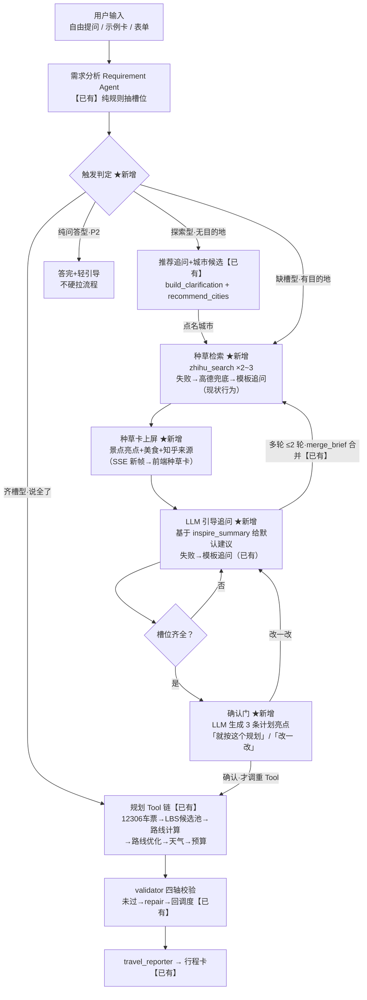

# 旅游「种草期」交互与示例优化方案

> 2026-10-02 起草，待拍板。覆盖两个诉求：①入口示例卡优化（三条新文案）；②自由提问场景的「种草期」新流程。
> 结论先行：**数据源层零新增**（知乎 Tool 已在平台），缺的是编排层（种草期状态机）、生成层（LLM 追问/亮点）、前端层（种草卡+确认门）三层；另有白名单扩容与示例卡替换两个前置项。

---

## 1. 背景与诉求

### 诉求一：入口示例卡优化

现有三张示例卡（`frontend/src/app/travel/page.tsx` `EXAMPLE_SCENARIOS`，点击=把 message 原文发进对话流）：

| 现有卡 | 实测状态 |
|---|---|
| 福州美食周末 | 可用，但 message 硬编码「2026-10-03」已临近过期 |
| 福州 → 厦门 | 可用，同样硬编码日期 |
| 泉州慢游 | **死卡**：泉州已随种子库下线移出支持名录，点击得到「泉州暂不支持」——示例卡当场演示失败 |

用户拟换的三条新文案（助手视角）：

1. 「周末想出去走走吗？我来帮你挑几个适合短途放松的好去处」
2. 「丽江的热门旅游景点已经整理好了」
3. 「我给你安排一个西安3天逛古迹不绕路行程」

**逐条实测结论**（判据：目的地抽取只认白名单 `poi_seed.all_cities()` = 福州/厦门/杭州）：

| 新文案 | 定位 | 照原样发送的实际行为 | 判定 |
|---|---|---|---|
| ① 周末探索 | 无目的地轻探索 | 目的地为空 → `build_clarification` 追问，且追问已接 `recommend_cities` 推荐行（requirement_agent.py:693），承诺大致兑现 | **基本能落**（需配用户话术 message） |
| ② 丽江景点 | 单城景点清单 | 丽江不在白名单也不在知名城市名单 → 抽取返回空 → 答非所问的泛泛反问，连「不支持」明示都没有 | **必挂**（需白名单扩容+轻产物形态） |
| ③ 西安行程 | 完整行程（3天/古迹/不绕路） | 西安在 `KNOWN_MAJOR_CITIES`「知名但不支持」名单 → 明示「西安暂不支持」 | **必挂且最打脸**（需白名单扩容） |

三条共性问题：全是**助手视角文案**，与「点 chip=发 message」机制冲突——chip 展示文字可以用助手语气，但点击实际发送的 message 必须是用户话术且城市在白名单内（现有 `EXAMPLE_SCENARIOS` 本就是 title/message 成对结构，支持这种设计）。

### 诉求二：自由提问的「种草期」流程（用户口径整理）

```
用户自由提问（如「想出去走走」「丽江有什么好吃的」）
→ ① 需求分析（已有：Requirement Agent 纯规则抽槽位）
→ ② 知乎搜索：搜该地景点/特色/美食（新时序：需求分析后立即触发）
→ ③ 向用户介绍这些景点与美食（种草内容上屏）
→ ④ 系统追问引导，往旅游规划方向问（三天两晚慢游？必去景点？）——用 LLM 生成
→ ⑤ 多轮：用户自己选或继续提问，直到需求确认
→ ⑥ 先说明这个计划的亮点（新，LLM 生成）
→ ⑦ 用户确认后，开始调用各种 Tool 跑旅游规划（已有链路）
```

### 链路图（mermaid 版）



---

## 2. 现状盘点

### 2.1 已有资产（方案直接复用，零新增数据源）

| 资产 | 现状 | 对本方案的意义 |
|---|---|---|
| **知乎官方 MCP Tool**（`tools/search/zhihu.py`） | `zhihu_search_tool` + `global_search_tool` 已注册进契约 lock；官方开放平台，Bearer 鉴权；开关 `ZHIHU_MCP_ENABLED` **默认关**；300s TTL 缓存、按源节流、期内配额记账（搜索类各 5000 次/期） | 种草检索的数据源已就绪，只差编排前移 + 开关打开 |
| **Research Agent**（`travel/agents/research_agent.py`） | 无状态无 LLM 的数据供给方；`search_zhihu_guides(destination)` 已接入，当前在**规划链路中后段**当内部数据用（上轮流里「旅游知识检索」空结果 = 开关未开） | 检索执行体可复用，要改的是**调用时机**与**产物形态**（内部摘录 → 面向用户的种草内容） |
| **追问链路**（`build_clarification`） | 纯规则模板 + `recommend_cities` 推荐行（无目的地时给可选城市） | 追问骨架已在；LLM 引导是在其上的增强，模板保留为降级路径 |
| **多轮合并**（`merge_brief` + checkpointer 跨轮补槽） | 结构化槽位合并、断点恢复 | 多轮选/改的合并语义已在，只需扩种草摘要的存取 |
| **规划 Tool 链** | 12306 车票 / LBS 候选池（live）/ 路线计算+优化 / 天气 / 预算 / 高德美食酒店 | ⑥确认后的执行段全部现成 |
| **前端展示** | Tool 时间线 + 三类可视化卡（车次表/商户卡/攻略卡）+ SSE 帧契约（13 帧） | 种草卡与确认门是新事件形态，需扩展契约 |

### 2.2 核心差距（一句话）

**不是「没有知乎搜索」，而是交互时序与交互形态**：现状知乎检索在规划段内部、不影响对话走向、追问与内容无关、槽位齐就直接跑全链；目标是把检索前移到需求分析后、产物从内部数据升级为种草内容、追问由内容驱动（LLM）、规划前加确认门。

---

## 3. 目标流程与触发口径

### 3.1 全景（★ = 新增）

```
用户输入
→ 需求分析（Requirement Agent，纯规则，已有）
→ 触发判定（见 3.2）
→ ★ 种草检索：知乎搜「目的地+景点/特色/美食」（复用 search_zhihu_guides，
   扩多查询词）+ 高德美食/景点兜底
→ ★ 种草输出：中栏种草卡（景点亮点 + 美食介绍，标知乎来源与时间）
→ ★ LLM 引导追问：基于种草内容往规划方向问（几天几晚/必去/预算/节奏，
   给默认建议，如「推荐 3 天 2 晚慢游，要把 XX 和 XX 都排进去吗？」）
→ 多轮（用户选/改/再问；merge_brief 合并；★ 种草轮次上限 2）
→ ★ 确认门：槽位齐 → LLM 生成 3 条计划亮点 → 用户点「就按这个规划」
→ 规划 Tool 链（车票/候选池/路线/天气/预算，已有）→ 行程卡交付
```

### 3.2 触发口径（关键设计，防止过度热情）

| 输入形态 | 判据 | 行为 |
|---|---|---|
| 探索型（无目的地） | destination 为空 | 现有追问+推荐 → 用户点名城市后**进种草** |
| 缺槽型（有目的地） | 有 destination，days/budget 等关键槽缺 | **直接进种草** + LLM 引导追问 |
| 齐槽型 | 槽位齐全（示例卡/表单/一句话说全） | **跳过种草直通规划**——现有体验不倒退 |
| 纯问答型 | 明显只要信息（「丽江有什么好吃的」） | 答完 + 一句轻引导「要不要我帮你排进行程？」，不硬拉流程（P2） |

### 3.3 种草内容量与配额

- 每轮种草 = 知乎搜索 2~3 次（景点 1 + 美食 1，必要时特色 1），复用 300s TTL 缓存；建议种草摘要按城市做 24h 二级缓存（同城市重复种草不烧配额）。
- LLM 用量上限：每轮对话 ≤3 次（种草摘要提炼 1 + 引导追问 1 + 亮点生成 1），模型走现有 DeepSeek 配置。

---

## 4. 差距清单与做法

| # | 缺失 | 做法 | 改动面 |
|---|---|---|---|
| G1 | **种草期编排**：域图没有「需求分析后→种草→引导→确认」的中间态 | `slot_filler` 内扩 inspire 阶段（跨轮状态机已在 slot_filler，不新增顶层节点，不动 builder）；槽位不齐且开关开 → 先种草再追问；产物写 state | 后端 `travel/slot_filler.py` + `services/live_search_service.py`（扩多查询词） |
| G2 | **LLM 引导追问**：现追问是纯规则模板 | 种草内容存在时调 DeepSeek 生成 1~2 个基于内容的追问（含默认建议）；失败/超时/无内容 → 降级现有 `build_clarification` 模板 | 新增 `travel/services/inspire_service.py`（或并入 requirement_service，遵守「禁止堆积通用资源」约束需另立模块） |
| G3 | **种草内容进状态**：merge_brief 只合并结构化槽位 | state 增 `inspire_summary`（dict：top 景点/美食名+一句话摘要+来源 URL，checkpoint 安全、token 预算内截断）；追问与亮点生成时注入 | `graph_state` + slot_filler 存取 |
| G4 | **亮点+确认门**：槽位齐即直跑，无确认环节 | brief 齐 → LLM 用 `inspire_summary`+brief 生成 3 条亮点 → 前端确认卡（「就按这个规划」/「改一改」）→ 确认后才进 supervisor 调 Tool 链；**齐槽型路径跳过确认门保持直通**；拒绝/修改回追问循环（防循环上限沿用域图既有约定） | slot_filler 出口分支 + reporter 前状态 + 前端 |
| G5 | **前端种草卡与确认门**：中栏无此两类事件 | SSE 帧契约扩展（新帧或复用 meta/log 帧加 kind 字段，沿 node_labels 先例）；种草卡=景点/美食列表带知乎来源；确认门=按钮组；追问带可点 chips | `graph/events.py` 契约 + 前端 `travelRuntime.ts`/`TravelChatDrawer` |
| G6 | **白名单扩容**：丽江不在任何名单、西安在「不支持」名单 | 引入/扩充支持城市名录（live POI 源下名录=白名单语义，需把语义从「种子城市」解耦出「支持城市」）；丽江/西安进场后实测 LBS POI 质量与行程四轴校验通过率；②③示例卡随即成立 | `poi_seed` 名录层 + requirement_service（KNOWN_MAJOR_CITIES 语义重构，Phase 3 已挂账的「数据/名录层抽离」正好一并做） |
| G7 | **示例卡替换**：死卡泉州、硬编码日期 | 三条新示例按「chip 展示文案 + 用户话术 message」成对落；删泉州卡；日期改 `tomorrowIso()` 动态生成 | 纯前端 `page.tsx` |
| G8 | **配额与成本控制** | 知乎配额记账已有；增种草摘要 24h 缓存；LLM 每轮 ≤3 次；种草轮次上限 2；trace 记录种草检索耗时与配额余量 | 复用 `_bump_period_usage` + 新增缓存 |

---

## 5. 开关与降级

| 开关 | 默认 | 语义 |
|---|---|---|
| `TRAVEL_INSPIRE_ENABLED` | **关** | 种草期总闸；关 = 全链维持现状行为 |
| `ZHIHU_MCP_ENABLED` + `ZHIHU_MCP_API_KEY` | 关 | 已有，知乎数据源闸（**.env 的 key 已配好**，7129a35 上线时实测 PASS；验收前置 = 开关置 true + 重启容器） |
| `TRAVEL_INSPIRE_LLM_ENABLED` | 关 | LLM 引导追问+亮点生成；关 = 模板追问、无确认门（齐槽直通不变） |

降级链（任一环失败不阻塞、不吞异常）：

```
知乎失败/未配 → 高德 poi+美食兜底种草 → 再失败 → 现有 recommend_cities + 模板追问（= 现状行为）
LLM 失败/超时 → 模板追问；亮点生成失败 → 直接出确认卡（无亮点列表）
```

---

## 6. 分期实施

| 期 | 内容 | 说明 |
|---|---|---|
| **P0** | G7 示例卡（纯前端，独立可先上）+ G1/G2/G3/G5 种草主链 + 开关接线 | 主体验：自由提问 → 种草 → 引导 → 规划 |
| **P1** | G4 亮点确认门 + G6 白名单扩容（丽江/西安实测） | 确认门与②③示例的城市支撑 |
| **P2** | 纯问答轻引导、种草摘要 24h 缓存、知乎攻略可视化卡升级（对齐 12306 车次表形态） | 体验增强 |

依赖关系：P0 不依赖 G6（种草城市先用白名单三城）；G4 依赖 G3；②号示例卡的原文案成立依赖 G6+「只列景点」轻产物（后者若不做，②落地形态为「杭州/厦门 2 日游」换城版）。

## 7. 待拍板项

1. **触发口径**：3.2 的四分法是否同意（探索型先推荐再种草；齐槽型保持直通不倒退）。
2. **白名单扩容**：丽江/西安是否进场（西安建议进——「逛古迹」与 LBS 检索契合度最高；丽江连带「只列景点不排程」轻产物是否要做）。
3. **确认门是否必经**：种草路径走完后确认门强制，还是提供「跳过直接规划」。
4. **知乎配额策略**：种草默认全量开，还是先灰度（5000 次/期，种草每次 2~3 次 + 24h 缓存可显著摊薄）。
5. **纯问答型**是否接受放 P2。

## 8. 验收标准

1. 示例卡三条：①点击 → 追问含推荐城市行；②③（扩容后）→ 城市被接住并进入对应流程；死卡泉州消失；日期不再硬编码。
2. 自由提问「想去丽江吃吃喝喝」→ 种草卡出现丽江景点与美食（标知乎来源）→ 追问含默认建议 → 回复「3 天 2 晚」后 brief 合并 → 亮点 3 条 → 确认 → 行程卡交付。
3. `ZHIHU_MCP_ENABLED=false` 与 `TRAVEL_INSPIRE_ENABLED=false` 两种关闭态下，全链降级到现状行为，无报错、无空卡。
4. 种草轮次达上限后不再发知乎请求；知乎配额余量在 trace 可见。
5. 回归：现有 travel 测试全绿；新增 G1~G5 模块测试 + 降级路径测试；契约 lock 因 SSE 帧扩展重新生成并提交。

---

## 附：本文事实依据

- 知乎 Tool：`backend/tools/search/zhihu.py`（头部注释含 2026-10-02 实测返回形态）；注册于 `tool_registry`，配额记账 `_bump_period_usage`。
- research_agent 定位：`backend/travel/agents/research_agent.py` 头注释（无状态无 LLM 数据供给方）。
- 白名单：`backend/tools/travel/poi_seed.py::all_cities()` = 福州/厦门/杭州；`backend/travel/services/requirement_service.py::KNOWN_MAJOR_CITIES`（含西安，不含丽江）。
- 目的地抽取：`backend/travel/agents/requirement_agent.py::extract_destination` / `_extract_explicit_unsupported_destination`。
- 追问+推荐：`build_clarification`（requirement_agent.py:663，:693 调 `recommend_cities`）；推荐数据源 `backend/travel/recommend.py`（种子池打分，确定性）。
- 前端示例卡：`frontend/src/app/travel/page.tsx` `EXAMPLE_SCENARIOS` + `onRunExample`（与自由文本同链路）。
- 偏好→LBS 检索词：`backend/travel/services/poi_service.py:40` 起。
