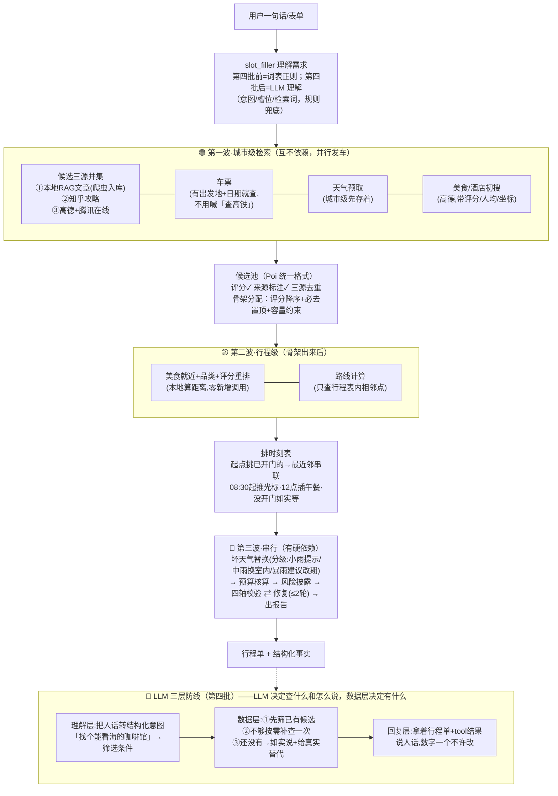

# 旅游规划助手流程重构计划（大白话版）

> 2026-10-04 与用户逐项讨论后定稿。前身讨论：候选三源/美食排序/并行化/天气分级区县/LLM 化边界。
> 配套技术图：`docs/reports/2026-10-04-旅游检索规划流程重构计划.md`（本文）+ `D:/tmp/travel-flow-restructure-diagrams.md`（现状/目标图）+ `D:/tmp/travel-langgraph-flow.md`（LangGraph 链路）。

## 一句话目标

让旅游助手「**选地方有依据、搜得全、找得快、说话像人**」——数据是真的、排序有道理、数字不靠 LLM 编。

## 全景设计图（改造后）

## 分批任务

### 第一批：选地方有依据（代码开发，最优先）

| # | 干什么 | 为什么 | 做完的效果 |
|---|---|---|---|
| 1 | 景点评分打通：高德景点类目与腾讯 LBS 并集，评分取高德的 | 现在评分全是 0，排序等于没排 | 行程优先排评分高的，不是随机 |
| 2 | 候选扩容：偏好词表补齐（温泉/滑雪/citywalk 等接不住的词）、每类 10→20 条、上限 60→120 | 现在最多 3 类×10 条，用户没得选 | 候选池够大，后面候选表有东西展示 |
| 3 | 本地文章进候选池：爬虫文章解析出景点名→入候选，标「本地攻略收录」，缺坐标的自动补 | 三源之一；语料是现成的 | 冷门但本地攻略收录的景点能被排进来 |
| 4 | 美食综合排序：按「离当天景点近 + 品类对味 + 评分」重排（本地算距离，零新增调用） | 现在高德返回什么顺序就什么顺序 | 美食卡第一个是「景点旁边、对味、分高」的店 |

**谁干**：后端代码。**验收**：同城市重排两次结果一致（确定性）；候选带评分；美食卡首位符合就近+高分。

### 第二批：喂文章（人工数据准备，不是功能开发）

| # | 干什么 | 谁干 |
|---|---|---|
| 5 | 清洗脚本：错分类扔（「市树」被当美食）、人物大词条扔（92KB 的林则徐人物页）、太薄扔（<1KB）、维基垃圾行清掉 → **清洗清单给你过目，确认后才入库** | 我写脚本，你拍板 |
| 6 | 批量入库：走现成 RAG 上传通道（自动带元数据抽取+摘要），零代码改动 | 脚本执行 |

**做完立刻自动受益**（无需开发）：「本地攻略参考」卡摘录变多、城市指南一级链（文档摘要直出）开始命中。

### 第三批：快 + 细（代码开发）

| # | 干什么 | 为什么 |
|---|---|---|
| 7 | **交通查询两分**：a) 抵达交通（高铁/动车）——填了出发地才查（可选，单城市场景默认不查）；b) **市内交通**——行程相邻段加「公交/地铁」候选模式（腾讯路线 API 四模式 driving/walking/bicycling/transit 全支持，现成能力，现状只用前两种） | 场景是单城市旅游，市内公交才是主角 |
| 8 | 第一波并行化：候选/车票/天气/美食初搜同时发（LangGraph Send） | 串行排队白等 2-4 秒；都是城市级查询互不依赖 |
| 9 | 天气精细化：区县级（按当天景点位置反查，查不到降级城市级）+ 分级应对：**小雨→只提示带伞；中雨→换室内；暴雨/台风→整日室内化+建议改期** | 现在全市一个预报、小雨暴雨一刀切 |
| 10 | **SSE 进度「检查清单」化**：第一波并行时多行同时转圈、完成即打勾（✅搜景点 12 个候选 / ⏳查车票中…）、失败项黄标不阻塞、完成后收敛一行汇总；理解层完成后插确认帧「好的，帮你看下第 2 天的安排 ↓」 | 用户不能干等；tool.started/result 事件现成，纯展示改造 |

### 第四批：聊天框功能优先（LLM 化；**页面动态渲染暂停**）

> 2026-10-04 拍板：候选表 UI 等页面级改造后置，当前集中做聊天框——理解/回复 LLM + 聊天流内 SSE 清单 + 打字机（useTypewriter 已有，直接复用）。

| # | 干什么 | 铁律 |
|---|---|---|
| 11 | 理解层 LLM：自由文本→结构化意图。典型用例：「第二天别排太满」→改单；「三坊七巷有什么好玩的」→**景点提问不重排**（本地 RAG→知乎，带出处）；「想泡温泉」→产出检索词补搜（词表接不住的典型）；「预算800够吗」→拿现有费用对比说人话；「订单何时发货」→出域引导 | LLM 挂了自动回退现有词表规则，不比现在差 |
| 12 | 回复层 LLM：拿着行程单+tool 结果说人话，打字机渐显 | **数字/时刻/费用一个字不许改**；数据里没有的不许提（评测专测空数据编造） |

**三层防线**（「找个能看海的咖啡馆」的处理）：①先筛第一波已搜的候选 → ②筛不到按理解出的关键词补查一次 → ③还没有就如实说+给**真实的**替代选项（「3公里内有这几家江景的」）。

### 实验项（拍板后再做）

- **LLM 参与搭配**：LLM 只决定「哪个景点放哪天、组内顺序」（只能从候选池里选，不能编地点），时刻/路线/费用仍规则算；开关控制，挂了回规则骨架；拿 34 条金标对比质量分。前置条件：第一批的评分落地（评分全 0 时 LLM 也只能瞎排）。
- **分类候选表 UI**：左栏「景点/美食/酒店/交通」按钮展开候选表+换入按钮（换入走代发草案管线，落决策留痕）。**已拍板后置**——页面动态渲染暂停，聊天框功能优先。

## 补充说明（2026-10-04 讨论增补）

- **候选「高德+腾讯」的含义**：两个地图商合并——腾讯坐标全（任意城市可用）、高德带评分/人均/营业时间；并集去重，评分取高德、坐标兜底腾讯。
- **交通两类**：抵达交通（高铁/动车，可选——单城市场景默认不查）与市内交通（行程相邻段怎么走，公交/地铁路线为 API 现成能力，本次启用）。
- **第三波串行的原因（大白话）**：先定去哪 → 看天下雨换地方 → 换完才算钱（换了票价变，先算就作废）→ 算完才检查超没超 → 超了再调、调完再查。顺序倒了全盘皆错，天生排队。
- **理解层模拟用例**：见第四批表格（6 个典型问法与处理路径）。
- **SSE 展示**：并行时「检查清单」多行转圈、完成打勾、失败黄标不阻塞、完成收敛一行；理解层确认帧（「好的，帮你看下第 2 天 ↓」）。
- **打字机**：useTypewriter 已有（M2-e），回复层直接复用，零新增。

## 三条全局铁律

1. **Tool 根据已有行程/需求补数据**：已有数据优先 → 不够按需补查一次 → 还没有就诚实；不预查用不上的。
2. **执行链零 LLM 不动摇**：排时刻/算路线/算钱/校验/修复全是确定性规则，同样输入永远同样输出（金标门禁保得住）；LLM 只进「理解层」和「表达层」。
3. **每批独立提交、独立验收、可单独回滚**；改完必过 tsc + travel 测试基线 + 容器实机走查。

## 待用户确认

- 第一批（1-4）+ 第三批的 9（天气分级区县）先开工？
- 第二批清洗清单出稿后给你过目的节奏 OK？
- 实验项（LLM 搭配 / 候选表 UI）排期后置，是否同意？
